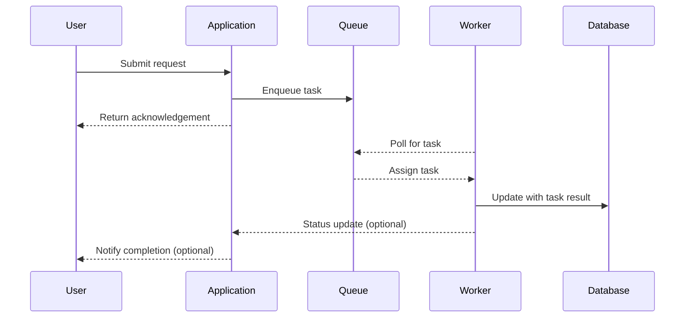

## Overview

The Asynchronous Processing pattern involves decoupling task execution from user-facing processes by offloading tasks to be processed in the background, enhancing the overall responsiveness of cloud applications. This approach is fundamental in systems where immediate response to user requests is critical, despite the workflow involving time-consuming operations.

## Detailed Explanation

### Key Concepts

1. **Separation of Concerns**: Asynchronous Processing distinctly separates the initiation of a task from its completion. This separation ensures that users are not kept waiting for long-running operations to finish.
   
2. **Task Queues**: Utilizing message queues to hold tasks temporarily until they can be processed. These queues provide buffering and decouple task producers from consumers.

3. **Workers**: Background worker processes handle tasks from the queue. They can be scaled independently to meet varying loads and perform computationally expensive operations without affecting frontend performance.

4. **Event-driven Architecture**: Leveraging events to trigger processing operations enables efficient resource allocation and utilization, aligning with cloud-native architecture principles.

### Architectural Approach

In a typical asynchronous processing setup:

- When an application receives a request that triggers an operation requiring extensive processing, it immediately returns control to the user after acknowledging the request, submitting the processing task to a queue.
  
- Dedicated worker processes monitor the queue and handle the processing tasks independently of user requests. Once complete, the result can be stored or further operations can be triggered asynchronously.

- Optional status tracking systems can inform users about task progress or completion.

### Best Practices

- **Idempotency**: Ensure that repeated task executions yield the same result to guard against duplicate task processing.
  
- **Monitoring and Logging**: Implement robust logging and monitoring to track task failures, queue lengths, and processing latencies.

- **Scalability**: Design the system such that worker instances can be scaled dynamically based on current demand.

- **Failure Handling**: Incorporate retry mechanisms with exponential backoff to handle transient failures.

### Example Code

Below is a simplified example using Node.js, illustrating adding tasks to a queue and processing them asynchronously:

```javascript
const { Queue, Worker, QueueScheduler } = require('bullmq');
const connection = { host: 'localhost', port: 6379 };

// Create a queue and a scheduler
const myQueue = new Queue('my-task-queue', { connection });
const myQueueScheduler = new QueueScheduler('my-task-queue', { connection });

// Task addition to queue
async function addTask(data) {
    await myQueue.add('process', data);
    console.log('Task added:', data);
}

// Worker to process tasks
new Worker('my-task-queue', async job => {
    console.log('Processing job:', job.id, job.data);
    // Perform task processing here
    await performAsyncTask(job.data);
}, { connection });

// Function representing processing logic
async function performAsyncTask(data) {
    // Simulate asynchronous task
    return new Promise(resolve => setTimeout(resolve, 5000));
}

// Example: Add a task to the queue
addTask({ taskDetail: 'Sample task data' });
```

### Diagrams

#### Sequence Diagram

Here's a sequence diagram detailing a typical asynchronous processing workflow:



### Related Patterns

- **Command Query Responsibility Segregation (CQRS)**: Separates read and update operations for more efficient data handling.
- **Event Sourcing**: Ensures that state changes are stored as a sequence of events.
- **Saga Pattern**: Coordinates complex transactions and handles failure scenarios effectively.

## Additional Resources

- [Cloud Design Patterns: Asynchronous Messaging](https://docs.microsoft.com/en-us/azure/architecture/patterns/asynchronous-messaging)
- [Understanding Asynchronous Patterns in Modern Web Development](https://developer.mozilla.org/en-US/docs/Learn/JavaScript/Asynchronous)

## Summary

The Asynchronous Processing design pattern is instrumental in enhancing the responsiveness of cloud applications by decoupling task execution from user interactions through the use of background task execution and message queues. Adopting this pattern can significantly improve user experiences and optimize resource usage in cloud environments.
