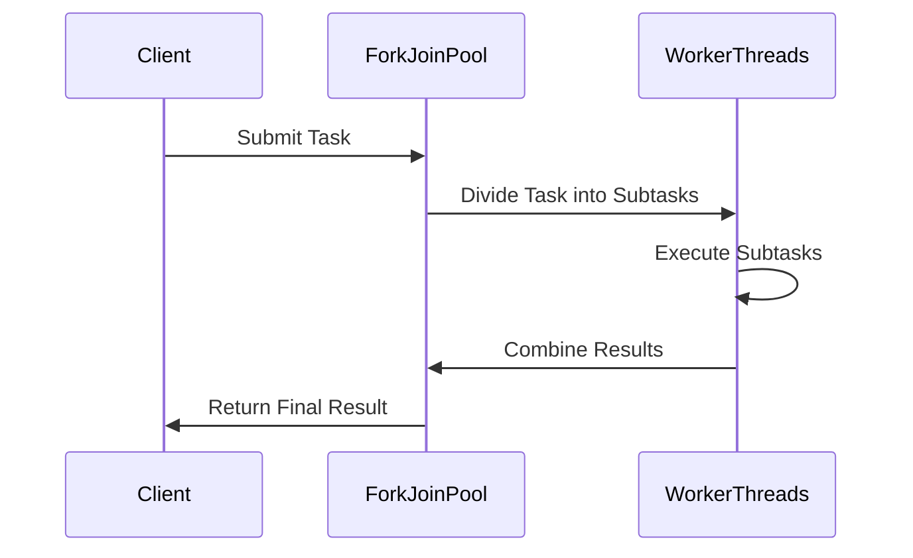

## Introduction

Parallel Processing and Multithreading is a design pattern aimed at enhancing the performance of applications by executing multiple tasks simultaneously. This approach is commonly used in cloud computing to optimize resource utilization and reduce execution time.

## Detailed Explanation

### Concepts

- **Parallel Processing**: Involves dividing a task into subtasks and processing these concurrently on multiple processors or cores. This division can significantly speed up tasks that are computationally intensive by utilizing the full capacity of available resources.

- **Multithreading**: Focuses on running multiple threads within a single process. Each thread is capable of executing independently, which can improve the throughput of applications designed to handle multiple tasks simultaneously.

### Architectural Approach

1. **Task Decomposition**: Break down larger tasks into smaller, manageable subtasks that can be executed in parallel.
   
2. **Concurrency Control**: Utilize synchronization mechanisms to ensure the integrity of shared data among threads.

3. **Resource Management**: Efficiently allocate and manage resources like CPU and memory across multiple tasks.

4. **Load Balancing**: Distribute workload evenly across processors to prevent overloading and maximize throughput.

### Best Practices

- **Thread Pooling**: Avoid the overhead of creating and destroying threads by reusing a pool of existing threads.
  
- **Lock-Free Algorithms**: Minimize bottlenecks associated with locks by using lock-free algorithms and data structures.

- **Efficient Serialization**: Optimize serialization processes in distributed systems to reduce latency and improve parallel execution.

- **Resource Fine-Tuning**: Continuously monitor and tune resource allocation based on workload characteristics and system performance.

## Example Code

### Java Example Using Fork/Join Framework

```java
import java.util.concurrent.RecursiveTask;
import java.util.concurrent.ForkJoinPool;

public class ParallelProcessingExample extends RecursiveTask<Integer> {
    private static final int THRESHOLD = 10;
    private int[] data;
    private int start, end;

    public ParallelProcessingExample(int[] data, int start, int end) {
        this.data = data;
        this.start = start;
        this.end = end;
    }

    @Override
    protected Integer compute() {
        if ((end - start) <= THRESHOLD) {
            return computeSequentially();
        } else {
            int mid = (start + end) / 2;
            ParallelProcessingExample leftTask = new ParallelProcessingExample(data, start, mid);
            ParallelProcessingExample rightTask = new ParallelProcessingExample(data, mid, end);
            invokeAll(leftTask, rightTask);
            return leftTask.join() + rightTask.join();
        }
    }

    private int computeSequentially() {
        int sum = 0;
        for (int i = start; i < end; i++) {
            sum += data[i];
        }
        return sum;
    }

    public static void main(String[] args) {
        ForkJoinPool pool = new ForkJoinPool();
        int[] data = {/* initialize with a large dataset */};
        ParallelProcessingExample task = new ParallelProcessingExample(data, 0, data.length);
        int result = pool.invoke(task);
        System.out.println("Result: " + result);
    }
}
```

## Diagrams



## Related Patterns

- **MapReduce**: A pattern for processing large data sets with a distributed algorithm on a cluster.

- **Reactive Programming**: Deals with asynchronous data streams and the propagation of change.

- **Bulkhead Isolation**: Prevents a single failing component from taking down an entire system by isolating resources into separate segments.

## Additional Resources

- [JDK Fork/Join Framework Documentation](http://docs.oracle.com/javase/8/docs/api/java/util/concurrent/ForkJoinPool.html)
- [Concurrency in Practice](https://jcip.net/)
- [Java Concurrency Framework](https://docs.oracle.com/javase/tutorial/essential/concurrency/)

## Summary

Parallel Processing and Multithreading is a powerful pattern in cloud computing that enhances application performance by utilizing concurrent execution. By breaking down tasks and efficiently managing resources, this pattern can significantly optimize task execution time and improve system throughput. Understanding and correctly implementing this pattern is key to achieving high-performance distributed applications.
