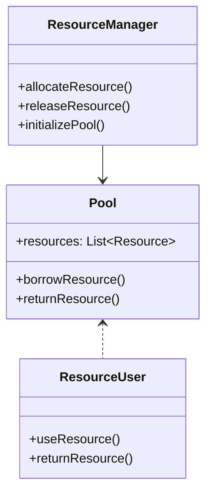

## Introduction to Resource Pooling

In the context of cloud computing, resource pooling is a pivotal performance optimization pattern. It involves managing a pool of reusable resources, like threads or database connections, to handle multiple requests without incurring the overhead of frequently creating and destroying these resources. This pattern enhances system efficiency and scalability, making it indispensable for high-performance cloud applications.

## Detailed Explanation

### Concept and Benefits

Resource pooling revolves around pre-allocating a set of resources and efficiently distributing them as needed. This approach avoids the costly process of resource allocation and deallocation on each request. By keeping a pool of reusable resources, systems can:

- **Improve Performance:** Reduce time spent on resource creation and disposal, leading to faster response times.
- **Enhance Scalability:** Manage a larger number of concurrent users by effectively reusing available resources.
- **Decrease Resource Contention:** Allows shared resources to be used optimally without frequent locking or synchronization issues.

### Components of Resource Pooling

1. **Resource Manager:** Handles the allocation, deallocation, and reclamation of resources.
2. **Pool:** A pre-allocated set of resources that are available for use.
3. **Resource User:** The part of the application that requests access to the resource.

### Implementation Strategy

1. **Pool Initialization:** Create a fixed number of resources at startup, or dynamically adjust based on system load.
2. **Resource Allocation:** Provide a mechanism for resource borrowing and usage tracking.
3. **Resource Release:** Ensure timely return of resources to the pool after use.
4. **Idle Resource Management:** Regularly clean up or recycle resources that remain idle for too long.

### Example Code

Below is a simple example in Java demonstrating thread pool implementation using Java's `ExecutorService`:

```java
import java.util.concurrent.ExecutorService;
import java.util.concurrent.Executors;

public class ThreadPoolingExample {
    public static void main(String[] args) {
        // Create a pool of 10 threads
        ExecutorService executor = Executors.newFixedThreadPool(10);

        // Simulate 100 tasks
        for (int i = 0; i < 100; i++) {
            executor.execute(new Task(i));
        }

        // Shutdown the executor
        executor.shutdown();
    }

    static class Task implements Runnable {
        private final int taskId;

        Task(int taskId) {
            this.taskId = taskId;
        }

        @Override
        public void run() {
            System.out.println("Task " + taskId + " is running");
        }
    }
}
```

### Diagrams



## Related Patterns

- **Circuit Breaker:** Works alongside resource pooling by providing a fallback mechanism when resources are exhausted.
- **Bulkhead:** Isolates resources to prevent failures from cascading, often used in conjunction with resource pools.
- **Load Balancer:** Distributes incoming network traffic across multiple resources in the pool.

## Best Practices

- **Monitoring and Logging:** Regularly track resource usage to identify bottlenecks or under-utilization.
- **Dynamic Sizing:** Use strategies to adjust pool size dynamically based on traffic patterns and workloads.
- **Timeout Management:** Implement timeouts to deal with stuck or slow resources effectively.

## Additional Resources

- [Java Concurrency in Practice](https://www.oreilly.com/library/view/java-concurrency-in/9788131775901/)
- [Microsoft Azure Documentation on Resource Management](https://learn.microsoft.com/en-us/azure/resource-pooling)
- [AWS Best Practices for Performance Optimization](https://aws.amazon.com/architecture/performance-optimization/)

## Summary

Resource Pooling is an essential design pattern that optimizes the use of shared resources in cloud environments. By maintaining a pool of reusable resources, applications can significantly enhance their performance, scalability, and responsiveness. Understanding and implementing this pattern effectively is crucial for architects and developers aiming to build high-performance cloud-based applications.
