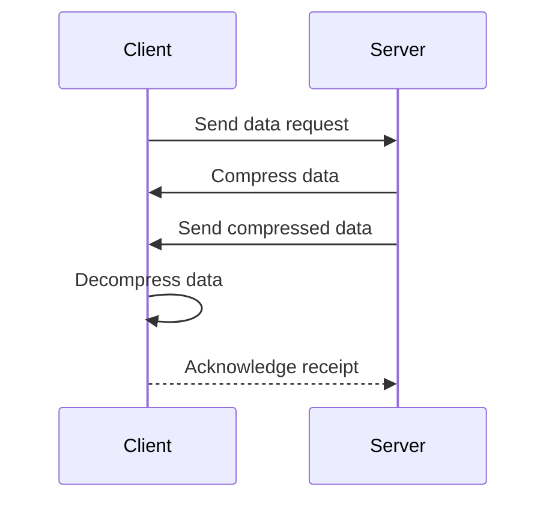
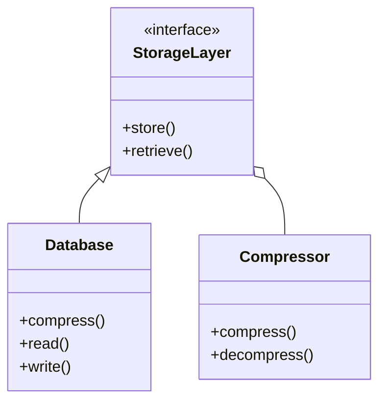

In the age of cloud computing, the efficient transfer and storage of data are crucial for performance optimization. One of the key strategies to achieve this is through the use of **compression techniques**. Compression reduces the size of data, thus leading to faster data transfer, decreased latency, and optimized bandwidth usage.

## Detailed Explanation

### What is Data Compression?
Data compression involves encoding information using fewer bits than the original representation. This process can significantly reduce the time and cost associated with data transmission and storage. Compression can be broadly classified into two types:

- **Lossless Compression**: Enables the exact original data to be reconstructed from the compressed data. Common examples include Gzip, Brotli, and LZW.
- **Lossy Compression**: Involves some loss of information, suitable for scenarios where exact replication is not necessary, like audio, video, and image files. JPEG and MP3 are examples of lossy compression.

### Architectural Approaches

1. **Compression at Rest**: Data stored in databases or storage systems is compressed to save space and reduce storage costs. Tools like ZFS or certain features in databases like PostgreSQL can automatically handle this.

2. **Compression In Transit**: Data is compressed before being sent over the network. Protocols like HTTP/2 or custom API endpoints often include support for this, reducing latency and improving load times.

3. **Hybrid Compression**: A combination of both at rest and in transit, providing optimal performance in use cases with significant data transfer and storage needs.

### Best Practices

- **Choose the Right Compression Algorithm**: Depending on the data type and use case, select an appropriate algorithm. Textual data often benefits more from algorithms like Gzip or Brotli, while multimedia data might require specialized solutions like MPEG.

- **Consider Trade-offs**: Balance between compression ratio and computing overhead. Highly efficient compression might consume more CPU, affecting other processes.

- **Leverage Built-in Cloud Tools**: Many cloud providers offer built-in compression tools as part of their services, such as AWS S3's automatic compression or GCP's data transfer services.

- **Automate Compression Policies**: Use scripts or automation tools to ensure that data is automatically compressed before storage or transmission.

## Example Code

Here's a simple example of compressing and decompressing data using Python's `zlib` library:

```python
import zlib

data = b"This is the data to be compressed"
compressed_data = zlib.compress(data)
print(f"Compressed Data: {compressed_data}")

decompressed_data = zlib.decompress(compressed_data)
print(f"Decompressed Data: {decompressed_data.decode('utf-8')}")
```

## Diagrams

### Compression Sequence Diagram



### Compression at Rest Architecture



## Related Patterns

- **Caching**: Often used alongside compression to speed up data retrieval and reduce latency.
- **Content Delivery Networks**: These networks often use compression to reduce the amount of data transferred to end-users.

## Additional Resources

- [Gzip vs Brotli Compression](https://developers.google.com/web/fundamentals/performance/optimizing-content-efficiency/http-compression)
- [AWS Compression in S3](https://aws.amazon.com/s3/features/)
- [Data Compression in Apache Kafka](https://www.confluent.io/blog/introduction-to-compression-in-apache-kafka/)

## Summary

Compression techniques in cloud computing offer substantial improvements in data transfer speeds and storage efficiency by reducing data size. By implementing these strategies, organizations can achieve significant cost savings and performance enhancements in their cloud infrastructure. The selection of appropriate compression methods and a thoughtful combination of at-rest and in-transit compression can significantly enhance cloud application efficiency and scalability.
