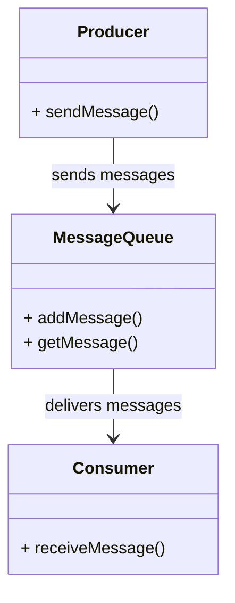
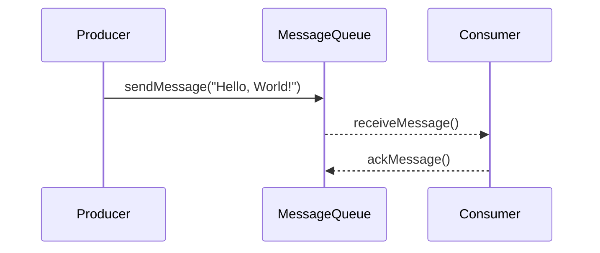

## Introduction

In modern cloud-based architectures, decoupling system components and managing asynchronous workflows is crucial for creating scalable and resilient applications. **Message Queueing Services** such as AWS Simple Queue Service (SQS), Azure Queue Storage, and Google Cloud Pub/Sub provide the backbone for these communications by allowing components to communicate asynchronously.

## Detailed Explanation of Design Pattern

Message Queuing Services are pivotal in cloud environments for achieving loose coupling between services, thereby enhancing both scalability and resilience:

- **Decoupling**: By inserting a message queue between producers and consumers, you decouple the components. This means that producers don't need to wait for consumers to handle the message, and consumers can process messages at their own pace.
  
- **Buffering**: Queues can act as buffers when the rate of message production exceeds the rate of message consumption. This helps in smoothing out burst traffic and ensures that messages are not lost.

- **Reliable Communication**: These services guarantee message delivery with mechanisms like at-least-once delivery, ensuring that no data is dropped, even in cases of consumer failure.

- **Scalability**: Queues can scale horizontally across multiple producers and consumers, enabling your system to handle a high volume of messages seamlessly.

- **Error Handling and Dead-Letter Queues**: Unprocessed messages can be routed to dead-letter queues for further inspection and remediation, aiding in fault tolerance and error management.

## Architectural Approaches

1. **Producer-Consumer Pattern**:
   - Producers send messages to a queue.
   - Consumers retrieve messages from the queue asynchronously.
   - Ensures that the producer and consumer can process at different rates.
  
2. **Fan-Out Pattern**:
   - A single message is broadcast to multiple consumers.
   - Enables real-time updates across various components.

3. **Work Queue Pattern**:
   - Distributes workloads among multiple workers.
   - Enhances throughput and efficiency by parallelizing task execution.

## Best Practices

- Implement idempotency in consumers to handle potential message duplication.
- Set appropriate retention periods for queues to prevent data loss.
- Monitor queue metrics to ensure optimum performance and timely processing.
- Use backoff strategies to handle rate-limiting and avoid overwhelming consumers.
  
### Example Code (AWS SQS)

```java
import com.amazonaws.services.sqs.AmazonSQS;
import com.amazonaws.services.sqs.AmazonSQSClientBuilder;
import com.amazonaws.services.sqs.model.SendMessageRequest;

public class SQSSample {
    
    public static void main(String[] args) {
        final AmazonSQS sqs = AmazonSQSClientBuilder.defaultClient();
        final String queueUrl = "<Your-Queue-URL>";

        // Sending a message
        SendMessageRequest send_msg_request = new SendMessageRequest()
                .withQueueUrl(queueUrl)
                .withMessageBody("Hello, World!");
        sqs.sendMessage(send_msg_request);
        
        System.out.println("Message sent successfully!");
    }
}
```

## Diagrams

### UML Class Diagram



### Sequence Diagram



## Related Patterns

- **Publish-Subscribe Pattern**: Allows multiple consumers to receive a broadcast of messages.
- **Event Sourcing Pattern**: Captures the state change events as they're stored in the queue for replayable history.
- **Circuit Breaker Pattern**: Protects systems from cascading failures by interacting with a queuing backoff.

## Additional Resources

- [AWS SQS Documentation](https://aws.amazon.com/sqs/)
- [Azure Queue Storage Documentation](https://docs.microsoft.com/en-us/azure/storage/queues/storage-queues-introduction)
- [Google Cloud Pub/Sub Documentation](https://cloud.google.com/pubsub/docs/)

## Summary

Message Queueing Services are integral to building decoupled, scalable, and resilient cloud-based applications. By implementing message queues, such as AWS SQS, system components can communicate asynchronously, maintain operational efficiency during peaks, and recover from errors gracefully. This pattern assures reliable delivery and streamlined processing, paving the way for robust application designs.
