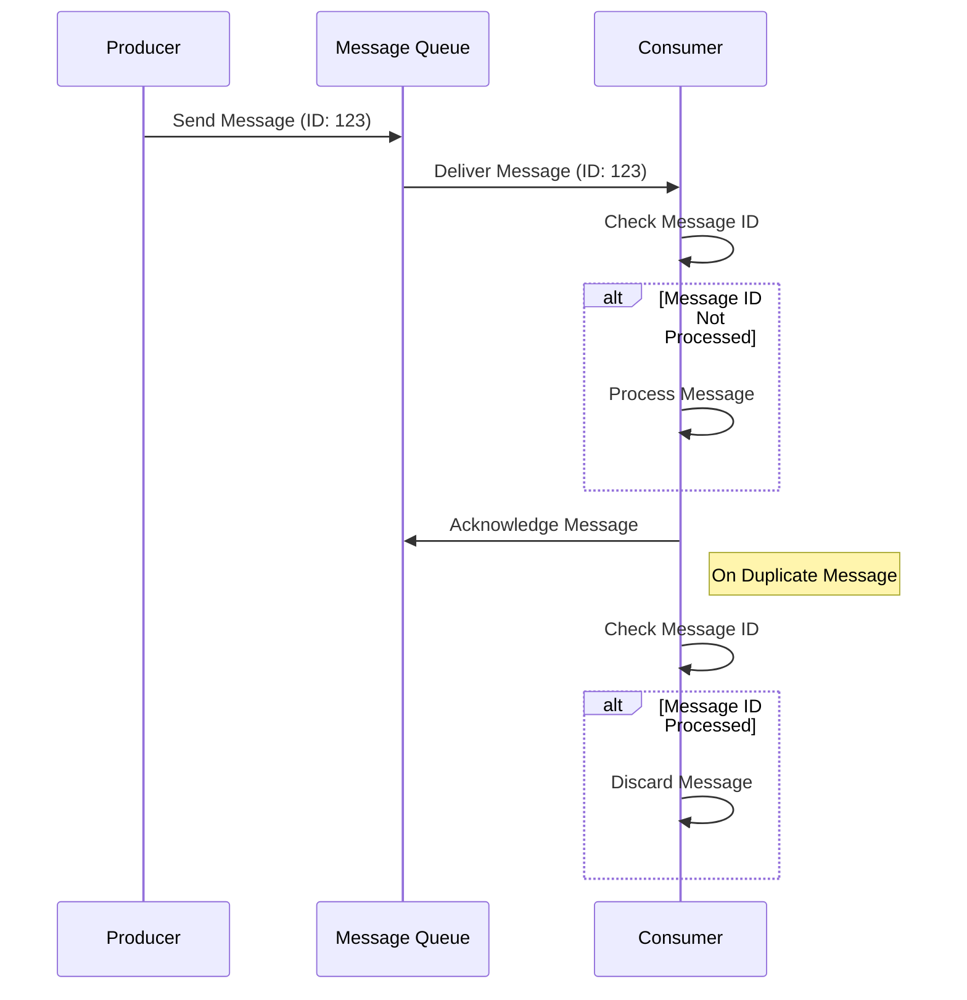

## Introduction

In distributed systems, particularly those involving message passing and event-driven architectures, ensuring that operations are idempotent is crucial. Idempotency guarantees that performing an operation multiple times results in the same state as performing it once. This is particularly important to handle duplicate messages in a cloud-based environment where network partitions and system failures may cause the same message to be sent or processed multiple times.

## Detailed Explanation

Idempotent message processing ensures that the system behaves correctly even when the same message is delivered more than once. This characteristic is vital in cloud environments due to factors like network unreliability, retry mechanisms, and batch processing, which can result in duplicate messages.

An operation is considered idempotent if applying it multiple times has the same effect as applying it once. For example, setting a user's email address to a specific value is idempotent, whereas adding a value to a list is not unless explicitly managed.

### Architectural Approach

To achieve idempotency in message processing, consider the following strategies:

1. **Idempotent Consumers**: Design consumers of messages to check the processing status before executing any actions. Store a unique identifier for each message and track the completion state of these identifiers.

2. **State Tokens**: Use tokens or version numbers to represent unique states of data entities in databases. This helps in identifying changes since the last processing.

3. **Deduplication Storage**: Maintain a deduplication store where processed message IDs are stored and checked against future incoming messages to determine if they have been processed previously.

4. **At-Least-Once Delivery**: Assume messages can be delivered more than once and design consumers to handle this gracefully with idempotency.

5. **Distributed Locks or Transactions**: When accessing shared resources, use distributed locking mechanisms or transactional operations to prevent duplicate processing.

### Example Code

Here's a simple example demonstrating an idempotent message processing in a system using a memory-based deduplication approach:

```scala
import java.util.concurrent.ConcurrentHashMap

object IdempotentProcessor {
  private val processedMessages = new ConcurrentHashMap[String, Boolean]()

  def processMessage(messageId: String, process: () => Unit): Unit = {
    if (!processedMessages.containsKey(messageId)) {
      process()
      processedMessages.put(messageId, true)
    }
  }
}

// Usage
val message = "Message123"

IdempotentProcessor.processMessage(message, () => println(s"Processing $message"))
```

### Diagrams

Here’s sequence diagram illustrating an idempotent message processing workflow:



### Related Patterns

- **Retry Pattern**: Used to handle transient faults by retrying failed operations, often leading to duplicate message issues that idempotency can address.
  
- **Message Deduplication Pattern**: Specific handling of duplicates entries in message processing.

### Best Practices

- Always utilize a consistent and reliable unique identifier for each message to track processing state.
  
- Implement thorough logging for duplicate detection and handling to simplify troubleshooting and ensure system reliability.
  
- Test your idempotent operations extensively under conditions simulating network unreliability and duplicates.

### Additional Resources

- [Idempotency Patterns in Microservice Architectures](https://docs.example.com/idempotency-patterns)
- [Designing Event-Driven Systems](https://docs.example.com/event-driven-systems)

## Summary

Idempotent Message Processing is a foundational pattern in cloud-based distributed systems, allowing robust and reliable message handling by ensuring that duplicate messages do not lead to incorrect states or side effects. By leveraging unique identifiers, deduplication techniques, and mindful design, you can effectively manage message processing in environments prone to failure and retries.
