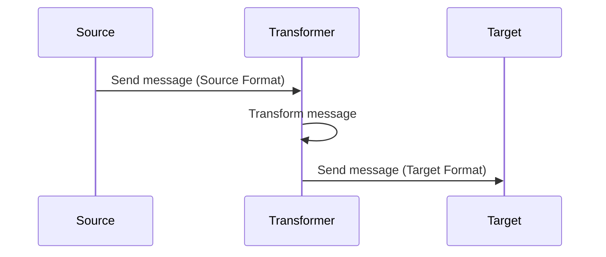

## Introduction

In cloud-based systems, different services often need to communicate with each other. However, these services might use different formats and protocols for their data. The **Message Transformation** design pattern addresses this challenge by converting messages into formats that are understandable by different services, facilitating seamless integration and communication across distributed systems.

## Design Pattern Overview

The **Message Transformation** pattern is an integration pattern that involves transforming message data into alternative forms to accommodate the needs of various components within a system. This pattern is critical in cloud computing environments, where applications developed in different languages and platforms must work together.

### Key Components

1. **Source System**: The origin system that generates the message in its native format.
2. **Target System**: The destination system that requires the message in a different format for processing.
3. **Transformer**: A middleware component responsible for converting message formats from the source format to the target format.
4. **Transformation Logic**: The rules and algorithms that dictate how data should be transformed between different formats.

## Architectural Approaches

1. **Middleware Transformation**: Implement transformers as middleware in a service mesh. This can be a dedicated transformation service or integrated into API gateways.

2. **Endpoint Transformation**: Implement transformation logic directly at service endpoints to address specific format needs.

3. **Broker-Based Transformation**: Use message brokers with capabilities to transform messages in transit between source and target services.

### Example Code

Here's an example of a simple message transformer using Java and Jackson for JSON transformation:

```java
import com.fasterxml.jackson.databind.ObjectMapper;

public class MessageTransformer {

    private ObjectMapper objectMapper = new ObjectMapper();

    public <T, R> R transformMessage(T sourceMessage, Class<R> targetClass) throws Exception {
        // Serialize the source message to a JSON string
        String jsonString = objectMapper.writeValueAsString(sourceMessage);
        
        // Deserialize the JSON string to the target class
        return objectMapper.readValue(jsonString, targetClass);
    }

    public static void main(String[] args) {
        try {
            SourceMessage source = new SourceMessage("Hello, World!");
            MessageTransformer transformer = new MessageTransformer();
            
            TargetMessage target = transformer.transformMessage(source, TargetMessage.class);
            System.out.println(target.getContent());
        } catch (Exception e) {
            e.printStackTrace();
        }
    }
}

class SourceMessage {
    private String content;
    
    // Constructors, getters and setters
    public SourceMessage(String content) {
        this.content = content;
    }

    public String getContent() {
        return content;
    }
}

class TargetMessage {
    private String content;
    
    // Constructors, getters and setters
    public void setContent(String content) {
        this.content = content;
    }
    
    public String getContent() {
        return content;
    }
}
```

### UML Sequence Diagram



## Related Patterns

- **Messaging**: Ensures communication between distributed components.
- **Content Enricher**: Adds additional data to messages if required.
- **Content Filter**: Filters unnecessary data from the messages.
- **Format Translator**: A specific type of message transformation that changes data format without altering the content.

## Additional Resources

- *"Enterprise Integration Patterns: Designing, Building, and Deploying Messaging Solutions"* by Gregor Hohpe and Bobby Woolf
- Cloud provider documentation for message transformation best practices, such as AWS Lambda for serverless transformations, or Azure Logic Apps for integration workflows.

## Summary

The **Message Transformation** pattern is essential for achieving interoperability between diverse systems in cloud environments. By converting messages into appropriate formats, it ensures that different services can communicate effectively, thus fostering a more flexible and integrated architecture. This pattern aids in minimizing the complexity associated with integrating multi-format services, allowing developers to focus on their core logic rather than data compatibility issues. This makes it a cornerstone in the toolkit of cloud architects and engineers.
