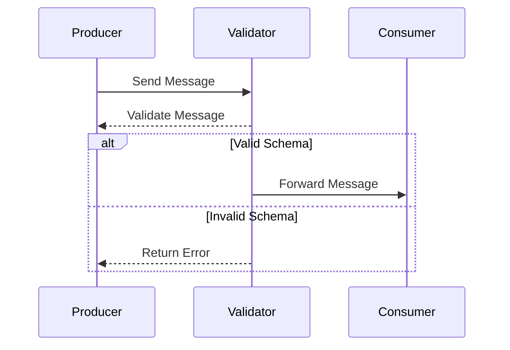

## Introduction

In cloud-based and distributed systems, messages are widely used for communication between different services and components. Ensuring these messages adhere to predefined structures or schemas is crucial for maintaining data integrity and system reliability. **Schema Validation** is a design pattern that enforces strict schema rules when sending and receiving messages. It helps in identifying potential errors early and facilitates seamless integration between diverse systems.

## Detailed Explanation

### Purpose

The primary goal of Schema Validation is to ensure that all messages exchanged in a system conform to a predefined schema. This validation process is essential for:

- **Data Integrity**: Ensuring data is structured correctly and consistently.
- **Interoperability**: Facilitating communication between different systems with guaranteed compliance.
- **Error Handling**: Providing early error detection before a message propagates further into the system.
- **Security**: Preventing injection of malformed data which could lead to potential vulnerabilities.

### How It Works

1. **Schema Definition**: Define schemas using formats like JSON Schema, XML Schema (XSD), Apache Avro, Protocol Buffers, etc.
2. **Validation Logic**: Implement validation logic in message consumers and producers.
3. **Integration**: Use middleware or standalone libraries that automatically validate messages against their schemas.
4. **Error Handling**: Reject or log messages that do not conform to the schema with actionable error messages.
5. **Schema Evolution**: Manage changes in schemas while minimizing disruptions, often using versioning.

### Architectural Approaches

- **Centralized Validation**: A middleware layer or service that validates all incoming and outgoing messages. It ensures consistent validation logic across the system.
- **Decentralized Validation**: Each service is responsible for validating its messages. This approach offers flexibility but can lead to inconsistencies.

### Best Practices

- **Versioning**: Enable schema evolution by versioning schemas. Ensure backward compatibility where possible.
- **Automated Testing**: Implement automated tests for validating schemas to identify issues during development.
- **Documentation**: Thoroughly document schemas and validation rules for developers and integrators.
- **Monitoring & Logging**: Monitor validation failures and maintain logs for diagnostic purposes.

## Example Code

Here's a simple example illustrating schema validation using JSON Schema with JavaScript:

```javascript
const Ajv = require("ajv");
const ajv = new Ajv();

const schema = {
  type: "object",
  properties: {
    id: { type: "integer" },
    name: { type: "string" },
    email: { type: "string", format: "email" }
  },
  required: ["id", "name", "email"],
  additionalProperties: false
};

const data = {
  id: 1,
  name: "John Doe",
  email: "john.doe@example.com"
};

const validate = ajv.compile(schema);
const valid = validate(data);

if (valid) {
  console.log("Data is valid!");
} else {
  console.error("Data is invalid:", validate.errors);
}
```

## Diagrams

### Sequence Diagram for Schema Validation


## Related Patterns

- **Canonical Data Model**: Ensures consistent data structure across different services, complementing schema validation.
- **Message Translator**: Adapts messages to conform to required schemas, often used in conjunction with validation.

## Additional Resources

- [JSON Schema Documentation](https://json-schema.org)
- [Apache Avro Documentation](https://avro.apache.org/docs/current/)
- [Protocol Buffers Documentation](https://developers.google.com/protocol-buffers/)

## Summary

Schema Validation is a robust design pattern critical in distributed and cloud systems. By enforcing compliance with predefined schemas, it ensures data integrity, facilitates interoperability, and enhances security. Implementing effective schema validation practices involves automated tools, proper versioning, and comprehensive documentation. As cloud systems evolve and scale, robust schema validation remains fundamental to reliable system operation.
