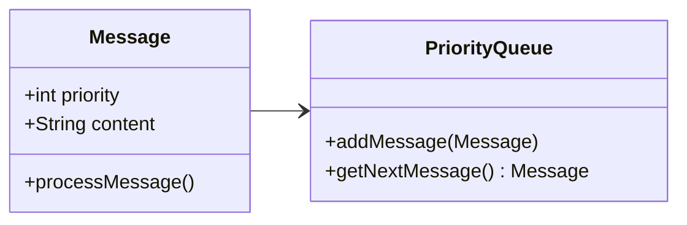
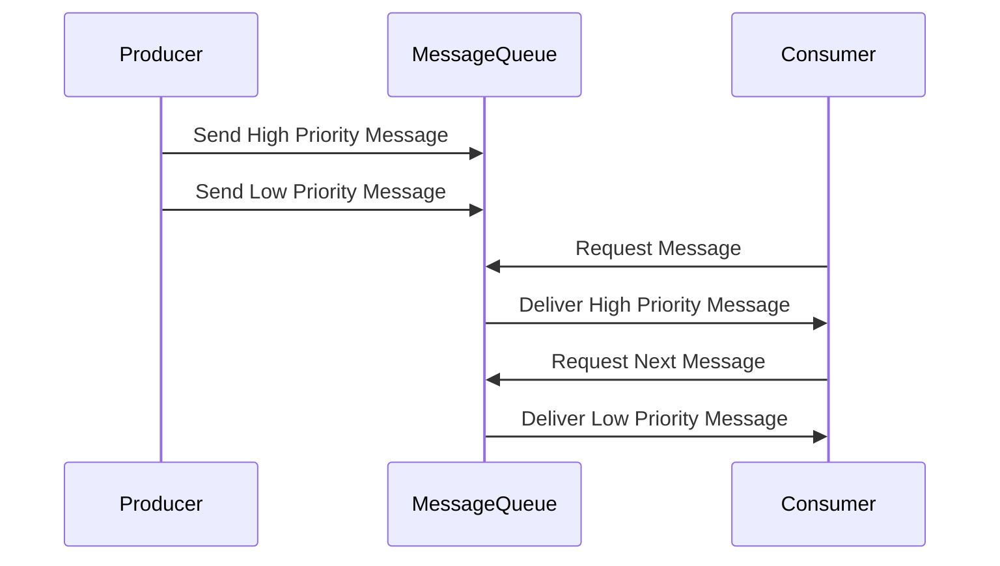

## Overview

In cloud-based applications, communication between components is often achieved through message passing. The Message Prioritization pattern ensures that messages deemed critical are processed before others, which is essential for applications that need to handle events with varying levels of urgency.

## Architectural Context

In many enterprise systems, components communicate over message queues that don't inherently manage message importance. However, certain applications demand that high-priority events (e.g., a payment transaction) be processed before less critical ones (e.g., a system log update). The Message Prioritization pattern solves this issue by assigning priorities to messages, allowing the system to handle them appropriately.

## Implementation Strategies

### Message Queue Configuration

- **Priority Queues**: Utilize message brokers that support priority queues, such as RabbitMQ or ActiveMQ. These systems allow messages to be tagged with a priority level, and the broker ensures that higher-priority messages are delivered first.
  
- **Custom Headers**: In systems where native prioritization isn't available, use custom headers to indicate message priority. Implement a middleware layer that examines these headers and dynamically sorts messages.

### N-tier Architecture Enhancements

- **Priority-Based Handlers**: Develop specialized handlers that monitor queues and pull messages based on priority. Use thread pools with dynamic workloads shifted towards high-priority handlers.
  
- **Rate-Limiting**: Implement rate-limiting for low-priority messages to ensure more resources are available for processing high-priority messages.

## Example Code

Here’s a simple example illustrating a priority queue using Java with RabbitMQ:

```java
import com.rabbitmq.client.*;

public class PriorityQueueExample {
    private final static String QUEUE_NAME = "priority_queue";

    public static void main(String[] argv) throws Exception {
        ConnectionFactory factory = new ConnectionFactory();
        factory.setHost("localhost");
        try (Connection connection = factory.newConnection(); Channel channel = connection.createChannel()) {
            channel.queueDeclare(QUEUE_NAME, true, false, false, null);

            String highPriorityMessage = "High Priority Task";
            channel.basicPublish("", QUEUE_NAME, new AMQP.BasicProperties.Builder().priority(10).build(), highPriorityMessage.getBytes());
            
            String lowPriorityMessage = "Low Priority Task";
            channel.basicPublish("", QUEUE_NAME, new AMQP.BasicProperties.Builder().priority(1).build(), lowPriorityMessage.getBytes());
            
            System.out.println(" [x] Sent priority messages");
        }
    }
}
```

## Diagrams

### Class Diagram



### Sequence Diagram



## Related Patterns

- **Message Filtering**: Ensures only relevant messages are processed by a consumer.
- **Competing Consumers**: Allows multiple consumers to process messages from a queue to improve throughput.
- **Dead Letter Queue**: Manages messages that cannot be processed successfully.

## Additional Resources

- [RabbitMQ Priority Documentation](https://www.rabbitmq.com/priority.html)
- [Enterprise Integration Patterns](https://www.enterpriseintegrationpatterns.com/patterns/messaging/MessagePriority.html)
- [AWS SQS Message Prioritization Techniques](https://aws.amazon.com/blogs/database/using-aws-sqs-message-priority-with-standard-queues/)

## Summary

The Message Prioritization pattern is crucial in enabling systems to efficiently manage and process messages of varying importance. By adopting prioritization strategies, developers can ensure critical tasks are completed in a timely manner, improving the overall performance and reliability of cloud applications.
