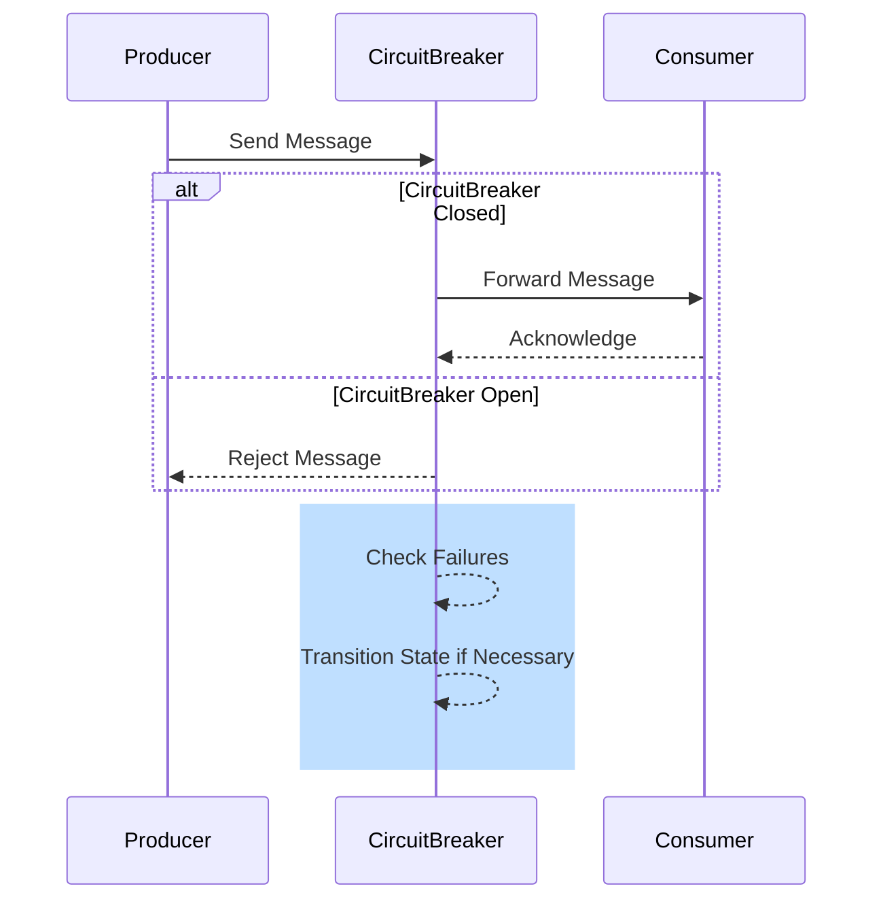

## Overview

In cloud-based environments, messaging systems often face the challenge of handling large volumes of traffic, which can lead to service degradation or outage if not managed properly. The Circuit Breaker pattern is an essential architectural approach used to prevent services from being overwhelmed by too many messages, thus maintaining application availability and performance. 

This article delves into the core concepts, implementation strategies, and best practices for applying the Circuit Breaker pattern in messaging systems. 

## Pattern Description

The Circuit Breaker pattern acts as a regulatory mechanism between message producers and consumers. It monitors for failures and manages responses systematically to prevent downstream services from being flooded with requests they cannot handle. When a threshold of failures is detected within a certain timeframe, the circuit "breaks," blocking further message transmission until the service stabilizes.

### Key Components

1. **Circuit State Management**: Maintains the current state - Closed, Open, or Half-Open.
   - *Closed*: Normal operations, all messages are processed.
   - *Open*: Stops all message processing to allow the service to recover.
   - *Half-Open*: A test period where a limited number of messages are allowed to determine if the service has regained stability.

2. **Failure Detection**: Monitors message processing, typically through error rates or latency measures.

3. **State Transition**: Manages transition rules between states based on defined thresholds and conditions.

## Architectural Approach

Implementing the Circuit Breaker pattern in messaging involves:

- **Threshold Settings**: Define thresholds for failure rates or response times that trigger state transitions.
- **State Monitoring**: Use tools and frameworks to monitor the health of message processing services.
- **Alerting and Logging**: Implement logging mechanisms for debugging and alerts to inform stakeholders about the circuit state changes.




## Example Code

Below is an illustrative example using Java and a typical messaging library.

```java
public class CircuitBreaker {
    private State state = State.CLOSED;
    private int failureCount = 0;
    private final int failureThreshold = 5;
    private final long retryTimePeriod = 5000;
    private long lastFailureTime = 0;

    public synchronized void sendMessage(Message message) throws Exception {
        if (state == State.OPEN) {
            if (System.currentTimeMillis() - lastFailureTime > retryTimePeriod) {
                state = State.HALF_OPEN;
            } else {
                throw new Exception("Circuit is open");
            }
        }

        try {
            message.send();
            reset();
        } catch (Exception e) {
            failureCount++;
            lastFailureTime = System.currentTimeMillis();
            if (failureCount >= failureThreshold) {
                state = State.OPEN;
            }
            throw e;
        }
    }

    private void reset() {
        state = State.CLOSED;
        failureCount = 0;
    }

    private enum State {
        CLOSED, HALF_OPEN, OPEN
    }
}
```

## Related Patterns

- **Retry Pattern**: Complements Circuit Breaker by attempting to reprocess failed messages automatically after a delay.
- **Throttling Pattern**: Limits the number of allowed requests in a given timeframe to control traffic.
- **Bulkhead Pattern**: Isolates components to prevent cascading failures.

## Additional Resources

- [Resilience4j library](https://resilience4j.readme.io/docs/circuitbreaker): A Java library that enables Circuit Breaker and other resilience patterns.
- [Microsoft Azure Best Practices: Circuit Breaker Pattern](https://docs.microsoft.com/en-us/azure/architecture/patterns/circuit-breaker)

## Summary

The Circuit Breaker pattern for messaging is a pivotal solution in managing fault tolerance and ensuring the robustness of cloud services. By effectively handling failures, it prevents service overwhelm, reducing downtime and improving resilience. Implementing this pattern, along with complementary strategies, will significantly enhance system stability and reliability.
