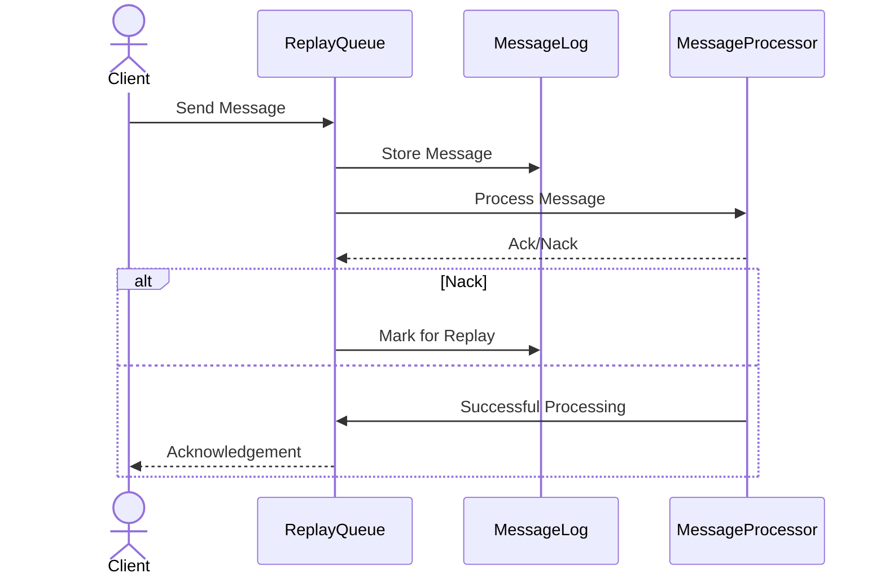

## Overview

The Replay Queues pattern is a messaging and communication design pattern commonly employed in cloud environments and distributed systems. It provides a mechanism to reprocess messages that have been previously received, either to restore a system to a known good state or to recover from errors. This design pattern is crucial in achieving robustness and ensuring fault tolerance, as it allows systems to handle transient errors and intermittent failures gracefully.

## Core Principles

The core principles of Replay Queues revolve around:

1. **Idempotency**: Ensuring that message reprocessing does not cause unintended side effects is crucial. Systems must be designed to handle repeated processing of the same messages without negative impact.
   
2. **Persistence**: Storing messages for potential replay requires durable storage solutions. Messages should be reliably logged and retrievable for an extended period.

3. **State Management**: The system needs mechanisms to track and manage the state of message processing, ensuring a clear understanding of which messages have been processed and which need replay.

4. **Error Recovery**: Providing mechanisms to recover from application errors by replaying messages, thereby allowing the system to achieve eventual consistency.

## Implementation Approaches

Implementing Replay Queues involves a few key steps:

1. **Durable Message Storage**: Utilize a persistent message broker or distributed log system such as Apache Kafka, AWS SQS, or Azure Service Bus to store messages safely.

2. **Logging and Tracking**: Track processed and unprocessed messages using unique identifiers and a reliable logging system.

3. **Replay Logic**: Implement logic to trigger message reprocessing based on specific criteria, such as time-based schedules or error detection.

4. **Concurrency and Throttling**: Handle message reprocessing in a manner that respects system load, optimizing performance without overwhelming resources. 

5. **Monitoring and Alerts**: Set up monitoring and alerting to detect processing anomalies that might necessitate replay actions, ensuring timely recovery.

## Example Code

Below is a simplified example in Java using Apache Kafka for implementing Replay Queues:

```java
Properties props = new Properties();
props.put("bootstrap.servers", "localhost:9092");
props.put("group.id", "replay-consumer-group");
props.put("enable.auto.commit", "false");
props.put("key.deserializer", StringDeserializer.class.getName());
props.put("value.deserializer", StringDeserializer.class.getName());

KafkaConsumer<String, String> consumer = new KafkaConsumer<>(props);
consumer.subscribe(Collections.singletonList("replay-topic"));

while (true) {
    ConsumerRecords<String, String> records = consumer.poll(Duration.ofMillis(100));
    for (ConsumerRecord<String, String> record : records) {
        try {
            processMessage(record);
            consumer.commitSync(Collections.singletonMap(new TopicPartition(record.topic(), record.partition()), 
                                new OffsetAndMetadata(record.offset() + 1)));
        } catch (Exception e) {
            logError(e, record);
            // Store record for replay
            replayQueue.add(record);
        }
    }
}

// Replay logic
replayQueue.forEach(record -> {
    try {
        processMessage(record);
        replayQueue.remove(record);
    } catch (Exception e) {
        logError(e, record);
        // Retry logic
    }
});
```

## Diagram



## Related Patterns

- **Dead Letter Queues**: Used to handle messages that cannot be processed successfully after multiple attempts, providing an endpoint for further analysis.
  
- **CQRS (Command Query Responsibility Segregation)**: Separates read and write operations, often employed with Replay Queues to ensure a system can rebuild its state.

- **Event Sourcing**: Log changes as a series of events which can be replayed to reconstruct past states, closely related in providing a mechanism for system restoration.

## Additional Resources

- [Apache Kafka Documentation](https://kafka.apache.org/documentation/)
- [AWS SQS Best Practices](https://aws.amazon.com/sqs/faqs/#bestpractices)
- [Azure Service Bus Overview](https://docs.microsoft.com/en-us/azure/service-bus-messaging/)

## Summary

Replay Queues are a pivotal component in the architecture of resilient distributed systems, providing the means to address error recovery and state restoration through message reprocessing. By leveraging durable storage, ensuring idempotent operations, and implementing thorough replay logic, systems can achieve higher reliability and fault tolerance. The pattern works well in conjunction with other messaging strategies like Dead Letter Queues and CQRS, further enhancing the robustness of cloud and enterprise applications.
