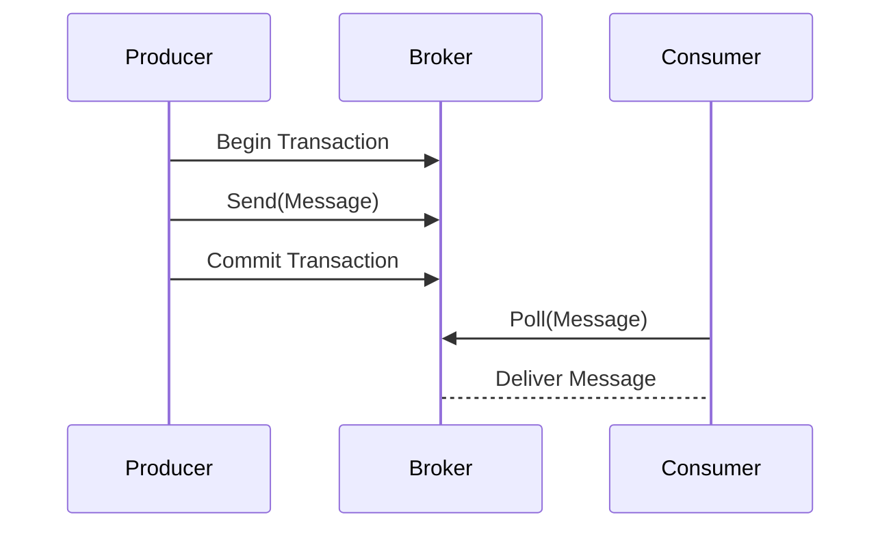

### Overview

Transactional Messaging is a design pattern used to maintain data consistency and reliability by integrating message operations—such as producing, consuming, and processing—into existing transactional contexts. It guarantees that messages are handled in a way that if part of a message operation fails, the entire transaction is rolled back, ensuring atomicity and consistency in distributed systems.

### Design Pattern Details

In distributed cloud environments, where systems may involve multiple services communicating through messages, ensuring the reliability of message processing is critical. Transactional Messaging ensures that any changes made during message processing are committed only if the transaction is successful, otherwise they are rolled back.

#### **Core Concepts:**

1. **Atomicity:** All operations within the transaction are completed successfully, or none are.
2. **Consistency:** System invariants are maintained before and after transaction execution.
3. **Isolation:** Intermediate states of transactions are not visible to other operations.
4. **Durability:** Once a transaction is committed, the changes persist even after a system failure.

### Architectural Approaches

1. **Two-Phase Commit (2PC):** This protocol coordinates a commit across distributed components, ensuring all or none commit the transaction.
2. **Saga Pattern:** A sequence of local transactions where each transaction updates and publishes a message. If a transaction fails, compensating transactions can undo its effects.
3. **Idempotency:** By designing operations to be idempotent, the system can safely retry actions without causing unwanted side effects.
4. **Atomic Processing:** Utilize storage and messaging systems supporting atomic operations, typically found in transactional message queues.

### Best Practices

- **Idempotent Handlers:** Design consumer operations to be idempotent, meaning multiple identical requests should have the same effect as a single request.
- **Retries and Dead Letter Queues (DLQ):** Implement retries with exponential backoffs and DLQs to handle failed message processing gracefully.
- **Monitor and Audit:** Employ comprehensive monitoring and auditing to track transactional states and message flows for trouble-shooting operational issues.

### Example Code

Below is a Java example demonstrating Transactional Messaging using a Kafka transaction:

```java
Properties props = new Properties();
props.put(ProducerConfig.BOOTSTRAP_SERVERS_CONFIG, "localhost:9092");
props.put(ProducerConfig.KEY_SERIALIZER_CLASS_CONFIG, StringSerializer.class.getName());
props.put(ProducerConfig.VALUE_SERIALIZER_CLASS_CONFIG, StringSerializer.class.getName());
props.put(ProducerConfig.ENABLE_IDEMPOTENCE_CONFIG, true);
props.put(ProducerConfig.TRANSACTIONAL_ID_CONFIG, "prod-1");

KafkaProducer<String, String> producer = new KafkaProducer<>(props);
producer.initTransactions();

try {
    producer.beginTransaction();
    producer.send(new ProducerRecord<>("my-topic", "key", "value"));
    // perform other operations
    producer.commitTransaction();
} catch (ProducerFencedException | OutOfOrderSequenceException | AuthorizationException e) {
    // Fatal errors
    producer.close();
} catch (KafkaException e) {
    // Application error encountered
    producer.abortTransaction();
}
```

### Diagrams



### Related Patterns

- **Reliable Messaging:** Focuses on ensuring that messages are delivered without duplication or loss.
- **Compensating Transaction:** Provides a mechanism to undo the effects of transactions that could not be completed successfully.
- **Circuit Breaker Pattern:** Improves system stability and resilience by halting operation requests expected to fail.

### Additional Resources

- [Kafka Transactions: The Ins and Outs](https://kafka.apache.org/documentation/#transactions)
- [Distributed Sagas](https://microservices.io/patterns/data/saga.html)
- [Cloud Pub/Sub Transactional Messaging](https://cloud.google.com/pubsub/docs/transactions)

### Summary

Transactional Messaging is fundamental in cloud-based distributed systems where consistent and reliable message handling is required. By implementing this pattern, systems can ensure atomic message operations, thereby maintaining data integrity and consistency even in complex environments. Balancing transactional guarantees with performance and choosing the appropriate architecture like 2PC or Sagas can significantly impact system reliability and efficiency.
