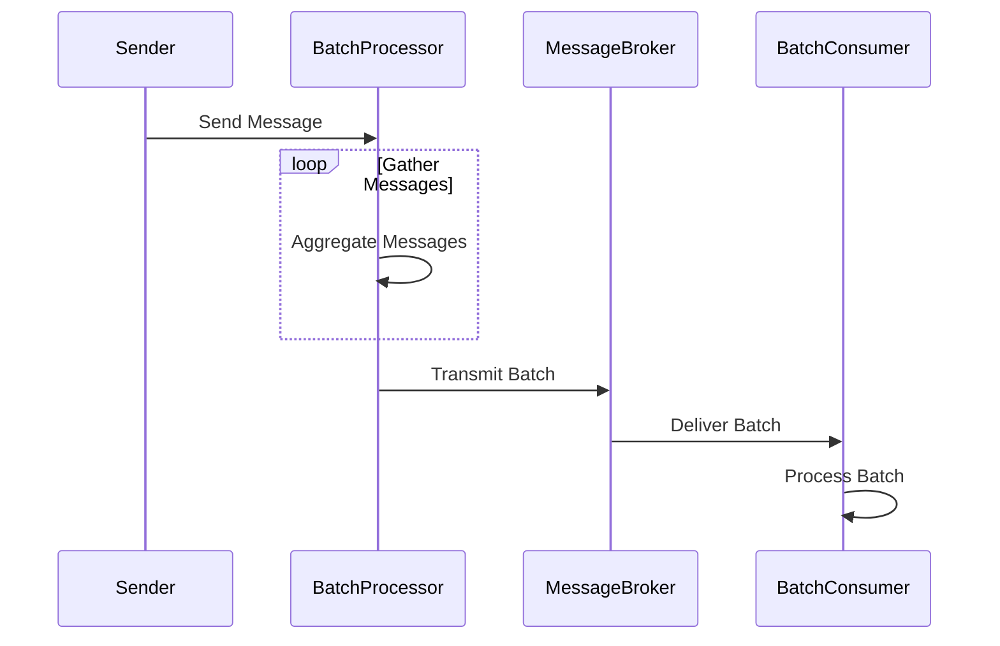

## Introduction

Batch Messaging is a design pattern used to aggregate multiple messages into a single, larger transmission. This approach enhances system efficiency and throughput by making optimal use of bandwidth, reducing the processing overhead required for individual messages, and improving overall application performance in cloud environments.

## Description

Batch Messaging involves collecting individual messages over a period and sending them as a batch rather than as standalone messages. This strategy is beneficial in systems where reducing latency for individual messages is less critical than increasing overall throughput and performance.

## Architectural Approach

### Components

1. **Batch Processor**: Responsible for aggregating messages into batches based on defined criteria (e.g., size, time).
2. **Message Broker**: Transmits the message batches efficiently to the destination.
3. **Batch Consumer**: Receives and processes the batches accordingly.

### Workflow

1. **Collecting Messages**: Incoming messages are gathered by the Batch Processor.
2. **Batch Formation**: Messages are grouped into batches. This can be based on time intervals or a threshold of accumulated message sizes.
3. **Transmission**: Batches are transmitted to the Message Broker.
4. **Processing**: The Batch Consumer processes the message batch.

### Sequence Diagram



## Best Practices

- **Batch Size Management**: Determine optimal batch sizes to balance latency and throughput.
- **Time and Size Thresholds**: Implement time-based and size-based cutoffs to ensure timely delivery.
- **Error Handling**: Ensure robust error-handling strategies are in place to manage partial batch failures.
- **Monitoring and Logging**: Monitor batch sizes, throughput, and error rates to optimize performance.

## Example Code

Here's an example of a Batch Messaging implementation in Java:

```java
import java.util.ArrayList;
import java.util.List;
import java.util.Timer;
import java.util.TimerTask;

public class BatchMessaging {
    private static final int BATCH_SIZE = 10;
    private static final int BATCH_INTERVAL_MS = 5000; // 5 seconds

    private final List<String> messageQueue = new ArrayList<>();
    private final Timer timer = new Timer(true);

    public BatchMessaging() {
        timer.schedule(new TimerTask() {
            @Override
            public void run() {
                sendBatch();
            }
        }, BATCH_INTERVAL_MS, BATCH_INTERVAL_MS);
    }

    public synchronized void enqueueMessage(String message) {
        messageQueue.add(message);
        if (messageQueue.size() >= BATCH_SIZE) {
            sendBatch();
        }
    }

    private synchronized void sendBatch() {
        if (!messageQueue.isEmpty()) {
            // Simulate sending batch
            System.out.println("Sending batch: " + messageQueue.toString());
            messageQueue.clear();
        }
    }

    public static void main(String[] args) {
        BatchMessaging batchMessaging = new BatchMessaging();
        // Simulate sending messages
        for (int i = 0; i < 25; i++) {
            batchMessaging.enqueueMessage("Message " + (i + 1));
        }
    }
}
```

## Related Patterns

- **Message Queuing**: Typically the foundational pattern for queuing messages before batch processing.
- **Event Sourcing**: May use batch processing for persisting events more efficiently.
- **Throttling**: Can be applied to control the rate at which batches are transmitted.

## Additional Resources

- [AWS SQS Batching](https://docs.aws.amazon.com/AWSSimpleQueueService/latest/SQSDeveloperGuide/using-send-message-batch.html)
- [Azure Batch Processing](https://docs.microsoft.com/en-us/azure/batch/)
- [Kafka Batched Produciton](https://kafka.apache.org/documentation/streams/)

## Summary

Batch Messaging significantly enhances communication efficiency in cloud environments by reducing overhead and optimizing bandwidth usage. It is best suited for scenarios where maximizing throughput outweighs the need for real-time message delivery. This pattern can be seamlessly integrated with other messaging patterns like queuing and event sourcing, providing a robust architecture for scalable cloud-based applications.
