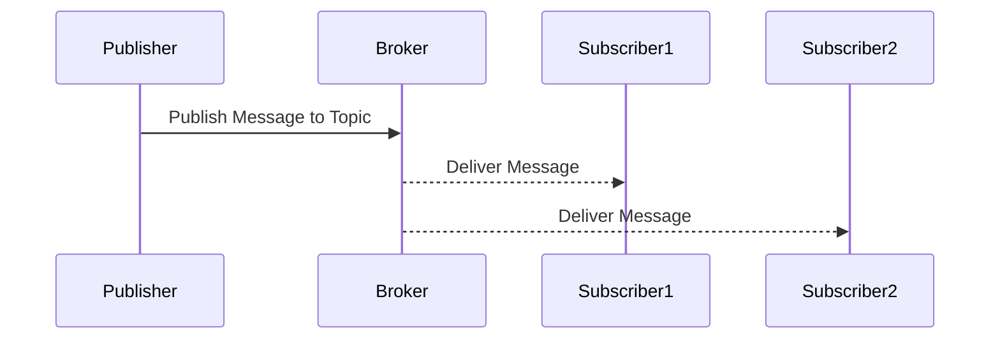

## Introduction

The Publish/Subscribe (Pub/Sub) messaging pattern is a distributed communication paradigm that facilitates asynchronous interaction among decoupled services. This design pattern allows services, known as publishers, to disseminate messages without needing to know the specifics of the receivers, referred to as subscribers. Subscribers express interest in specific topics and automatically receive updates when messages relevant to those topics are published. This decoupling of message producers from consumers significantly improves system modularity, flexibility, and scalability in complex cloud environments.

## Design Pattern Overview

### Key Concepts

- **Publisher**: Entities that create and send messages to a specific topic without any knowledge of the subscribers.
- **Subscriber**: Entities that express interest in particular topics and receive related messages.
- **Topic**: An intermediary channel, often based on specific criteria or subject matter, through which publishers and subscribers communicate.
- **Broker**: A message-oriented middleware responsible for managing topics, ensuring message delivery, and coordinating interactions between publishers and subscribers.

### Architectural Approach

In a typical Pub/Sub architecture, message producers publish their messages to specific topics managed by a broker. The broker then ensures that all subscribed consumers receive relevant messages based on their expressed interests. This architecture is inherently asynchronous, allowing for non-blocking communication between dispersed components.

### Sequence Diagram



## Best Practices

1. **Loose Coupling**: Design with high modularity in mind, utilizing topics to decouple publishers and subscribers. This ensures independent scaling and development.
2. **Scalability**: Use dynamic topic creation and automated scaling to handle varying loads efficiently.
3. **Fault Tolerance**: Implement message persistence and retry mechanisms to ensure message delivery in the face of failures.
4. **Security**: Leverage role-based access control (RBAC) and use encryption to secure the communication channels.

## Example Code

Here's a simple example using Google's Cloud Pub/Sub:

```java
import com.google.cloud.pubsub.v1.*;
import com.google.pubsub.v1.*;

public class PubSubExample {

    public static void main(String[] args) throws Exception {
        // Project and topic identifiers
        String projectId = "your-project-id";
        String topicId = "your-topic-id";
        String subscriptionId = "your-subscription-id";

        // Create a topic
        TopicAdminClient topicAdminClient = TopicAdminClient.create();
        ProjectTopicName topicName = ProjectTopicName.of(projectId, topicId);
        topicAdminClient.createTopic(topicName);

        // Create a subscription
        SubscriptionAdminClient subscriptionAdminClient = SubscriptionAdminClient.create();
        ProjectSubscriptionName subscriptionName = ProjectSubscriptionName.of(projectId, subscriptionId);
        subscriptionAdminClient.createSubscription(subscriptionName, topicName, PushConfig.getDefaultInstance(), 10);

        // Publish a message
        Publisher publisher = Publisher.newBuilder(topicName).build();
        ByteString data = ByteString.copyFromUtf8("Hello, Pub/Sub!");
        PubsubMessage pubsubMessage = PubsubMessage.newBuilder().setData(data).build();
        publisher.publish(pubsubMessage).get();

        // Clean up
        publisher.shutdown();
        topicAdminClient.close();
        subscriptionAdminClient.close();
    }
}
```

## Related Patterns

- **Message Queue**: While similar, this pattern emphasizes point-to-point, guaranteed delivery of messages.
- **Event Sourcing**: Preserves event history and builds state from event sequences which can be integrated with Pub/Sub for notification.

## Additional Resources

- [Google Cloud Pub/Sub Documentation](https://cloud.google.com/pubsub/docs)
- [AWS SNS (Simple Notification Service)](https://aws.amazon.com/sns/)
- [Apache Kafka Documentation](https://kafka.apache.org/documentation/)

## Summary

The Publish/Subscribe messaging pattern is an essential tool for building scalable, decoupled systems in cloud environments. By allowing services to independently publish and subscribe to topics, this pattern facilitates efficient, asynchronous communication across distributed components. It plays a critical role in modern application architectures, especially as systems increasingly rely on microservices and event-driven architectures. Implementing Pub/Sub effectively can lead to significant improvements in application design and operational flexibility.
