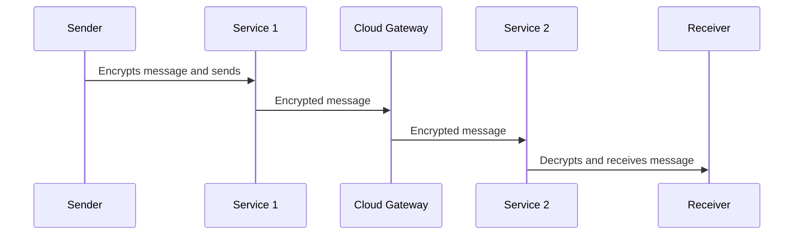

In modern cloud environments, ensuring the confidentiality and integrity of message transmission is paramount. As data flows across distributed systems and spans multiple services, Message Encryption provides a vital mechanism for securing information in transit. This pattern involves encrypting messages to protect them from unauthorized interception and tampering.

## Detailed Explanation

Message Encryption is a critical security measure for any system that involves communication between services, especially in multi-tenant cloud environments where data privacy concerns are heightened. Here's a detailed look at the key aspects of this pattern:

- **Encryption Techniques**: The process involves encrypting the message payload using cryptographic algorithms. Common algorithms include AES (Advanced Encryption Standard) for symmetric encryption and RSA (Rivest-Shamir-Adleman) for asymmetric encryption.

- **Key Management**: Proper management and distribution of encryption keys are crucial to maintaining security. Utilizing cloud-based key management solutions like AWS KMS, Google Cloud KMS, or Azure Key Vault can simplify this aspect by automating key rotation and storage.

- **Transport Layer Security (TLS)**: In addition to message encryption, securing the transport layer with protocols like TLS is advisable to protect data integrity and prevent attacks such as man-in-the-middle.

- **Message Integrity**: To ensure that the message has not been altered during transit, techniques like hashing and digital signatures can be employed. This step verifies the sender's identity and ensures message authenticity.

### Architectural Approaches

1. **Decentralized Encryption**: Each service independently encrypts outgoing messages and decrypts incoming messages. This approach suits microservices architectures where services operate with autonomy.

2. **Centralized Gateway Encryption**: A centralized gateway handles encryption and decryption before passing messages to services. This can simplify key management and logging but may introduce a single point of failure.

3. **End-to-End Encryption**: Provides the highest security level by encrypting messages on the sender's side and only decrypting them on the recipient's side, ensuring that intermediaries cannot access the plaintext.

## Best Practices

- **Use Strong Encryption Standards**: Ensure that encryption methods comply with the latest cryptographic standards.

- **Automate Key Rotation**: Regularly rotating encryption keys helps prevent key leakage and compromises.

- **Log Access Control**: Restrict and audit access to encryption keys using IAM policies and logging services.

- **Integrate with CI/CD**: Incorporate encryption and decryption processes into the CI/CD pipeline for seamless deployment.

## Example Code

### Symmetric Encryption Using AES in Java

```java
import javax.crypto.Cipher;
import javax.crypto.KeyGenerator;
import javax.crypto.SecretKey;

public class MessageEncryptionExample {

    public static void main(String[] args) throws Exception {
        // Generate a key
        KeyGenerator keyGenerator = KeyGenerator.getInstance("AES");
        keyGenerator.init(256);
        SecretKey key = keyGenerator.generateKey();

        // Encrypt a message
        String message = "Sensitive data here";
        Cipher cipher = Cipher.getInstance("AES");
        cipher.init(Cipher.ENCRYPT_MODE, key);
        byte[] encryptedMessage = cipher.doFinal(message.getBytes());

        // Decrypt the message
        cipher.init(Cipher.DECRYPT_MODE, key);
        byte[] decryptedMessage = cipher.doFinal(encryptedMessage);

        System.out.println("Original Message: " + message);
        System.out.println("Decrypted Message: " + new String(decryptedMessage));
    }
}
```

### Sequence Diagram



## Related Patterns

- **Transport Layer Security (TLS)**: Adds security to the transport layer.
- **Authentication and Authorization**: Ensures only authorized entities can encrypt/decrypt messages.
- **Data Masking**: An additional technique for sensitive data protection.

## Additional Resources

- [AWS Key Management Service (KMS)](https://aws.amazon.com/kms/)
- [Google Cloud Key Management](https://cloud.google.com/security-key-management)
- [Azure Key Vault](https://azure.microsoft.com/en-us/services/key-vault/)
- [Cryptography Best Practices](https://cheatsheetseries.owasp.org/cheatsheets/Cryptographic_Storage_Cheat_Sheet.html)

## Summary

Message Encryption is an essential pattern for securing communications in cloud environments. By applying encryption to messages, organizations can ensure data integrity, confidentiality, and prevent unauthorized access, thereby enhancing overall system security and trust. Proper implementation involves leveraging robust encryption algorithms, effective key management, and integrating these processes into existing systems and deployment pipelines to achieve comprehensive protection against evolving threats.
