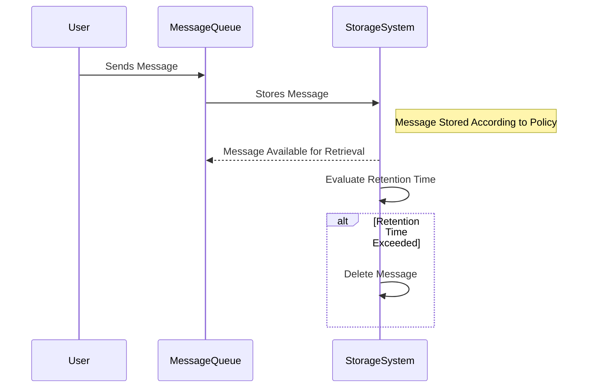

---

linkTitle: "Message Retention Policies"
title: "Message Retention Policies: Managing Message Lifecycles in Cloud Messaging Systems"
category: "Messaging and Communication in Cloud Environments"
series: "Cloud Computing: Essential Patterns & Practices"
description: "An exploration of message retention policies in cloud-based messaging systems, detailing how these policies manage the lifecycle of messages to optimize storage, configuration strategies, manage costs, and ensure system reliability and compliance."
categories:
- Cloud Computing
- Messaging Systems
- Data Management
tags:
- Message Retention
- Cloud Messaging
- System Design
- Data Lifecycle Management
- Messaging Policies
date: 2024-07-07
type: docs

canonical: "https://softwarepatternslexicon.com/18/19/21"
license: "© 2024 Tokenizer Inc. CC BY-NC-SA 4.0"
---

## Introduction to Message Retention Policies

Message retention policies are integral to cloud-based messaging systems, as they dictate how long messages are kept in storage and ensure compliance with business, legal, and operational requirements. These policies help manage storage costs, ensure message availability for the appropriate duration, and aid in the proper planning of message lifecycles.

## Design Pattern: Message Retention Policies

Message retention policies broadly define how messages are stored and purged across nodes within a distributed environment. These policies can be customized based on system requirements and can vary widely depending on the architecture and intended use case.

### Key Considerations

- **Storage Duration**: Defines the length of time messages should be retained. This can vary depending on the type of data, its importance, and legal compliance needs.
  
- **Message Purging**: Establishes criteria and mechanisms for removing messages after they have surpassed their retention period.

- **Cost Management**: Balances between over-provisioning storage and ensuring message availability.

- **System Reliability**: Ensures that necessary messages are retained throughout processes such as replaying failed transactions or system recovery efforts.

- **Compliance**: Aligns with legal or industry requirements related to data protection and auditing.

## Architectural Approaches

1. **Time-Based Policies**: Messages are retained for a specific duration (e.g., 24 hours, 7 days) before automatic deletion. This method is straightforward and suitable for many use cases with fixed retention requirements.

2. **Size-Based Policies**: Messages are retained until certain storage thresholds are met. This policy adapts to fluctuating data volumes but may require sophisticated management.

3. **Event-Based Policies**: Messages are retained based on the occurrence of specific events (e.g., post-processing completion). This approach is dynamic but may add complexity to system design.

4. **Hybrid Retention Policies**: Combines various attributes like time, size, and events to create a flexible retention strategy, suitable for complex systems handling diverse message types.

## Example Code

Below is an example illustrating a time-based message retention policy using a hypothetical message queue framework:

```java
import com.messaging.QueueConfiguration;

public class MessageRetentionExample {

    public static void main(String[] args) {
        QueueConfiguration queueConfig = new QueueConfiguration.Builder()
                .withRetentionPolicy("TimeBased")
                .withRetentionDuration(7) // Retain messages for 7 days
                .build();

        System.out.println("Queue configured with a 7-day message retention policy.");
    }
}
```

## Diagrams

### Message Retention Policy Lifecycle



## Related Patterns

- **Queue-Based Load Leveling**: Utilizes queues to smooth out peaks in system loads, which requires managing message retention efficiently to avoid data loss.
  
- **Competing Consumers**: Multiple consumer processes compete to process messages from a queue and are reliant on appropriate message retention to balance loads effectively.

## Best Practices

- Implement clear and well-documented message retention policies to prevent data loss and ensure regulatory compliance.
  
- Regularly audit message transactions to verify that retention policies are effectively implemented and adhered to.

- Use monitoring tools to track storage usage and optimize retention policies for cost efficiency and system performance.

## Additional Resources

- [AWS Messaging and Targeted Policy Documentation](https://docs.aws.amazon.com/)
- [Google Cloud Pub/Sub Retention Policies](https://cloud.google.com/pubsub/docs/)
- [Azure Service Bus Message Lifecycle](https://docs.microsoft.com/en-us/azure/service-bus-messaging/)

## Summary

Message retention policies play a critical role in modern cloud messaging systems, balancing between operational efficiency and compliance. By leveraging appropriate retention strategies, organizations can optimize storage costs, ensure message availability, and meet critical business and legal requirements. The example and approaches discussed provide a framework to design efficient and compliant messaging architectures.


