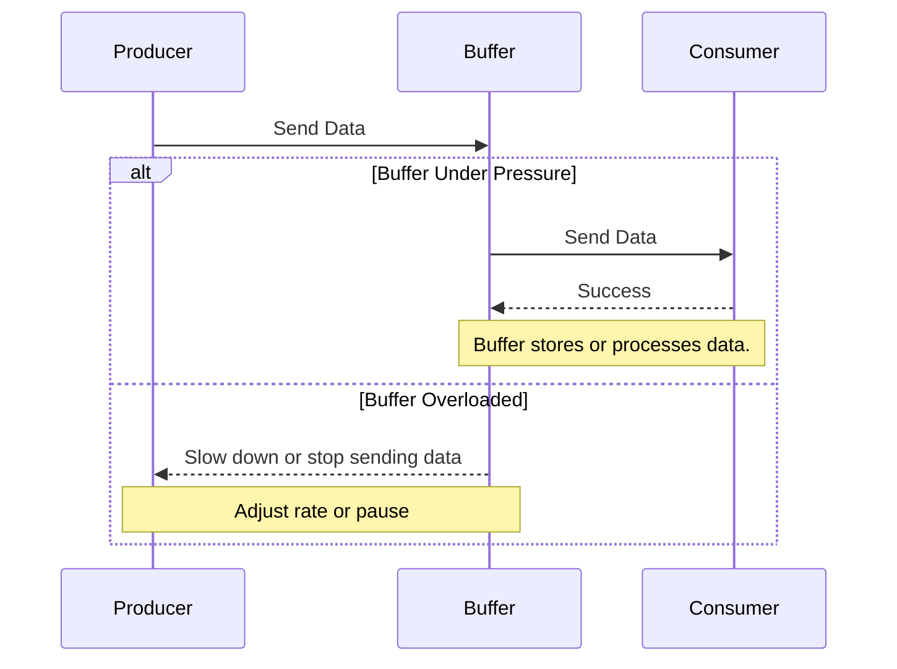

## Introduction

In cloud computing environments, the ability to manage data flow efficiently is crucial, especially when systems are overloaded with incoming messages or requests. **Backpressure Handling** is a pattern used to control the flow of data to ensure that the system can handle the load effectively without degrading performance or losing data.

## Problem Statement

In asynchronous messaging systems, producers might send data at a rate faster than consumers can process. This leads to a bottleneck where the system becomes overburdened, resulting in degraded performance, increased latency, or even failures. Without a mechanism to regulate this flow, the whole system can suffer.

## Solution

Backpressure Handling provides a systematic way to manage and control the rate of data flow between producers and consumers. It involves several strategies:

1. **Buffering**: Temporarily storing messages until they can be processed. While this allows for short-term management of bursts, excessive buffering can lead to memory overhead.

2. **Throttling**: Limiting the rate at which data is sent to match the consumer's processing capability. This can be managed by introducing delays or sending notifications to slow down the sender.

3. **Dropping Data**: When certain message payloads are non-critical, they can be dropped or sampled before processing to prevent overload.

4. **Batching**: Aggregating messages into batches before processing them to improve throughput while reducing the rate of processing overhead.

5. **Load Shedding**: Discarding less important or stale messages, or temporarily disabling certain parts of the system until load is manageable.

6. **Reactive Streams**: Utilizing frameworks that natively support backpressure, allowing consumers to explicitly request data at a rate they can handle.

## Example Code

Here's an example in Java demonstrating a simple backpressure handling mechanism using reactive streams:

```java
Flowable<Integer> source = Flowable.range(1, 1000000)
    .onBackpressureDrop()
    .observeOn(Schedulers.computation());

source.subscribe(new DefaultSubscriber<Integer>() {
    @Override
    protected void onStart() {
        request(1); // initial request
    }

    @Override
    public void onNext(Integer item) {
        try {
            // Simulate processing delay
            Thread.sleep(100);
        } catch (InterruptedException e) {
            e.printStackTrace();
        }
        request(1);
    }

    @Override
    public void onError(Throwable t) {
        t.printStackTrace();
    }

    @Override
    public void onComplete() {
        System.out.println("Completed");
    }
});
```

## Diagrams

### Flow Diagram of Backpressure Handling



## Related Patterns

- **Circuit Breaker**: Used in conjunction with Backpressure Handling to prevent service degradation by breaking the circuit to unresponsive parts of the system.
- **Bulkhead**: Isolates different components to prevent a failure in a single part from cascading in the system.

## Additional Resources

- [Reactive Streams Specification](https://www.reactive-streams.org/)
- "Reactive Programming with RxJava" by Tomasz Nurkiewicz and Ben Christensen.
- [Backpressure in Apache Kafka](https://kafka.apache.org/documentation/)

## Summary

The Backpressure Handling pattern is essential for maintaining stability and ensuring efficient data processing in overloaded cloud systems. By implementing strategies like buffering, throttling, and reactive streams, cloud-based architectures can manage data flow effectively, prevent bottlenecks, and maintain high system performance. Understanding and applying this pattern is crucial for engineers dealing with high-throughput scenarios in cloud computing.
