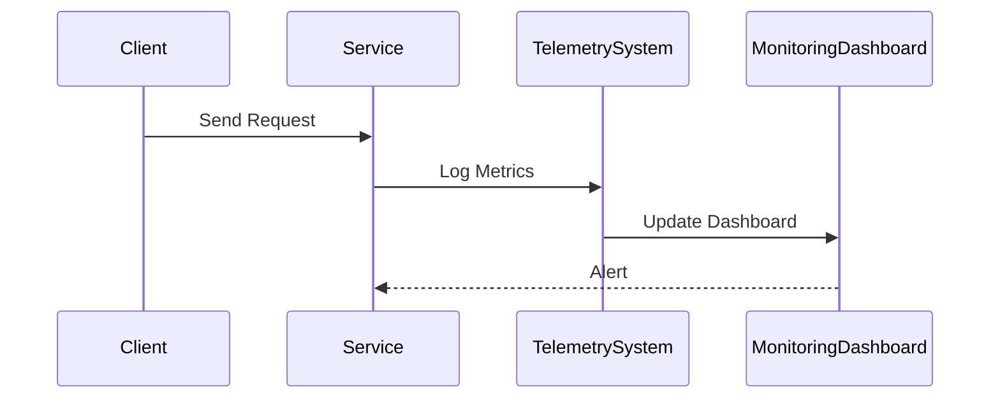

## Overview

In the context of cloud computing, **Telemetry and Monitoring** play crucial roles in maintaining the health and efficiency of messaging systems. By collecting and analyzing message metrics, organizations can gain insights into system performance, identify bottlenecks, and preemptively address potential issues.

## Design Pattern Description

**Telemetry** involves the automatic measurement and transmission of data from remote sources. It ensures that key performance indicators (KPIs) are consistently captured across various system components. **Monitoring**, on the other hand, leverages telemetry data to observe systems in real-time, conduct performance analysis, and swiftly react to anomalies or failures.

The combination of telemetry and monitoring enables a proactive approach to system health and performance management, essential in dynamic cloud environments.

## Architectural Approaches

1. **Centralized Logging**:
   - Use a centralized logging service (e.g., ELK Stack, AWS CloudWatch) to aggregate logs from different components.
   - Benefits include simplified tracking and troubleshooting processes.

2. **Distributed Tracing**:
   - Implement distributed tracing (e.g., OpenTelemetry, Jaeger) to trace requests and transactions as they cross through microservices.
   - Provides end-to-end visibility and assists in pinpointing performance issues.

3. **Metric Collection and Monitoring Tools**:
   - Use tools like Prometheus, Grafana, or Azure Monitor for collecting metrics such as message latency, throughput, and error rates.
   - These tools offer real-time dashboards for easy monitoring.

## Best Practices

- **Define Key Metrics**: Identify metrics critical to business outcomes, such as message delivery time, system uptime, and error rates.
- **Implement Alerting**: Set thresholds and automated alerting on KPIs to ensure quick response to unusual patterns.
- **Data Retention**: Ensure adequate storage for historical data to support trend analysis and capacity planning.
- **Security and Compliance**: Ensure that telemetry data collection and monitoring comply with security and privacy standards.

## Example Code

Below is an example demonstrating how to set up a basic telemetry and monitoring system for a messaging queue using Prometheus and Grafana.

```java
import io.prometheus.client.Counter;
import io.prometheus.client.exporter.HTTPServer;
import io.prometheus.client.hotspot.DefaultExports;

public class TelemetryExample {
    static final Counter requests = Counter.build()
        .name("http_requests_total")
        .help("Total HTTP Requests")
        .register();

    public static void main(String[] args) throws Exception {
        DefaultExports.initialize();
        HTTPServer server = new HTTPServer(1234);

        // Simulate processing requests
        for (int i = 0; i < 1000; i++) {
            processRequest();
        }

        server.stop();
    }

    private static void processRequest() {
        // Implement message handling here
        requests.inc();
    }
}
```

## Diagrams

Here is a simple sequence diagram depicting the telemetry system:



## Related Patterns

- **Circuit Breaker**: Prevents system failures by stopping the execution of calls that are likely to fail.
- **Health Check**: Actively checks the availability of applications and services.
- **Load Balancing**: Distributes incoming network traffic across multiple servers to ensure no single server becomes overwhelmed.

## Additional Resources

- [Prometheus Documentation](https://prometheus.io/docs/introduction/overview/)
- [Grafana Documentation](https://grafana.com/docs/grafana/latest/)
- [OpenTelemetry Documentation](https://opentelemetry.io/)

## Summary

Effective telemetry and monitoring are integral for the robust operation of cloud communication systems. By tracking and analyzing message metrics, organizations can ensure optimal system performance, quickly identify issues, and maintain high availability and reliability in cloud environments. Leveraging modern monitoring tools and strategies will enhance operational insights and drive proactive system management.
