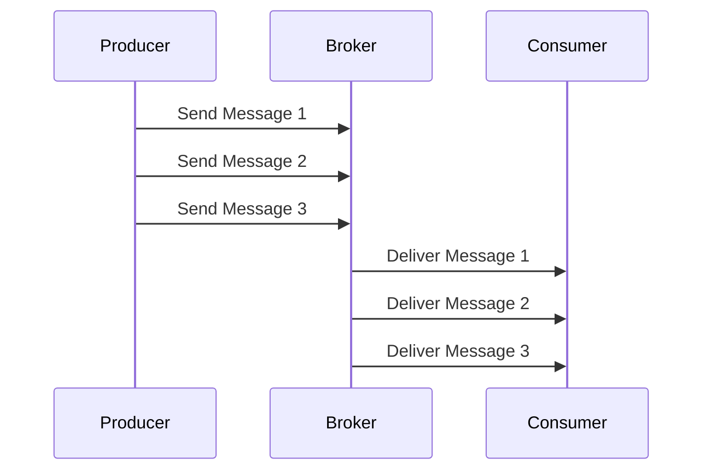

## Introduction

In distributed systems and cloud environments, ensuring the correct order of message processing is crucial for maintaining data integrity and consistency. **Message Sequencing** is a design pattern that addresses this challenge by providing mechanisms to ensure messages are processed in their intended sequence.

### Problem

In systems where messages are processed asynchronously or across distributed nodes, maintaining the order of operations can be challenging. For instance, updates to a customer record might need to occur in the same order they were initiated. Without a sequencing mechanism, these updates could be processed out of order, leading to data inconsistencies.

### Solution

The Message Sequencing pattern ensures that messages are processed in the exact order they are received or created. This can be achieved through various strategies:

1. **Sequence Identifiers**: Attach a unique sequence number to each message. As messages are processed, they are checked against their sequence numbers to ensure the correct processing order.
   
2. **Ordered Delivery Channels**: Use message brokers or channels that guarantee message order, such as Kafka, which can ensure order within a partition.

3. **Transactional Operations**: Enforce ordering at the database or storage level by using transactions and isolated operations.

### Example Code

Below is an example of using a message broker that supports ordering, like Apache Kafka, to maintain message sequencing.

```java
import org.apache.kafka.clients.producer.KafkaProducer;
import org.apache.kafka.clients.producer.ProducerRecord;
import java.util.Properties;

public class MessageSequencer {
    private final KafkaProducer<String, String> producer;

    public MessageSequencer(String bootstrapServers) {
        Properties props = new Properties();
        props.put("bootstrap.servers", bootstrapServers);
        props.put("key.serializer", "org.apache.kafka.common.serialization.StringSerializer");
        props.put("value.serializer", "org.apache.kafka.common.serialization.StringSerializer");
        props.put("acks", "all");
        this.producer = new KafkaProducer<>(props);
    }

    public void sendMessage(String topic, String key, String message) {
        // In Kafka, messages with the same key go to the same partition, preserving the order
        ProducerRecord<String, String> record = new ProducerRecord<>(topic, key, message);
        producer.send(record);
    }

    public void close() {
        producer.close();
    }
}
```

### Diagram



### Related Patterns

- **Message Deduplication**: Ensures that each message is processed only once, often used in tandem with Message Sequencing for idempotency.
- **Competing Consumers**: Used in scenarios to manage load, while Message Sequencing ensures ordered consumption even with multiple consumers.

### Additional Resources

- [CAP Theorem and Distributed Systems](https://en.wikipedia.org/wiki/CAP_theorem)
- [Kafka's Strong Ordering Guarantees](https://kafka.apache.org/documentation/#design)
- [Transactional Messaging in Cloud Systems](https://docs.microsoft.com/en-us/azure/architecture/patterns/transactional-outbox)

### Final Summary

The Message Sequencing pattern is essential for maintaining proper message processing order within distributed systems. By implementing this pattern, developers can ensure data consistency and integrity across cloud-based applications. This pattern leverages sequence identifiers, ordered delivery channels, or transactional operations to manage message order effectively, providing a robust foundation for building reliable message-driven systems.

By understanding and applying the Message Sequencing pattern, organizations can tackle one of the common challenges in asynchronous and distributed environments, delivering reliable and consistent cloud services.
