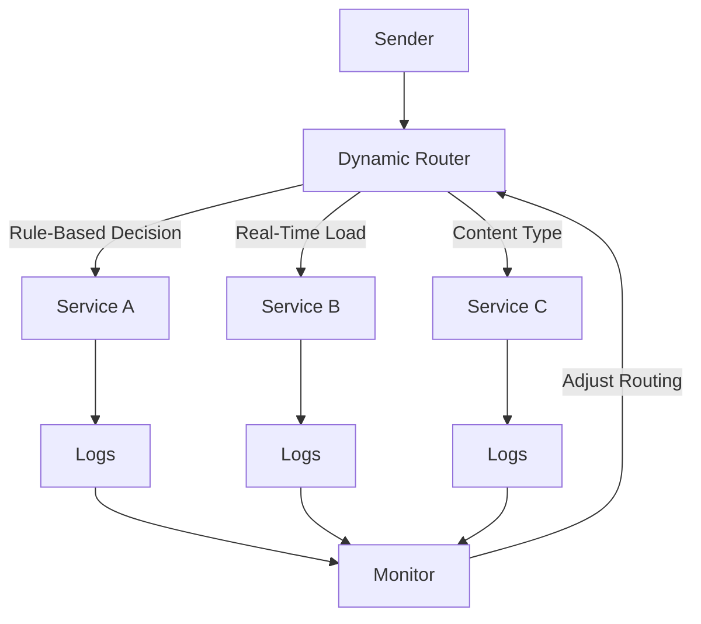

## Overview

Dynamic Message Routing is a design pattern used in cloud environments to control and adapt the flow of messages dynamically, based on real-time conditions. This pattern is particularly useful in systems that require flexibility and responsiveness, such as distributed applications and microservices architectures that need to handle varying loads and priorities.

## Detailed Explanation

### Problem

In a distributed system, different parts of the application might need to handle messages differently based on current state, load, or context. Static message routing can lead to bottlenecks and inefficiencies, especially when system conditions change dynamically.

### Solution

Dynamic Message Routing enables messages to be routed to different destinations based on rules or real-time evaluations. This is achieved using dynamic routing algorithms and logic that can consider current system states, message content, or other contextual data to make routing decisions.

#### Key Components

- **Router**: The core component that manages the routing logic. It uses pre-defined rules or conditions to evaluate and direct messages to the appropriate destination.
- **Rules Engine**: Defines the conditions under which messages are rerouted. It can include load balancing logic, content-based routing, or priority-based routing.
- **Monitoring and Feedback Loop**: Continuously monitors system conditions and adapts the routing rules and decisions in real-time.

### Architecture

#### Diagram: Dynamic Message Routing Architecture



### Example Code

Below is a simple implementation using a hypothetical message routing framework in **Java**:

```java
public class DynamicRouter {
    
    // Pseudocode for routing example
    public Destination routeMessage(Message message) {
        if (message.containsPriority("HIGH")) {
            return highPriorityQueue;
        } else if (systemLoad.isHigh()) {
            return backupQueue;
        } else if (message.getType().equals("EVENT")) {
            return eventQueue;
        } else {
            return defaultQueue;
        }
    }
}
```

### Best Practices

- **Decouple Logic**: Keep routing rules and message handling logic separate to enhance maintainability.
- **Monitor and Adapt**: Deploy monitoring tools to assess system load and adjust routing logic in real-time.
- **Failover Mechanisms**: Implement fallback routes for fault tolerance.
- **Performance Optimization**: Regularly profile routing decisions to ensure they are performant and do not become bottlenecks.

## Related Patterns

- **Content-Based Router**: Directs messages to different paths based on message content.
- **Load Balancer**: Distributes load across multiple services to improve system performance.
- **Circuit Breaker**: Helps systems gracefully handle failures, reducing the risk of cascading failures.

## Additional Resources

- Martin Fowler’s book on Enterprise Integration Patterns
- Cloud-Native Patterns for scaling distributed systems
- Documentation on AWS SNS and Google Pub/Sub for message routing

## Summary

Dynamic Message Routing is an invaluable design pattern for cloud environments needing high adaptability and responsiveness. By leveraging real-time conditions and adaptable routing logic, systems can ensure more efficient and reliable message delivery, accommodating dynamic workloads and varying application requirements. This pattern is essential for modern cloud architectures, particularly in microservices and IoT applications.
