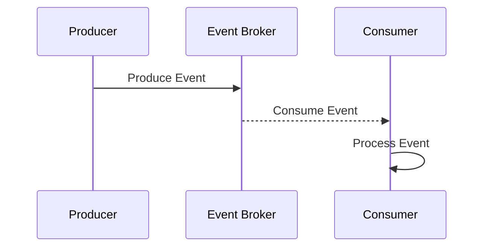
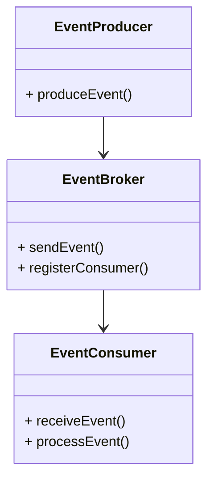

## Overview

Event-Driven Architecture (EDA) is a design pattern that enables the creation of highly responsive systems by leveraging events to trigger actions across different services and systems. This architectural style is characterized by its ability to decouple components, leading to systems that are more scalable, resilient, and adaptable to changes.

## Architectural Approaches

In an Event-Driven Architecture, the core concept revolves around **events**—significant changes in system state that can be produced, detected, and reacted to. There are several key components and approaches:

1. **Event Emitters/Producers**: Components that generate events when something notable happens, such as a new transaction or user registration.

2. **Event Consumers/Listeners**: Components or services that respond to events by executing predefined business logic.

3. **Event Channels/Brokers**: Middleware that routes events from producers to consumers. Common examples include Apache Kafka, RabbitMQ, and AWS SNS/SQS.

4. **Event Processing Models**:
   - **Simple Events**: Processed independently and represent a single change of state.
   - **Complex Events**: Derived by analyzing patterns within multiple simple events over time.

## Best Practices

- **Decouple Producers and Consumers**: Aim to minimize dependencies between event producers and consumers for improved flexibility and scalability.
- **Reliable Message Delivery**: Use event brokers that guarantee delivery (e.g., exactly-once or at-least-once semantics) to avoid data inconsistency.
- **Schema Design**: Maintain a consistent schema for events to ensure interoperability over time.
- **Error Handling and Monitoring**: Implement robust error handling and monitoring to quickly identify and respond to issues.
- **Scalability Considerations**: Design for scale by ensuring stateless processing in consumers and using distributed event brokers.

## Example Code

Here's an example using Java and Apache Kafka:

```java
import org.apache.kafka.clients.producer.KafkaProducer;
import org.apache.kafka.clients.producer.ProducerRecord;
import java.util.Properties;

public class EventProducer {

    public static void main(String[] args) {
        Properties props = new Properties();
        props.put("bootstrap.servers", "localhost:9092");
        props.put("key.serializer", "org.apache.kafka.common.serialization.StringSerializer");
        props.put("value.serializer", "org.apache.kafka.common.serialization.StringSerializer");

        KafkaProducer<String, String> producer = new KafkaProducer<>(props);
        ProducerRecord<String, String> record = new ProducerRecord<>("events", "user_signup", "User123 signed up");

        producer.send(record);
        producer.close();
    }
}
```

## Diagrams

### UML Sequence Diagram



### UML Class Diagram



## Related Patterns

- **Publish-Subscribe Model**: A pattern often used where published messages are received by all subscribers.
- **CQRS (Command Query Responsibility Segregation)**: Often paired with EDA to segregate data reading and writing.
- **Event Sourcing**: Captures state changes as a sequence of events for replayability and auditing.

## Additional Resources

- [Building Event-Driven Microservices](https://www.oreilly.com/library/view/building-event-driven-microservices/)
- [Event-Driven Architecture at AWS](https://aws.amazon.com/event-driven-architecture/)
- [Apache Kafka Documentation](https://kafka.apache.org/documentation/)

## Summary

The Event-Driven Architecture pattern is pivotal for building systems that are capable of rapid response to changes. By decoupling services, enabling scalability, and improving resilience, EDA supports the development of cloud-native applications that can effortlessly adapt to dynamic environments.
