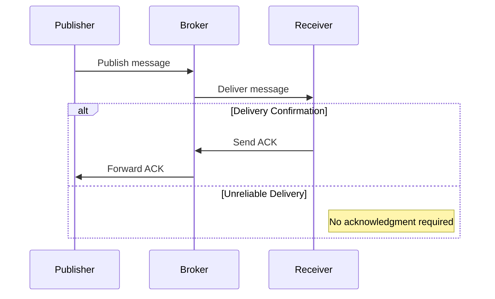

## Introduction

In the ever-evolving world of cloud computing, efficient messaging protocols are crucial for facilitating seamless communication between distributed systems and applications. Protocols like Advanced Message Queuing Protocol (AMQP) and Message Queuing Telemetry Transport (MQTT) are widely adopted for their capabilities in ensuring efficient, reliable, and scalable messaging.

## Design Pattern: Protocol Optimization

### Context

As cloud environments scale, managing inter-service communication and data flow becomes increasingly challenging. There are varying requirements, such as latency, reliability, delivery assurance, and resource constraints. Choosing the right protocol is paramount to meeting these needs efficiently.

### Problem

With the diverse requirements of modern applications, selecting an optimal protocol for messaging can significantly affect performance, reliability, and resource utilization. Protocols must be able to efficiently handle varying loads, ensure message delivery, and provide resilience against network failures.

### Solution

**AMQP and MQTT** are among the preferred protocols, each offering distinct advantages that can be tailored to specific messaging scenarios:

- **AMQP (Advanced Message Queuing Protocol):**
  - Suitable for environments requiring reliable, secure, and interoperable message interchange.
  - Ensures guaranteed delivery, acknowledgments, and high throughput.
  - Supports complex routing mechanisms.

- **MQTT (Message Queuing Telemetry Transport):**
  - Ideal for lightweight, bandwidth-constrained environments.
  - Optimizes low-power usage and operates effectively in unstable networks.
  - Implements a simple publish/subscribe model.

### Implementation

#### Example Code

Here is a basic example illustrating how AMQP and MQTT can be used within applications:

**AMQP Example:**

```java
import com.rabbitmq.client.*;

public class AMQPExample {
    private final static String QUEUE_NAME = "exampleQueue";

    public static void main(String[] args) throws Exception {
        ConnectionFactory factory = new ConnectionFactory();
        factory.setHost("localhost");
        try (Connection connection = factory.newConnection(); 
             Channel channel = connection.createChannel()) {
            channel.queueDeclare(QUEUE_NAME, false, false, false, null);
            String message = "Hello, AMQP!";
            channel.basicPublish("", QUEUE_NAME, null, message.getBytes());
            System.out.println(" [x] Sent: '" + message + "'");
        }
    }
}
```

**MQTT Example:**

```java
import org.eclipse.paho.client.mqttv3.*;

public class MQTTExample {

    public static void main(String[] args) {
        String broker = "tcp://localhost:1883";
        String clientId = "JavaClient";
        MemoryPersistence persistence = new MemoryPersistence();

        try {
            MqttClient sampleClient = new MqttClient(broker, clientId, persistence);
            MqttConnectOptions connOpts = new MqttConnectOptions();
            connOpts.setCleanSession(true);
            sampleClient.connect(connOpts);
            String topic = "test/topic";
            String content = "Hello MQTT!";
            int qos = 2;
            MqttMessage message = new MqttMessage(content.getBytes());
            message.setQos(qos);
            sampleClient.publish(topic, message);
            System.out.println("Message published: " + content);
            sampleClient.disconnect();
        } catch (MqttException me) {
            me.printStackTrace();
        }
    }
}
```

#### Diagram



## Related Patterns

- **Publish-Subscribe Pattern:** This pattern is heavily utilized in both AMQP and MQTT to decouple message producers and consumers.
- **Message Queuing Pattern:** Ensures reliable message delivery and buffering capability.
- **Circuit Breaker Pattern:** Useful in managing fault tolerance in the communication paths that use protocols like AMQP and MQTT.

## Best Practices

- **Protocol Selection:** Evaluate your application's specific needs in terms of bandwidth, latency, and reliability to select the most suitable protocol.
- **Network Optimization:** Configure appropriately to minimize overhead and maximize throughput.
- **Security Considerations:** Implement authentication and encryption as required by the protocol to protect message integrity and confidentiality.

## Additional Resources

- [AMQP Official Site](https://www.amqp.org/)
- [MQTT Organization](http://mqtt.org/)
- [RabbitMQ Documentation](https://www.rabbitmq.com/documentation.html)
- [Eclipse Paho MQTT](https://www.eclipse.org/paho/)

## Summary

Protocol optimization is pivotal in enhancing communication efficacy across distributed systems in the cloud. Both AMQP and MQTT provide robust solutions tailored for different environments - AMQP for secure, reliable messaging and MQTT for low-bandwidth, constrained scenarios. Understanding their characteristics and applying them judiciously can significantly improve system performance, resilience, and resource efficiency.
