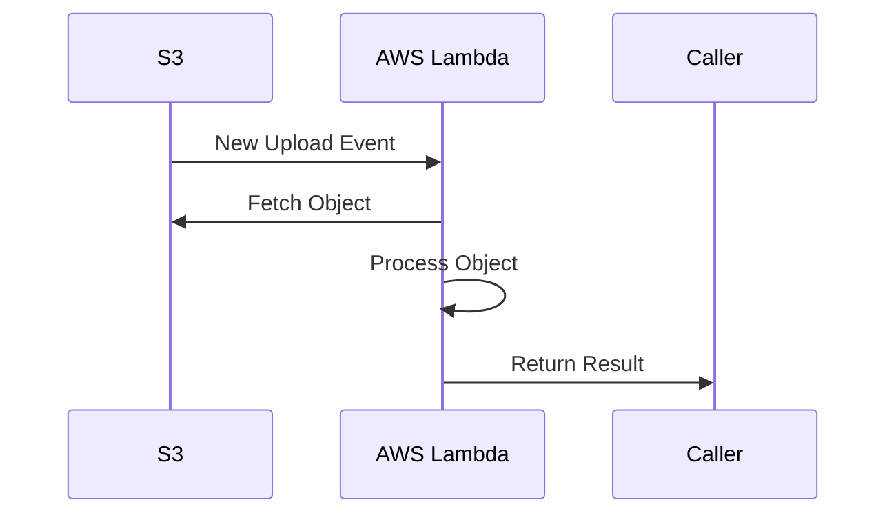

## Introduction

As cloud computing evolves, leveraging serverless architectures has become a powerful approach for building scalable, efficient, and cost-effective applications. One prominent pattern in this realm is **Integration with Cloud Functions**, which involves triggering serverless functions to execute in response to messages or events.

## Design Pattern Explanation

**Integration with Cloud Functions** refers to utilizing cloud-based, serverless computing environments, such as AWS Lambda, Azure Functions, or Google Cloud Functions to respond to an incoming message or event. This integration enables applications to process events asynchronously, thus decoupling the message producers from consumers and handling workloads elastically without the need for explicit resource provisioning.

### Benefits

1. **Scalability**: Automatically scales up or down according to the load, handling varying message volumes seamlessly.
2. **Cost Efficiency**: Only pay for the actual execution time of the cloud functions, reducing idle resource costs.
3. **Reduced Complexity**: Simplifies architecture by eliminating the need to manage server instances or container orchestration.
4. **Rapid Deployment**: Speeds up the development cycle by focusing on the code without worrying about the infrastructure setup.

## Architectural Approaches

### Event-Driven Architecture

In an event-driven architecture, cloud functions can subscribe to topics and trigger executions automatically. This approach allows systems to act immediately in response to events generated from various sources, such as databases, message brokers, or HTTP requests.

### Messaging Patterns

Cloud functions are typically integrated with messaging systems like AWS SQS, Google Pub/Sub, or Azure Service Bus. Message queues act as intermediaries ensuring reliable communication and delivery to the respective cloud function.

## Example Code

Here's a simple example of integrating an AWS Lambda function with an S3 bucket to automatically process files uploaded to the bucket.

```javascript
exports.handler = async (event) => {
  event.Records.forEach(record => {
    const bucket = record.s3.bucket.name;
    const key = record.s3.object.key;
    
    console.log(`New file uploaded: ${bucket}/${key}`);
    // Add your processing logic here
  });
};
```

## Diagrams

### Sequence Diagram



## Related Patterns

- **Event Sourcing**: Captures all changes to an application state as a sequence of events.
- **CQRS (Command Query Responsibility Segregation)**: Segregates the responsibility of handling data operations into distinct commands and queries for optimized performance.
- **Fan-out/Fan-in**: Distributes work across multiple nodes and then consolidates results back into a single unit.

## Additional Resources

- [AWS Lambda: Developer Guide](https://docs.aws.amazon.com/lambda/latest/dg/welcome.html)
- [Azure Functions Documentation](https://docs.microsoft.com/en-us/azure/azure-functions/)
- [Google Cloud Functions Quickstart](https://cloud.google.com/functions/docs/quickstart)

## Summary

The integration with cloud functions pattern enables developers to build resilient and flexible systems that respond to events as they happen. By taking advantage of serverless computing, organizations can achieve significant efficiencies in both cost and operations. This approach fosters the development of modern, reactive applications that scale effortlessly and are easy to maintain, ultimately leading to better performance and user satisfaction.
