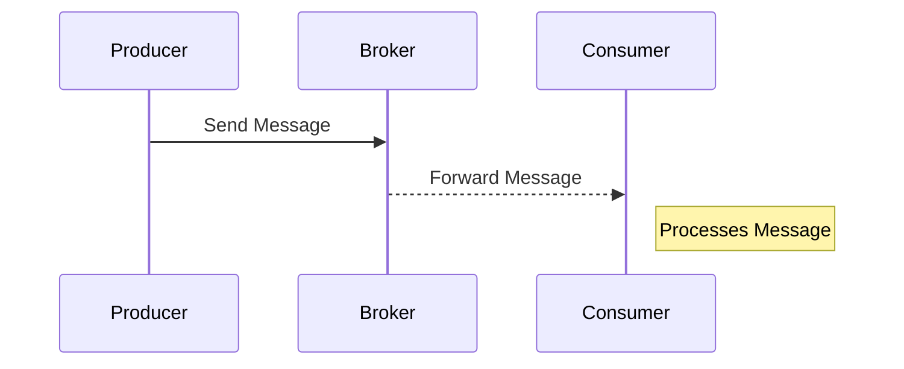

In modern cloud environments, asynchronous messaging is a fundamental design pattern that allows systems to decouple communication and process execution. This pattern helps in achieving scalability, fault tolerance, and high availability in distributed architectures, such as microservices.

## Detailed Explanation

### Definition

**Asynchronous Messaging** is a communication pattern where the sending and receiving of messages are decoupled. In this setup, the sender of a message does not wait for the receiver to process it. Instead, messages are queued by an intermediary messaging system, which ensures that they are delivered to the appropriate recipient when they are ready to process them.

### Key Components

1. **Message Producers**: Components that send messages.
2. **Message Consumers**: Components that receive and process messages.
3. **Message Broker**: The intermediary that routes messages from producers to consumers.

### Advantages

- **Scalability**: By decoupling message production and consumption, resources can be scaled out independently.
- **Resilience**: Message brokers can buffer large volumes of requests, allowing systems to handle traffic spikes gracefully.
- **Decoupled Architecture**: Systems do not depend on each other’s availability since messages are queued.

### Architectural Approaches

- **Message Queueing**: Utilizes queues to store and forward messages. Common implementations include RabbitMQ and Amazon SQS.
- **Publish/Subscribe Model**: Messages are broadcasted to multiple consumers. Tools like Apache Kafka and Google Pub/Sub are typical examples.
  
### Best Practices

- **Idempotency**: Ensure message processing is idempotent to handle duplicate deliveries gracefully.
- **Dead-letter Queues**: Set up DLQs to capture and analyze messages that can't be delivered successfully.
- **Monitoring and Logging**: Implement thorough monitoring and logging for message flows to quickly identify bottlenecks.

### Example Code

Here's a simple example using **RabbitMQ** in Java:

```java
import com.rabbitmq.client.*;

public class Send {
    private final static String QUEUE_NAME = "hello";

    public static void main(String[] argv) throws Exception {
        ConnectionFactory factory = new ConnectionFactory();
        factory.setHost("localhost");
        try (Connection connection = factory.newConnection();
             Channel channel = connection.createChannel()) {
            channel.queueDeclare(QUEUE_NAME, false, false, false, null);
            String message = "Hello World!";
            channel.basicPublish("", QUEUE_NAME, null, message.getBytes());
            System.out.println(" [x] Sent '" + message + "'");
        }
    }
}
```

### Diagrams

#### Asynchronous Messaging Flow



### Related Patterns

- **Event Sourcing**: Stores state changes as a sequence of events.
- **CQRS (Command Query Responsibility Segregation)**: Separates the read and write operations for data management and processing.

### Additional Resources

- [Enterprise Integration Patterns by Gregor Hohpe](https://www.enterpriseintegrationpatterns.com/)
- [The RabbitMQ Homepage](https://www.rabbitmq.com/)
- [Apache Kafka Documentation](https://kafka.apache.org/documentation/)

## Summary

Asynchronous Messaging is vital for achieving scalable, highly available cloud systems. By leveraging message brokers and implementing best practices like idempotency and monitoring, organizations can effectively manage distributed environments with low coupling and high throughput. Whether using RabbitMQ or Kafka, this pattern offers robust solutions to complex communication challenges in cloud and microservice architectures.
