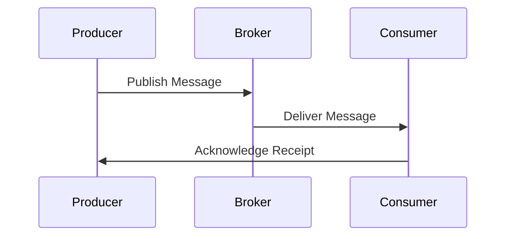
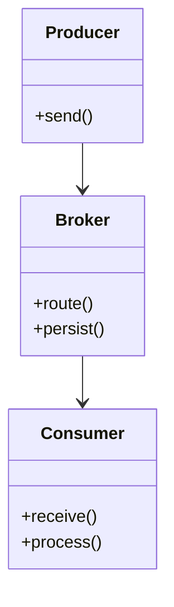

## Introduction

The **Service Bus Implementation** pattern employs message brokers to manage the communication between services in a distributed system. This approach ensures a decoupled, reliable, and scalable environment by efficiently routing and delivering messages.

## Detailed Explanation

### Design Principles

- **Decoupling**: Services are isolated from one another, communicating only through a broker.
- **Scalability**: Brokers can handle varying loads by managing message traffic effectively.
- **Reliability**: Supports features like message persistence, ensuring delivery despite service failures.
- **Asynchronous Communication**: Enables services to operate concurrently without immediate dependency.

### Architectural Approach

#### Components

- **Message Producer**: Generates messages and sends them to the broker.
- **Message Broker**: Routes messages to appropriate consumers, can provide transformations or translations.
- **Message Consumer**: Receives and processes messages from the broker.
- **Queues/Topics**: Hold messages until consumed. Queues route each message to one consumer, while topics allow multiple subscribers.

#### Workflow

1. **Message Publishing**: Producers send messages to specific queues or topics in the message broker.
2. **Message Routing**: The broker determines the appropriate route based on messaging rules and forwards messages.
3. **Message Reception**: Consumers subscribe and retrieve messages from queues or topics, processing them as needed.

### Best Practices

- **Choose the Right Broker**: Consider factors like throughput, latency, and persistence needs (e.g., RabbitMQ, Apache Kafka, AWS SQS).
- **Message Design**: Keep messages lightweight, use appropriate serialization/deserialization strategies (e.g., JSON, Avro).
- **Error Handling**: Implement dead-letter queues for messages that cannot be processed.
- **Security**: Use encryption and authentication to secure message channels.

### Example Code

```java
// Using RabbitMQ for Java
import com.rabbitmq.client.ConnectionFactory;
import com.rabbitmq.client.Connection;
import com.rabbitmq.client.Channel;

public class Send {
    private final static String QUEUE_NAME = "hello";

    public static void main(String[] argv) throws Exception {
        ConnectionFactory factory = new ConnectionFactory();
        factory.setHost("localhost");
        try (Connection connection = factory.newConnection();
             Channel channel = connection.createChannel()) {
            channel.queueDeclare(QUEUE_NAME, false, false, false, null);
            String message = "Hello World!";
            channel.basicPublish("", QUEUE_NAME, null, message.getBytes());
            System.out.println(" [x] Sent '" + message + "'");
        }
    }
}
```

### Diagrams

#### Sequence Diagram



#### Class Diagram



## Related Patterns

- **Publish-Subscribe Pattern**: Allows multiple consumers to receive messages from a topic.
- **Pipes and Filters Pattern**: Breaks down message processing into discrete steps for flexibility.
- **Event Sourcing Pattern**: Tracks state changes as a series of events stored in the message broker.

## Additional Resources

- [RabbitMQ Official Documentation](https://www.rabbitmq.com/documentation.html)
- [Apache Kafka Documentation](https://kafka.apache.org/documentation/)
- [AWS SQS](https://aws.amazon.com/sqs/)

## Summary

The Service Bus Implementation pattern provides an effective solution for decoupled communication in distributed systems using message brokers. By routing and delivering messages asynchronously, it enhances system scalability, reliability, and manageability, which are crucial in modern cloud architectures. Understanding and implementing this pattern can significantly streamline development processes and operational workflows in cloud-based environments.
