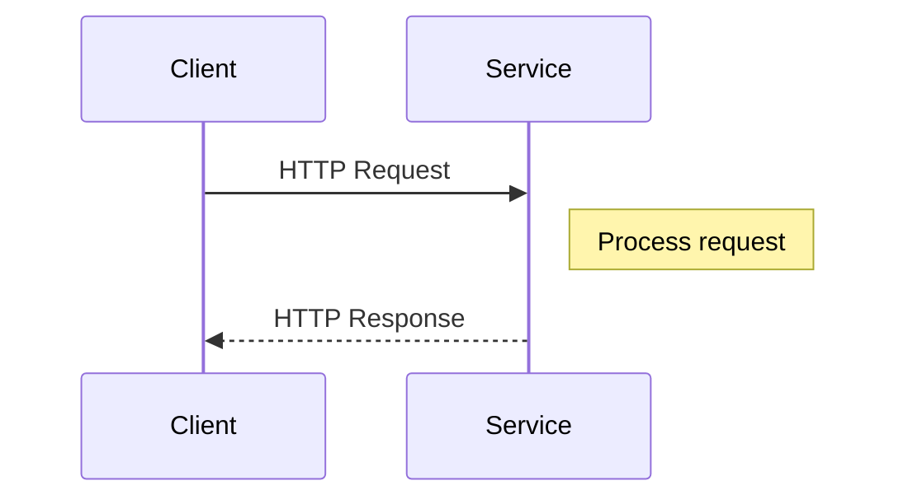

## Synchronous Communication

Synchronous Communication is a design pattern utilized within distributed systems architecture and cloud environments where immediate response is critical. This pattern involves direct communication between services, often through HTTP or gRPC, requiring a service to wait for a response before proceeding with further processing.

### Detailed Explanation

In distributed networks, Synchronous Communication ensures that a requester receives a response directly from the service it calls. This pattern is vital for scenarios where real-time data processing or tight coupling between services is necessary.

Key attributes of Synchronous Communication include:

- **Immediate Response Guarantee:** The caller service halts execution until it receives the response, ensuring that subsequent operations are based on fresh and accurate data.
- **Simple Interaction Model:** Often implemented via direct HTTP calls or RPC (Remote Procedure Calls), this model represents a straightforward client-server interaction.
- **State Management:** Typically easier in synchronous setups as each request-response cycle is complete and self-contained.

However, Synchronous Communication can introduce challenges such as increased latency, reduced system availability, and difficulties scaling due to its blocking nature.

### Architectural Approaches

Synchronous Communication can be implemented using various protocols and frameworks, including:

- **HTTP/REST:** Utilizing RESTful APIs where synchronous calls are made over HTTP, suitable for web services needing direct access to resources.
- **gRPC:** Offers high-performance, language-agnostic communication using Protocol Buffers, beneficial in microservices architectures needing efficient binary streams.
- **SOAP and XML-RPC:** Although less common today, these protocols provide standardized message envelopes for conducting synchronous exchanges, particularly in legacy systems.

### Best Practices

Adopting Synchronous Communication involves addressing its blocking and potentially latency-inducing characteristics:

1. **Optimize Endpoint Responses:** Ensure that service endpoints reply rapidly by optimizing data access paths and computation logic.
2. **Timeout Management:** Implement request timeouts and retries to handle network disruptions gracefully.
3. **Circuit Breakers:** Use circuit breakers to prevent service overload by temporarily blocking traffic to failing endpoints.
4. **Load Balancing:** Distribute requests across multiple instances to enhance availability and responsiveness.

### Example Code

Here's a simple example demonstrating synchronous HTTP communication in Java using Spring Boot:

```java
@RestController
public class OrderController {

    @GetMapping("/order/{id}")
    public ResponseEntity<Order> getOrder(@PathVariable String id) {
        Order order = orderService.findOrderById(id);
        return order != null ? ResponseEntity.ok(order) : ResponseEntity.notFound().build();
    }
}

@FeignClient(name = "inventory-service")
public interface InventoryClient {

    @GetMapping("/inventory/{productId}")
    Inventory getInventory(@PathVariable("productId") String productId);
}
```

The above code snippets show a synchronous call to retrieve order details and checks inventory via an external service using Feign, a declarative REST client in Java.

### Diagrams

Here's sequence diagram illustrating a synchronous request-response cycle:



### Related Patterns

- **Asynchronous Communication:** Engages in non-blocking interactions, suitable for decoupled systems where immediate responses are not required.
- **Circuit Breaker:** Prevents failures by isolating failing components, especially useful in mitigating issues with synchronous calls.
- **Bulkhead:** Limits the consumption of resources across different service areas to prevent cascading failures.

### Additional Resources

1. *Cloud Native Patterns: Designing Change-tolerant Software* by Cornelia Davis, detailing resilient communication patterns.
2. *Building Microservices* by Sam Newman, with insights into service interaction patterns including synchronous communication.
3. [gRPC official documentation](https://grpc.io/docs/), for understanding efficient synchronous calls using gRPC.

### Summary

The Synchronous Communication pattern is essential for scenarios demanding immediate, dependable responses between services. While it simplifies service interactions and state management, careful consideration of latency and scalability impacts is necessary. Employing best practices like optimizing requests and implementing robust error handling can ensure effective synchronous communication in cloud environments.
