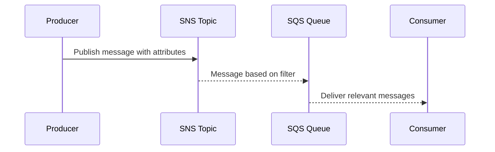

The **Message Filtering and Routing** pattern is crucial in modern cloud architectures, particularly those that heavily rely on messaging systems for inter-service communication. This pattern ensures that messages or events are routed to the correct consumer or service based on the message content or pre-defined routing rules, optimizing the flow of information and preventing unnecessary processing.

## Detailed Explanation

### Core Concepts

- **Message Filtering**: Focuses on the evaluation of message content to determine whether it should be processed by a specific consumer. Filtering can be based on criteria such as message headers, body content, or metadata.
  
- **Routing**: Involves directing messages to appropriate endpoints based on routing rules that can be static or dynamic. The rules usually include topics, attributes, or specific routing keys.

### Architectural Context

Message Filtering and Routing are prominent in scenarios where multiple services subscribe to a common topic or queue, but each service needs to process only a subset of all incoming messages. This reduces the load on consumers and networks in distributed systems by ensuring that consumers receive only relevant data.

### Implementation Approaches

- **Content-Based Routing**: Routes messages based on their content by comparing predefined attributes or patterns within the messages. It involves analyzing the message payload at the router level.

- **Header-Based Routing**: Utilizes message headers to determine routing paths. This method is less resource-intensive as it doesn't require parsing the entire message content.

- **Pattern Matching**: Involves using wildcards or regex to match message characteristics to routing rules.

### Best Practices

- **Decouple Producers and Consumers**: Use the pattern to achieve loose coupling between publishers (producers) and subscribers (consumers) to enhance scalability.

- **Leverage Cloud Provider Services**: Utilize built-in message filtering and routing capabilities of cloud-based messaging services like AWS SNS/SQS, Google Cloud Pub/Sub, or Azure Service Bus to reduce the complexity of implementation.

- **Combine with Other Patterns**: Often used in conjunction with patterns such as Publish/Subscribe and Event Sourcing to create robust, scalable messaging solutions.

## Example Code

Here is an example of implementing message filtering and routing using AWS SNS and SQS:

```java
// AWS SDK initialization
AmazonSNS snsClient = AmazonSNSClientBuilder.defaultClient();
AmazonSQS sqsClient = AmazonSQSClientBuilder.defaultClient();

// Create an SNS topic
CreateTopicRequest createTopicRequest = new CreateTopicRequest("topicName");
CreateTopicResult createTopicResult = snsClient.createTopic(createTopicRequest);

// Subscribe an SQS queue to the SNS topic
String topicArn = createTopicResult.getTopicArn();
SubscribeRequest subscribeRequest = new SubscribeRequest(topicArn, "sqs", "queueArn");
snsClient.subscribe(subscribeRequest);

// Define message attributes for filtering
Map<String, MessageAttributeValue> messageAttributes = new HashMap<>();
messageAttributes.put("attributeName", new MessageAttributeValue()
        .withDataType("String")
        .withStringValue("attributeValue"));

// Publish a message with attributes
PublishRequest publishRequest = new PublishRequest(topicArn, "Message content")
        .withMessageAttributes(messageAttributes);
snsClient.publish(publishRequest);
```

## Diagrams

### Sequence Diagram



## Related Patterns

- **Publish/Subscribe**: Decouples publishers and subscribers, improving system scalability.
- **Event-Driven Architecture**: Utilizes events to trigger and communicate between decoupled services.
- **Content Enricher**: Augments a message with additional data needed for routing decisions.

## Additional Resources

- [AWS SNS and SQS Documentation](https://aws.amazon.com/documentation/sns-and-sqs/)
- [Google Cloud Pub/Sub Overview](https://cloud.google.com/pubsub/docs/overview)
- [Azure Service Bus Documentation](https://docs.microsoft.com/en-us/azure/service-bus-messaging/)

## Summary

The Message Filtering and Routing pattern plays a vital role in cloud environments by ensuring that messages are delivered efficiently to the appropriate consumers. Implementing this pattern mitigates unnecessary processing and bandwidth usage, contributing to a more scalable, responsive system. With cloud-native messaging services providing extensive support for this pattern, developers can easily implement sophisticated messaging architectures that demand precision and reliability.
