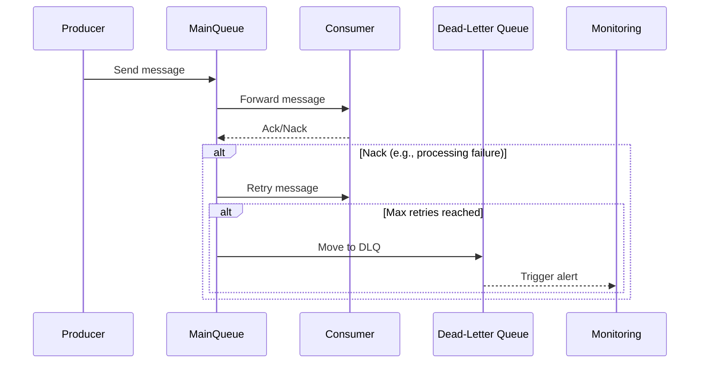

## Introduction

In cloud computing and distributed systems, *Dead-Letter Queues* (DLQs) are specialized queues used to store messages that cannot be processed successfully by the consuming application. These queues help improve the robustness and reliability of messaging systems by capturing problematic messages for later analysis, ensuring that the overall system remains responsive and resilient.

## Design Pattern Explanation

### Purpose

The primary purpose of a dead-letter queue is to handle scenarios where messages cannot be consumed successfully. This could be due to various issues such as validation errors, processing logic failures, or transient external dependencies. By diverting these unprocessable messages into a separate queue, the system can continue processing other valid messages, minimizing disruptions.

### Architectural Approach

- **Message Routing**: When a service or consumer encounters a message it cannot process after a predefined number of attempts, it routes the message to the dead-letter queue.
- **Monitoring and Alerts**: Monitoring tools can be set up to alert administrators when the number of messages in a DLQ surpasses a certain threshold, indicating potential systematic issues.
- **Inspection and Resolution**: Teams can inspect messages in the DLQ to understand failure reasons, allowing them to address bugs, update message schemas, or adjust system configurations.

### Advantages

- **Fault Isolation**: Ensures that faulty messages do not block the processing of valid ones.
- **Error Tracking**: Enables tracking and analysis of message failures, aiding in diagnosing systemic issues.
- **Resilience**: Contributes to the overall resilience of the system by facilitating graceful degradation and recovery.

## Best Practices

- **Define Clear Retry Policies**: Establish retry policies before routing messages to a DLQ to handle transient errors effectively.
- **Implement Robust Monitoring**: Use monitoring tools and dashboards to keep track of DLQ metrics, helping quickly identify and respond to emerging issues.
- **Regularly Review DLQ Contents**: Set up procedures for the regular inspection of the dead-letter queue to ensure timely resolution of errors.
- **Automation**: Consider automating the processing and re-insertion of messages from the DLQ after error resolution.

## Example Code

Here's a simplified example using Amazon SQS with AWS SDK for Java to handle dead-letter queue configurations:

```java
import software.amazon.awssdk.services.sqs.SqsClient;
import software.amazon.awssdk.services.sqs.model.*;

public class DeadLetterQueueExample {
    public static void main(String[] args) {
        try (SqsClient sqsClient = SqsClient.create()) {
            String queueUrl = createQueue(sqsClient, "mainQueue");
            String dlQueueUrl = createQueue(sqsClient, "dlq");

            // Set the dead-letter queue
            setDeadLetterQueue(sqsClient, queueUrl, dlQueueUrl, 5);
        }
    }

    private static String createQueue(SqsClient sqsClient, String queueName) {
        CreateQueueRequest createQueueRequest = CreateQueueRequest.builder()
                .queueName(queueName)
                .build();
        return sqsClient.createQueue(createQueueRequest).queueUrl();
    }

    private static void setDeadLetterQueue(SqsClient sqsClient, String queueUrl, String dlQueueUrl, int maxReceiveCount) {
        GetQueueAttributesRequest queueAttrsRequest = GetQueueAttributesRequest.builder()
                .queueUrl(dlQueueUrl)
                .attributeNames(QueueAttributeName.QUEUE_ARN)
                .build();
        String dlQueueArn = sqsClient.getQueueAttributes(queueAttrsRequest).attributes().get(QueueAttributeName.QUEUE_ARN);

        RedrivePolicy redrivePolicy = new RedrivePolicy(dlQueueArn, maxReceiveCount);
        SetQueueAttributesRequest setAttrsRequest = SetQueueAttributesRequest.builder()
                .queueUrl(queueUrl)
                .attributes(Map.of(QueueAttributeName.REDRIVE_POLICY, redrivePolicy.toJson()))
                .build();
                
        sqsClient.setQueueAttributes(setAttrsRequest);
    }
}

class RedrivePolicy {
    String deadLetterTargetArn;
    int maxReceiveCount;

    public RedrivePolicy(String deadLetterTargetArn, int maxReceiveCount) {
        this.deadLetterTargetArn = deadLetterTargetArn;
        this.maxReceiveCount = maxReceiveCount;
    }

    public String toJson() {
        return "{ \"deadLetterTargetArn\":\"" + deadLetterTargetArn + "\", \"maxReceiveCount\":" + maxReceiveCount + " }";
    }
}
```

## Diagrams

### Sequence Diagram



## Related Patterns

- **Retry Pattern**: Automatically retries failed message processing with exponential backoff to handle transient errors.
- **Circuit Breaker Pattern**: Prevents further processing of messages when system components are in a failure state.
- **Fallback Pattern**: Defines alternate processing paths for messages that experience failures.

## Additional Resources

- AWS Documentation on [SQS Dead-Letter Queues](https://docs.aws.amazon.com/AWSSimpleQueueService/latest/SQSDeveloperGuide/sqs-configure-dead-letter-queue.html)
- Azure Service Bus [Dead-Letter Queue](https://learn.microsoft.com/en-us/azure/service-bus-messaging/service-bus-dead-letter-queues)
- Google Cloud [Pub/Sub Dead-Letter Topics](https://cloud.google.com/pubsub/docs/dead-letter-topics)

## Summary

Dead-letter queues are a vital part of messaging systems, enhancing the reliability and fault tolerance of applications by capturing messages that fail to process. By designating a pathway for unprocessable messages, DLQs empower developers and system administrators to address issues with precision and prevent broader impacts on the system. Integrating DLQs with monitoring and alerting solutions further maximizes their utility, making them an essential pattern in robust cloud computing architectures.
