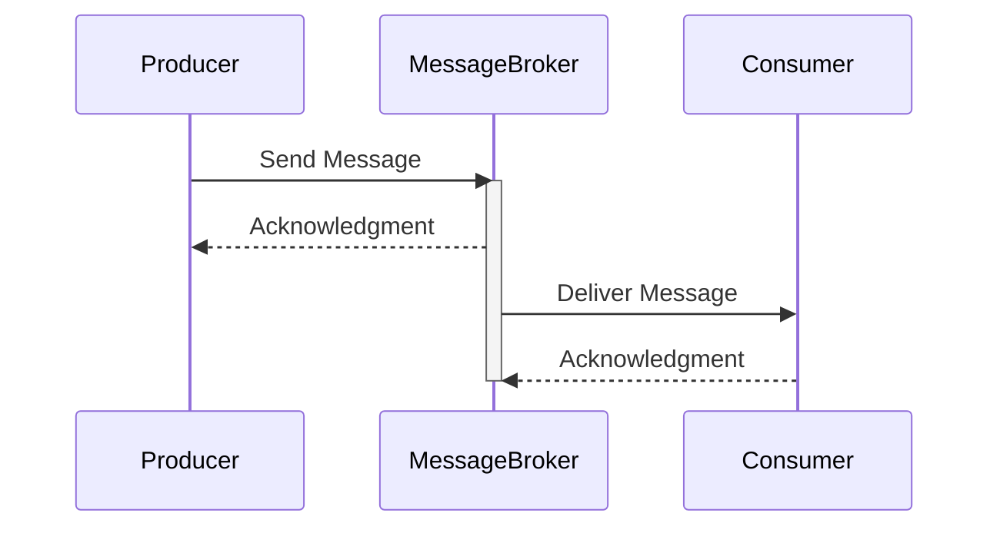

## Overview

The **Guaranteed Message Delivery** pattern is crucial in cloud environments to ensure that messages are delivered intact to their recipients, even if it means the recipient might receive a message more than once. This pattern mitigates the risk of lost messages due to outages, network issues, or other potential disruptions common in distributed systems.

## Detailed Explanation

The Guaranteed Message Delivery pattern is applied in messaging systems where it's unacceptable for messages to be lost. In these systems, ensuring all messages are received by their intended recipient is prioritized. This approach is foundational for applications where data integrity and reliability are paramount, such as financial transactions, inventory management, and critical updates.

### Key Concepts

1. **At-Least-Once Delivery**: The fundamental theme is that a message will be delivered at least once to the recipient. While this might imply duplicate messages, it ensures that no message is accidentally dropped.

2. **Acknowledgments and Retries**: Acknowledgments are essential for confirming receipt. If an acknowledgment isn't received within a specified timeframe, the message is re-sent. This helps in dealing with intermittent failures.

3. **Idempotency**: Since messages may arrive multiple times, the operations triggered by messages must be idempotent. This means processing the same message more than once does not change the end result beyond the initial application.

4. **Persistence**: Messages are typically logged or stored persistently until they're acknowledged by the recipient, safeguarding against data loss due to system failures.

## Example Implementation

Let's consider an example in Java using a message broker like Apache Kafka, which inherently supports the Guaranteed Message Delivery pattern through tools like acknowledgment and retry policies.

```java
Properties props = new Properties();
props.put("bootstrap.servers", "localhost:9092");
props.put("group.id", "test");
props.put("enable.auto.commit", "false");
props.put("key.deserializer", "org.apache.kafka.common.serialization.StringDeserializer");
props.put("value.deserializer", "org.apache.kafka.common.serialization.StringDeserializer");

KafkaConsumer<String, String> consumer = new KafkaConsumer<>(props);
consumer.subscribe(Arrays.asList("topic_name"));

while (true) {
    ConsumerRecords<String, String> records = consumer.poll(Duration.ofMillis(100));
    for (ConsumerRecord<String, String> record : records) {
        System.out.printf("offset = %d, key = %s, value = %s%n", record.offset(), record.key(), record.value());
        // Process record
    }
    consumer.commitSync(); // Ensure offsets are committed after processing
}
```

## Architectural Diagram



## Related Patterns

- **Idempotent Receiver**: Ensures that even if a message is delivered multiple times, processing it multiple times does not produce unintended side effects.
- **Competing Consumers**: Multiple consumers can process messages concurrently, ensuring system scalability.
- **Dead Letter Channel**: Provides a way to handle messages that cannot be processed successfully after multiple attempts.

## Additional Resources

- [Apache Kafka Documentation](https://kafka.apache.org/documentation/)
- [Enterprise Integration Patterns by Gregor Hohpe](https://www.enterpriseintegrationpatterns.com/patterns/messaging/)
- [AWS SQS Service - At-Least-Once Delivery](https://docs.aws.amazon.com/AWSSimpleQueueService/latest/SQSDeveloperGuide/sqs-messaging-protocols.html)

## Summary

The Guaranteed Message Delivery pattern is a cornerstone in cloud computing for ensuring reliable communication between distributed systems. Although it involves handling duplicate messages, it ensures data integrity by preventing message loss. By mastering this pattern, architects and developers can design systems that effectively manage communication even in the face of unpredictable network behaviors and failures.
