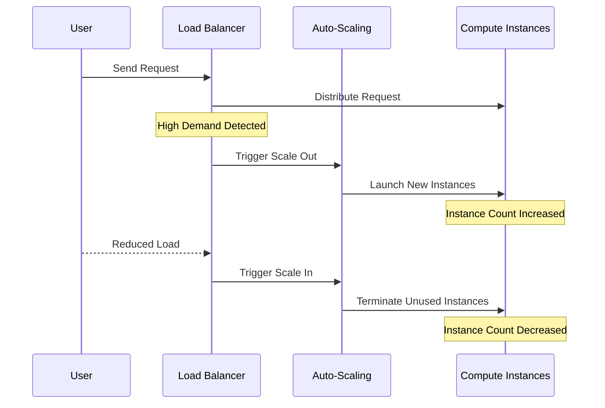

## Introduction

**Auto-Scaling Compute Instances** is a design pattern widely used in cloud environments to adjust compute resources dynamically based on the current load and demand. By implementing auto-scaling, organizations can optimize performance and cost efficiency, ensuring sufficient resources during high-demand periods and reducing waste during low-demand periods.

## Detailed Explanation

Auto-scaling automates the process of adding or removing compute instances in response to application demand. This capability is critical for maintaining the balance between performance (ensuring applications run smoothly) and cost (only paying for what is needed).

Key aspects of auto-scaling include:

- **Elasticity**: The ability to automatically increase or decrease resources.
- **Threshold Configuration**: Setting specific performance metrics and utilization thresholds that trigger scaling actions.
- **Scalable Infrastructure**: Resources such as CPU, memory, network bandwidth, and storage that can be scaled in or out.
- **Automation Policies**: Rules and schedules that define how and when scaling happens based on real-time metrics or predicted trends.

## Architectural Approach

Auto-scaling solutions are typically based on the architectural principles of:

- **Decoupled Components**: Separating scalability logic from application code for flexibility.
- **Statelessness**: Ensuring that scaling operations like adding or removing instances do not affect the state or consistency of the application.
- **Monitoring and Metrics**: Utilizing monitoring services to gather data on performance metrics such as CPU usage, throughput, or response time, which guide scaling decisions.

## Best Practices

1. **Define Clear Metrics and Triggers**: Use metrics like CPU utilization, request count, or specific application KPIs to define thresholds that trigger scaling actions.
2. **Use Predictive Scaling**: Complement reactive scaling with predictive scaling utilizing machine learning algorithms to anticipate demand.
3. **Testing and Simulation**: Regularly perform load testing to simulate peaks and adjust scaling policies accordingly.
4. **Right-Size Instances**: Initially select instance types based on workload characteristics to minimize initial costs and optimize performance before scaling.
5. **Review and Optimize Policies**: Continuously review auto-scaling policies to optimize for cost and performance as application demands and technologies evolve.

## Example Code

Here's an example of setting up auto-scaling in AWS using AWS SDK for Java:

```java
import com.amazonaws.services.autoscaling.AmazonAutoScaling;
import com.amazonaws.services.autoscaling.AmazonAutoScalingClientBuilder;
import com.amazonaws.services.autoscaling.model.*;

public class AutoScalingExample {
    public static void main(String[] args) {
        AmazonAutoScaling autoScaling = AmazonAutoScalingClientBuilder.defaultClient();

        // Create a launch configuration
        CreateLaunchConfigurationRequest launchConfigRequest = new CreateLaunchConfigurationRequest()
                .withLaunchConfigurationName("my-launch-config")
                .withInstanceType("t2.micro")
                .withImageId("ami-0abcdef1234567890");
        autoScaling.createLaunchConfiguration(launchConfigRequest);

        // Create an auto-scaling group
        CreateAutoScalingGroupRequest autoScalingGroupRequest = new CreateAutoScalingGroupRequest()
                .withAutoScalingGroupName("my-auto-scaling-group")
                .withLaunchConfigurationName("my-launch-config")
                .withMinSize(1)
                .withMaxSize(5)
                .withDesiredCapacity(2)
                .withAvailabilityZones("us-west-2a", "us-west-2b");
        autoScaling.createAutoScalingGroup(autoScalingGroupRequest);

        System.out.println("Auto-scaling group and configuration created successfully.");
    }
}
```

## Diagram

Below is a simple mermaid UML sequence diagram illustrating the interaction in an auto-scaling process:



## Related Patterns

- **Serverless Computing**: Auto-scaling on a granular level where functions are executed and scaled automatically.
- **Microservices Architecture**: Facilitates individual component scaling per service instead of scaling monolithic applications.
- **Event-Driven Architecture**: Responds to events and auto-scales based on event-driven metrics like message queue backlog size.

## Additional Resources

- [AWS Auto Scaling Documentation](https://aws.amazon.com/autoscaling/)
- [Azure Scale Sets](https://docs.microsoft.com/en-us/azure/virtual-machine-scale-sets/)
- [Google Cloud Auto-Scaler](https://cloud.google.com/kubernetes-engine/docs/how-to/cluster-autoscaler)

## Summary

The **Auto-Scaling Compute Instances** pattern is essential for modern cloud applications, offering the ability to automatically manage resource allocation based on real-time demands. By integrating auto-scaling mechanisms, organizations can effectively optimize performance and cost, ensuring resilience and responsiveness in their cloud infrastructures. This pattern is a cornerstone of elastic and agile cloud services, enabling seamless adaptation to varying workload demands.
