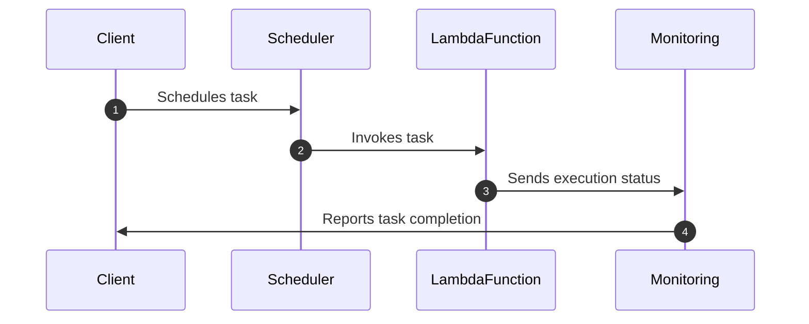

## Introduction

Compute Scheduling and Batch Processing are fundamental design patterns in the realm of cloud computing. These patterns allow for the efficient execution, monitoring, and management of long-running or scheduled tasks. In cloud environments, where resources are shared and costs need to be optimized, thoughtful scheduling and processing become key factors that affect performance, resource utilization, and overall cost efficiency.

## Pattern Overview

Compute scheduling refers to the method of allocating computing resources to tasks over time, while batch processing involves processing data in large groups or batches, as opposed to real-time processing. These methods help efficiently manage workloads, especially those that are resource-intensive or need to run periodically.

### Benefits

1. **Resource Efficiency**: By scheduling tasks during off-peak times, organizations can make better use of their cloud resources.
2. **Cost Optimization**: Batch processing often allows for lower costs as it can make use of preemptible or spot instances.
3. **Improved Management**: Centralized control over job execution allows for improved monitoring and failure management.

### Architectural Approaches

1. **Time-based Scheduling**: Tasks are executed at pre-defined times or intervals using cron jobs or managed scheduling services.
2. **Event-driven Scheduling**: Tasks are triggered based on events, such as system alarms or data arrivals.
3. **Job Queues**: Utilize message queues where tasks are queued and executed based on resource availability.
4. **Serverless Functions**: Triggers can be set to run compute functions in a serverless architecture, optimizing further for cost and efficiency.

## Best Practices

- **Scalability**: Ensure that your batch processing can scale horizontally to handle variable loads.
- **Robust Monitoring**: Implement comprehensive logging and monitoring to track job statuses and quickly resolve issues.
- **Resource Quotas**: Set quotas for tasks to avoid unexpected resource consumption.
- **Retry Mechanisms**: Implement retries with exponential back-off for transient errors.
- **Cost Analysis Tools**: Use tools to analyze and optimize costs associated with scheduling and batch processing.

## Example Code

Here is a simplified example using AWS Lambda and Step Functions for a scheduled task:

```typescript
import * as AWS from 'aws-sdk';

// Define the Lambda function
const lambda = new AWS.Lambda();

exports.handler = async (event) => {
  console.log('Scheduled task running:', new Date());
  // Task logic goes here
};

// Using AWS Step Functions to orchestrate the Lambda executions on a schedule
const stepFunctions = new AWS.StepFunctions();

const params = {
  stateMachineArn: 'arn:aws:states:us-east-1:123456789012:stateMachine:StateMachineName',
  input: '{}', // Input for the execution
  name: 'ExecutionName'
};

stepFunctions.startExecution(params, function(err, data) {
  if (err) console.log(err, err.stack);
  else     console.log(data);
});
```

## Diagrams



## Related Patterns

- **Event-Driven Architecture**: For tasks triggered by specific events.
- **Serverless Architecture**: For scheduling compute in a cost-efficient manner.
- **Load Balancing**: To distribute batch processing tasks evenly across resources.

## Additional Resources

- [AWS Batch Documentation](https://aws.amazon.com/batch/)
- [Azure Batch Overview](https://learn.microsoft.com/en-us/azure/batch/)
- [Google Cloud Scheduler](https://cloud.google.com/scheduler)

## Summary

Compute Scheduling and Batch Processing are crucial in optimizing resource use and managing costs in cloud environments. Understanding and implementing these patterns can significantly enhance your cloud infrastructure's efficiency, reliability, and cost-effectiveness. The choice of the right architecture and practices will tailor solutions to best fit organizational needs, leveraging the power of cloud resources to their fullest.
