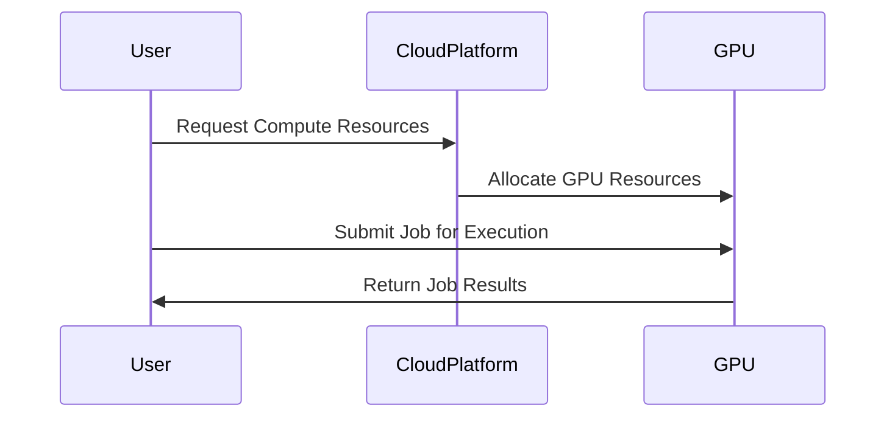

## Introduction

With the increasing demand for computational power in fields like machine learning, data analytics, gaming, and scientific simulations, traditional CPUs can sometimes fall short in delivering the required performance. Graphics Processing Units (GPUs) and specialized hardware like Tensor Processing Units (TPUs) offer a compelling alternative, bringing parallel processing capabilities and specialized computation features that are ideal for handling these intensive tasks.

## Design Pattern Overview

The **GPU and Specialized Hardware Utilization** design pattern involves leveraging cloud-based GPUs or TPUs to execute compute-intensive workloads. By utilizing these resources on demand in the cloud, businesses can achieve high performance and scalability without the overhead of managing physical infrastructure.

### Key Concepts

- **Compute-Intensive Tasks**: Tasks that require significant processing power, often involving large data sets or complex calculations, such as machine learning model training, real-time data analysis, or high-resolution video rendering.
- **Cloud-Based Hardware**: Using cloud service providers such as AWS, GCP, or Azure, which offer specialized hardware like GPUs and TPUs as part of their compute services.

## Architectural Approaches

### 1. Hybrid Compute Strategy

Combine local CPU resources with cloud-based GPUs/TPUs, utilizing the strengths of both environments. Local compute resources can handle less intensive tasks while offloading heavy computations to the cloud.

### 2. Dynamic Resource Allocation

Leverage cloud providers' ability to dynamically allocate and scale specialized hardware resources as per the workload requirements. This ensures optimal performance while minimizing costs.

### 3. Service Integration

Integrate with cloud-native services that offer seamless interfaces to GPUs and TPUs. For instance, using Kubernetes for containerized workloads can automate the process of scaling GPU-enabled applications.

## Best Practices

- **Optimize Workload Distribution**: Distribute tasks effectively between CPUs, GPUs, and TPUs to maximize performance and cost-efficiency.
- **Benchmark Performance**: Evaluate the performance of different hardware configurations by running benchmarks to determine the most efficient setup.
- **Monitor and Scale**: Implement monitoring solutions to track resource utilization and automate scaling decisions based on real-time metrics.
- **Cost Management**: Use cost management tools provided by cloud providers to keep track of expenses related to specialized hardware utilization.

## Example Code

```scala
import com.google.cloud.compute.v1._

object GpuInstanceCreator {
  def createInstance(projectId: String, zone: String, instanceName: String): Unit = {
    val instanceClient = InstanceClient.create()
    
    val instance = Instance.newBuilder()
      .setName(instanceName)
      .addDisks(Disk.newBuilder().setBoot(true).setAutoDelete(true))
      .setMachineType(s"zones/$zone/machineTypes/n1-standard-1")
      .addAccelerators(AcceleratorConfig.newBuilder()
        .setAcceleratorType("nvidia-tesla-v100")
        .setAcceleratorCount(4))
      .build()

    instanceClient.insertInstance(projectId, zone, instance)
    instanceClient.close()
  }
}
```

## Diagram



## Related Patterns

- **Elastic Compute Patterns**: Focus on scalable compute resources in the cloud, allowing dynamic allocation and deallocation based on demand.
- **Function as a Service (FaaS)**: Offering serverless computing, where functions run in stateless containers and automatically scale.
  
## Additional Resources

- [AWS GPU Instances](https://aws.amazon.com/ec2/instance-types/gpu/)
- [Google Cloud TPUs](https://cloud.google.com/tpu/)
- [Azure Machine Learning using GPUs](https://docs.microsoft.com/en-us/azure/machine-learning/concept-compute-target#gpus-and-other-hardware)

## Summary

The **GPU and Specialized Hardware Utilization** pattern guides organizations in efficiently leveraging cloud-based specialized hardware to handle compute-intensive tasks. By integrating such resources within their cloud infrastructure, companies can achieve significant boosts in performance and scalability without substantial physical investments. This pattern, coupled with best practices and related cloud computing strategies, serves as a foundational approach for modern high-performance applications.
