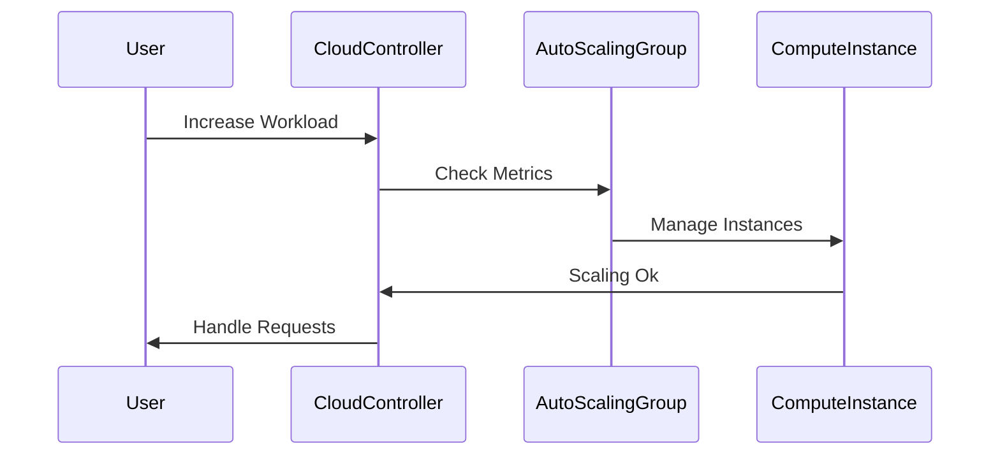

## Introduction

Infrastructure Scaling Policies are a critical component of cloud computing architectures, allowing services to handle variable workloads efficiently. By automatically adjusting the compute resources based on the real-time demand, businesses can achieve cost-effective and responsive cloud infrastructure provisioning. Scaling policies are crucial in both reactive and proactive scenarios to maintain application performance and accommodate growth.

## Detailed Explanation

### Key Concepts

1. **Auto-scaling**: Automatically adjusting the number of compute instances or other cloud services based on predefined criteria.
   
2. **Horizontal Scaling**: Increasing or decreasing the number of instances to distribute load without changing the size of each instance.
   
3. **Vertical Scaling**: Increasing or decreasing the resource capacity (CPU, memory) of an existing instance.
   
4. **Reactive Scaling**: Adjusting resources in response to current demand or resource utilization metrics.
   
5. **Predictive/Proactive Scaling**: Using forecasted demand models to allocate resources ahead of time.

### Architectural Approaches

- **Rule-Based Policies**: Simple policy definitions based on conditions such as CPU usage, memory threshold, or network load.
  
- **Schedule-Based Policies**: Triggered actions based on predefined schedules aligned with expected workload patterns.
  
- **Dynamic Scaling**: Utilizes AI/ML algorithms to predict and adjust resources based on historical data and usage trends.

- **Hybrid Scaling**: Combining multiple strategies to optimize costs and performance, e.g., using both rule-based and predictive approaches together.

## Best Practices

1. **Define Clear Metrics**: Use metrics like CPU usage, memory utilization, and latency to determine when to scale.

2. **Set Thresholds Carefully**: Ensure balance between over-provisioning and under-provisioning resources.

3. **Monitor and Optimize**: Continuously monitor scaling operations and adjust policies accordingly for better efficiency.

4. **Cost Management**: Understand pricing models from cloud providers to anticipate costs associated with scaling.

5. **Testing and Validation**: Regularly test scaling policies to ensure they perform as expected under varying load conditions.

## Example Code

Below is an example of a simple reactive auto-scaling policy using AWS Auto Scaling Groups:

```json
{
  "AdjustmentType": "ChangeInCapacity",
  "ScalingAdjustment": 1,
  "Cooldown": 300,
  "PolicyName": "ScaleUp",
  "PolicyType": "StepScaling",
  "StepAdjustments": [
    {
      "MetricIntervalLowerBound": 0,
      "MetricIntervalUpperBound": 10,
      "ScalingAdjustment": 1
    }
  ]
}
```

## Diagrams

### Auto-Scaling Process Sequence Diagram



## Related Patterns

- **Offloading Workload Pattern**: Use services like queues or event hubs to handle spikes in demand without immediate scaling.
  
- **Load Balancing**: Distributes incoming application or network traffic across multiple targets to ensure no single instance is overwhelmed.

## Additional Resources

- [AWS Auto Scaling](https://aws.amazon.com/autoscaling/)
- [Azure Virtual Machine Scale Sets](https://learn.microsoft.com/en-us/azure/virtual-machine-scale-sets/overview)
- [Google Cloud Autoscaler](https://cloud.google.com/compute/docs/autoscaler)

## Summary

Infrastructure Scaling Policies are indispensable in managing resources efficiently within cloud environments. By automating scaling processes, these policies help maintain performance, optimize costs, and enhance the overall reliability of services. Whether employing reactive, predictive, or hybrid strategies, well-defined scaling policies underpin the success of cloud applications in meeting dynamic user demands.
