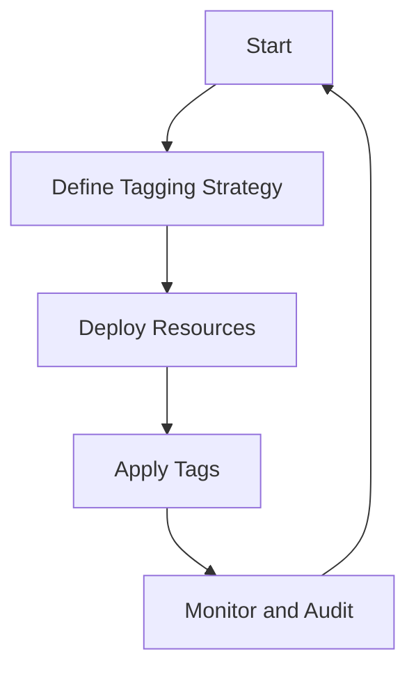

## Introduction to Compute Resource Tagging

In cloud computing, effectively managing and organizing resources is crucial for cost optimization, accountability, and streamlined workflows. Compute Resource Tagging is a pattern used to assign metadata to cloud resources, such as virtual machines, storage instances, and other services. This metadata, commonly known as "tags," consists of key-value pairs that describe properties or categorizations of the resources.

## Key Benefits

- **Cost Management**: Tags enable visibility into where and how resources are consumed, leading to more accurate billing.
- **Resource Organization**: Tags help categorize resources for better organization and easier management by teams.
- **Automation**: Tags can be leveraged in automated scripts and cloud management tools to trigger specific actions or policies.
- **Compliance and Reporting**: Tags assist in enforcing compliance requirements and aid in generating detailed reports.

## Best Practices for Resource Tagging

- **Establish a Tagging Convention**: Develop a consistent and comprehensive tagging strategy before deploying resources. Popular tags include environment (e.g., `prod`, `dev`), owner, project, cost center, and department.
- **Include Essential Metadata**: Use tags to include critical metadata that align with your organization's operational, financial, and compliance needs.
- **Automate Tagging**: Implement automated systems to apply or enforce tagging policies to avoid manually tagging resources.
- **Review and Audit Tags Regularly**: Continuously monitor and audit the use and effectiveness of tags to ensure they remain relevant and accurate.

## Example Code for Tagging

The following example demonstrates how to apply tags to an AWS EC2 instance using the AWS SDK for Java:

```java
import software.amazon.awssdk.services.ec2.Ec2Client;
import software.amazon.awssdk.services.ec2.model.CreateTagsRequest;
import software.amazon.awssdk.services.ec2.model.Tag;

public class TagEc2Instance {
    public static void main(String[] args) {
        Ec2Client ec2 = Ec2Client.builder().build();
        
        Tag tag1 = Tag.builder().key("Environment").value("Production").build();
        Tag tag2 = Tag.builder().key("Project").value("ProjectX").build();
        
        CreateTagsRequest request = CreateTagsRequest.builder()
                .resources("i-0a12b3456789cdef0")
                .tags(tag1, tag2)
                .build();
        
        ec2.createTags(request);
        System.out.println("Tags assigned successfully.");
        ec2.close();
    }
}
```

## Diagrams

### Resource Tagging Workflow



## Related Patterns

- **Resource Governance**: A pattern focusing on maintaining control over resource allocation and permissions.
- **Cost Management**: A pattern dedicated to understanding and optimizing cloud expenditure.
- **Automated Infrastructure**: Emphasizes automation in provisioning and managing structured resources.

## Additional Resources

- [AWS Tagging Best Practices](https://docs.aws.amazon.com/general/latest/gr/aws_tagging.html)
- [Azure Tagging Strategies](https://learn.microsoft.com/en-us/azure/azure-resource-manager/management/tag-resources)
- [GCP Resource Labeling](https://cloud.google.com/compute/docs/labeling-resources)

## Summary

Compute Resource Tagging is an essential practice in cloud environments for managing and organizing resources efficiently. By adhering to structured tagging conventions and regularly auditing your tags, organizations can significantly streamline their operations, optimize costs, and improve resource visibility. Being proactive and strategic about tagging can greatly enhance your cloud computing management processes and outcomes.
