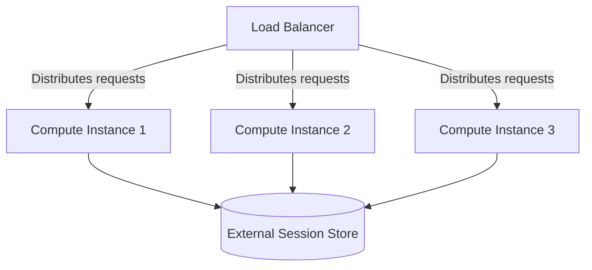

## Stateless Compute Instances: Enhancing Scalability with Stateless Design

Stateless compute instances are a fundamental pattern in cloud computing architecture designed to enhance the scalability, maintainability, and reliability of applications. By decoupling session data from the compute layer, applications can more efficiently balance loads and recover from instance failures without data loss. This pattern is critical in environments where demand can fluctuate significantly, such as web applications and microservices.

### Detailed Explanation

In traditional server architectures, session data (e.g., user sessions, cache data) might be stored locally on the server. This approach can lead to challenges in scalability and fault tolerance, as each server needs to handle individual user session states. Stateless compute instances avoid these issues by externalizing all state information, allowing any instance to handle any request.

#### Key Characteristics

- **State Externalization**: All session and state data are stored outside of the compute instance, often in distributed caches or databases.
- **Interchangeable Instances**: Instances are uniform with no persistent session data, meaning any instance can handle any request.
- **Enhanced Fault Tolerance**: Since there is no local state, losing an instance does not result in loss of session data.
- **Scalability**: Easily scale up or down by adding or removing instances without affecting the user experience.

### Architectural Approaches

- **External Session Stores**: Use of databases (SQL/NoSQL), distributed caches (e.g., Redis, Memcached), or dedicated session management services to manage state.
- **Stateless Protocols**: HTTP is a stateless protocol by nature; this pattern often relies on HTTP's principles to maintain a consistent session state externally.
- **Microservices Deployment**: In microservices architectures, stateless services can easily scale horizontally and are a typical manifestation of the Twelve-Factor App methodology.

### Best Practices

1. **Design for Failure**: Always design your applications assuming any compute instance can fail at any time.
2. **Use Distributed Cache**: Leverage technologies like Redis or AWS ElastiCache to maintain session data for fast retrieval across instances.
3. **Load Balancing**: Employ load balancers to distribute traffic effectively across stateless instances, ensuring optimal resource utilization.
4. **Automate Deployment**: Use infrastructure as code (IaC) to manage your instance deployments automatically and consistently.

### Example Code

Below is a simple example demonstrating how to keep a stateless session in a cloud environment, using an external cache service:

```java
// Using Spring Session with Redis for managing session data
import org.springframework.boot.SpringApplication;
import org.springframework.boot.autoconfigure.SpringBootApplication;
import org.springframework.session.data.redis.config.annotation.web.http.EnableRedisHttpSession;

@SpringBootApplication
@EnableRedisHttpSession
public class StatelessApplication {
    public static void main(String[] args) {
        SpringApplication.run(StatelessApplication.class, args);
    }
}
```

### Diagrams

Here's how stateless compute instances fit within a larger cloud architecture:



### Related Patterns

- **Service Discovery**: Automatically detect services in dynamic environments, complementing stateless design by ensuring seamless connectivity.
- **Circuit Breaker**: Protect services during heavy load, useful in systems utilizing stateless computing for resilience.
- **Blue-Green Deployment**: Facilitates seamless code updates to stateless services without downtime.

### Additional Resources

- [AWS Stateless Compute Instances Architecture](https://aws.amazon.com/architecture/)
- [Microsoft Azure Stateless Services Documentation](https://azure.microsoft.com/en-us/documentation/)
- [Google Cloud Stateless Architecture Guide](https://cloud.google.com/architecture/)

### Summary

Stateless compute instances represent a key pattern in modern cloud computing architectures, providing the means to efficiently scale and manage workloads by externalizing state information. This design allows cloud applications to achieve high availability, performance consistency, and resilience. By applying best practices and leveraging external state management solutions, developers can maximize the benefits of stateless architectures in delivering responsive and fault-tolerant cloud-based services.
