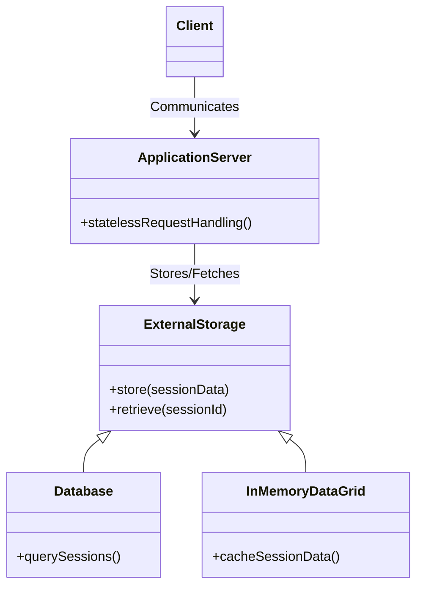

## Introduction

In cloud computing, services are often designed to be stateless to improve scalability and manageability. Stateless architectures do not store any session information between requests, which poses challenges in session management for applications where user states need to be maintained across multiple interactions. This article explores Session Persistence Strategies that leverage external storage solutions to sustain session data in stateless environments.

## Design Pattern Description

Session Persistence Strategies involve decoupling session data from application servers and using external storage systems to persist session information. This approach guarantees that session data survives server restarts, load balancing decisions, and other disruptions common in cloud-native architectures.

### Key Concepts:

- **Stateless Services**: Services that do not store any state information locally. Each request is handled independently.
- **Session Persistence**: The ability to persist user session data across multiple interactions and requests.
- **External Storage**: Using systems outside the application server to store session data, such as databases, distributed caches, or dedicated session managers.

## Architectural Approaches

1. **Client-Side Session Storage**: Storing session data on the client-side, such as in cookies or local storage. While simple, this approach can expose session data to security vulnerabilities.

2. **Backend Databases**:
   - Use distributed databases like AWS DynamoDB, Google Cloud Datastore, or managed SQL instances to store session data.
   - Pros: Data permanence, transaction support.
   - Cons: Potentially higher latency, complexity in implementation.

3. **In-Memory Data Grids**:
   - Tools like Redis or Memcached provide fast, in-memory storage ideal for session data.
   - Pros: Low latency, scalability.
   - Cons: Data volatility (unless persisted), consistency challenges.

4. **Session Management Services**:
   - Cloud-native services such as AWS Elasticache, GCP Memorystore, or Azure Cache for Redis.
   - Advantages include managed scaling, integration with other cloud services, and reduced operational overhead.

## Best Practices

- **Ensuring Security**: Implement encryption for session data both in transit and at rest to safeguard user information.
- **Graceful Fallbacks**: Design your application to handle session persistence failures gracefully, possibly falling back to client-side storage temporarily.
- **Consistency and Availability**: Choose storage systems with the right balance between consistency and availability according to your application's needs.

## Example Code

Here's an example of using Redis in a Node.js application to store session data:

```javascript
const session = require('express-session');
const RedisStore = require('connect-redis')(session);
const redis = require('redis');

const redisClient = redis.createClient();

app.use(session({
  store: new RedisStore({ client: redisClient }),
  secret: 'supersecretkey',
  resave: false,
  saveUninitialized: false
}));
```

## Diagrams

### Session Persistence Strategy UML Diagram



## Related Patterns

- **Stateless Microservices Architecture**: Designing microservices to be stateless and idempotent enhances scalability and failover.
- **Circuit Breaker Pattern**: Providing fallback strategies when session persistence middleware fails, ensuring system resilience.
- **Cache-Aside Pattern**: Using an external cache (e.g., Redis) alongside persistent databases for optimal session data access.

## Additional Resources

- [Redis as a Session Store](https://redis.io/docs/manual/data-types/#redis-as-a-session-store)
- [AWS Elasticache for Redis](https://aws.amazon.com/elasticache/redis/)
- [Google Cloud Memorystore](https://cloud.google.com/memorystore)

## Summary

Managing session persistence is crucial in stateless cloud architectures, ensuring seamless user experiences despite infrastructure changes. By leveraging external storage solutions, applications can effectively maintain user sessions, enhance resilience, and optimize performance. With careful design and implementation of these strategies, you can achieve robust and scalable session management in cloud environments.
