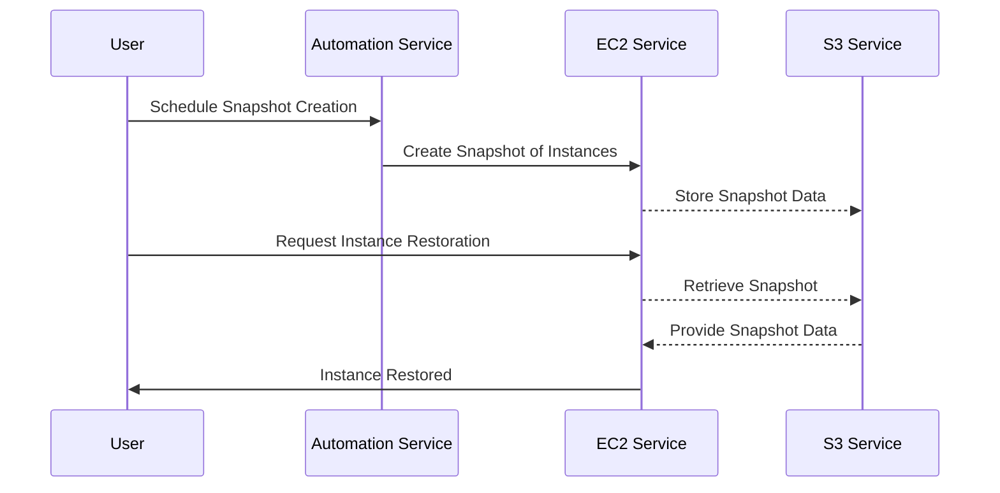

## Overview

In cloud computing, **Compute Snapshot Management** is a crucial pattern that involves creating and managing snapshots of compute instances to facilitate data backup, system restore points, and the seamless cloning of instances. This pattern is essential for maintaining resiliency and operational efficiency in cloud environments, enabling organizations to quickly recover from failures and easily replicate environments for testing and development purposes.

## Architectural Components and Best Practices

### Key Components

1. **Snapshot Creation**: 
   - This involves capturing the state and data of a compute instance at a specific point in time.
   - Snapshots can be initiated manually or automatically through scheduled tasks.

2. **Snapshot Storage**:
   - Snapshots should be stored in resilient and redundant storage.
   - Consider using cloud-native storage solutions, such as Amazon S3, Azure Blob Storage, or Google Cloud Storage, for durability and availability.

3. **Snapshot Management**:
   - Implement policies for snapshot retention, deletion, and lifecycle management to optimize storage usage and cost.
   - Use tagging to identify and organize snapshots effectively.

4. **Instance Cloning**:
   - Snapshots can be used to create new instances, facilitating environment cloning for testing and development.
   - Ensure that cloning procedures maintain network configurations and security settings.

### Best Practices

- **Automate Snapshot Schedules**: Implement automated snapshot schedules to ensure that backups are consistently created without human intervention. Use tools like AWS Data Lifecycle Manager, Azure Backup Service, or Google Cloud Scheduler.
  
- **Incorporate Security Measures**: Encrypt snapshots to protect data at rest, and use strict access controls to limit who can create, delete, or restore instances from snapshots.

- **Optimize for Cost and Performance**: Analyze snapshot storage costs regularly, and apply compression and deduplication techniques where supported.

- **Monitor and Audit**: Continuously monitor snapshot creation and usage through logging and auditing, ensuring compliance with policies and detecting any unauthorized activities.

## Example Code

Below is an example of automating snapshot creation using AWS SDK in Python:

```python
import boto3
from datetime import datetime

ec2 = boto3.client('ec2')

def create_snapshot(instance_id):
    volume_info = ec2.describe_volumes(
        Filters=[{'Name': 'attachment.instance-id', 'Values': [instance_id]}]
    )
    for volume in volume_info['Volumes']:
        ec2.create_snapshot(
            VolumeId=volume['VolumeId'],
            Description=f'Snapshot for {instance_id} at {datetime.now()}'
        )

create_snapshot('i-0abcd1234efgh5678')
```

## UML Diagram



## Related Patterns

- **Backup and Restore**: Focuses on creating redundancy and ensuring data recovery capabilities by making regular backups.
  
- **Disaster Recovery**: Establishes a comprehensive plan for data protection and systems recovery in the case of catastrophic failures.

- **Immutable Infrastructure**: Combines with snapshot management to create long-term, robust infrastructure with predefined state definitions.

## Additional Resources

- [AWS EC2 Snapshots Documentation](https://docs.aws.amazon.com/AWSEC2/latest/UserGuide/EBSSnapshots.html)
- [Azure VM Backups](https://docs.microsoft.com/en-us/azure/backup/backup-azure-vms)
- [Google Cloud Disk Snapshots](https://cloud.google.com/compute/docs/disks/snapshots)

## Summary

The **Compute Snapshot Management** pattern plays a pivotal role in modern cloud computing by offering a reliable solution for instance backups and cloning. It provides the necessary tools for restoring systems quickly in response to incidents, minimizing downtime, and enabling consistent test environments through cloning. By adopting best practices and leveraging cloud-native services, organizations can ensure efficient, cost-effective, and secure snapshot management, fitting seamlessly into broader disaster recovery and systems management strategies.
