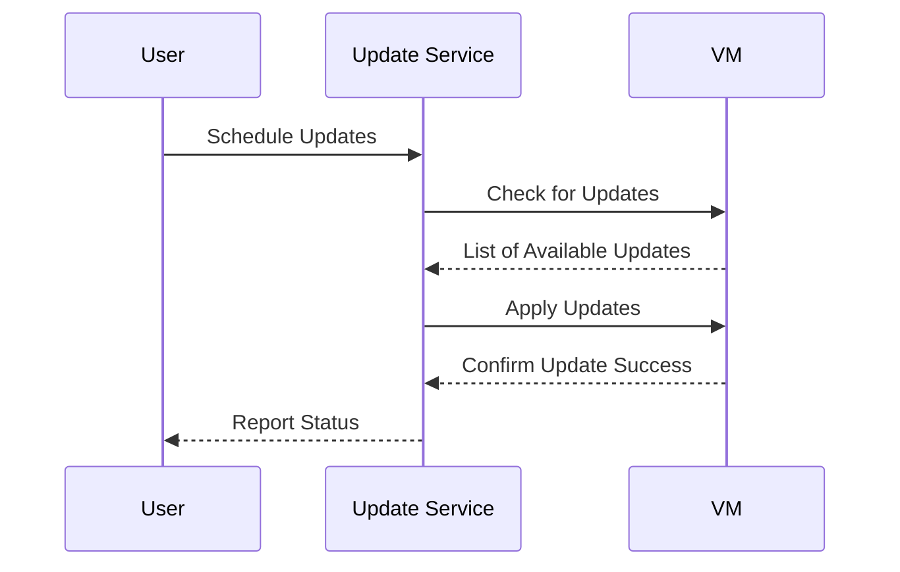

## Introduction

In the fast-paced world of cloud computing, maintaining the health and security of compute resources is crucial. Automation of Compute Updates is a design pattern focused on utilizing automation tools and techniques to apply updates and patches to virtual machines (VMs) and other compute resources automatically. This pattern is vital in preventing vulnerabilities, ensuring compliance, and maintaining system performance.

## Context

Compute resources in the cloud, such as VMs, containers, and serverless functions, require regular updates to address security vulnerabilities, add new features, and improve performance. Manually managing updates can be time-consuming and error-prone, especially in dynamic environments with numerous instances. Automation helps streamline this process, ensuring timely and consistent application of updates across your infrastructure.

## Problem

Manually updating compute resources leads to several operational challenges:
- **Inefficiency**: Scaling manual updates across many resources is labor-intensive.
- **Inconsistency**: Human error can result in resources being on different update levels.
- **Security Risks**: Delays in applying critical patches can leave systems vulnerable.
- **Downtime**: Updates applied inconsistently can lead to unexpected downtime or incompatibility issues.

## Solution

Implement an automation pipeline that manages updates and patches for compute resources. This includes:

1. **Detection of Available Updates**: Use monitoring tools to detect and evaluate available updates for your compute resources.
2. **Testing Updates**: Implement testing in stages, such as development, staging, and production, to ensure updates do not negatively impact services.
3. **Automated Deployment**: Script or use tools to automatically apply updates, validating their successful installation.
4. **Rollback Mechanism**: Ensure a mechanism is in place to rollback changes in case an update causes issues.
5. **Verification**: Use automated tests post-update to ensure systems are fully operational.

## Example Code

Here's a simple example using shell scripting and cron jobs to automate updates for a Linux-based virtual machine:

```bash
#!/bin/bash

sudo apt-get update -y

sudo apt-get upgrade -y

sudo apt-get autoremove -y
```

To schedule this script to run daily, you can add it to your cron jobs:

```
0 2 * * * /path/to/your/script.sh
```

This cron expression runs the update script every day at 2 AM.

## Diagram



## Related Patterns

- **Canary Release**: Deploy updates to a small subset of instances before general rollout to mitigate risk.
- **Blue-Green Deployment**: Utilize two environments to perform seamless updates and reduce downtime.
- **Infrastructure as Code (IaC)**: Manage and provision infrastructure using code to facilitate consistent environments and compliance with updates.

## Additional Resources

- [AWS Systems Manager](https://aws.amazon.com/systems-manager/) for managing and automating your infrastructure.
- [Azure Automation](https://azure.microsoft.com/en-us/services/automation/) to simplify cloud management.
- [Google Cloud OS Patch Management](https://cloud.google.com/compute/docs/os-patch-management) for automated patch deployment.

## Summary

Automating compute updates is essential for ensuring the security, efficiency, and reliability of cloud infrastructure. By implementing this automation pattern, organizations can reduce manual overhead, minimize security risks, and ensure a consistently updated environment, all while maintaining compliance and improving operational efficiency.
