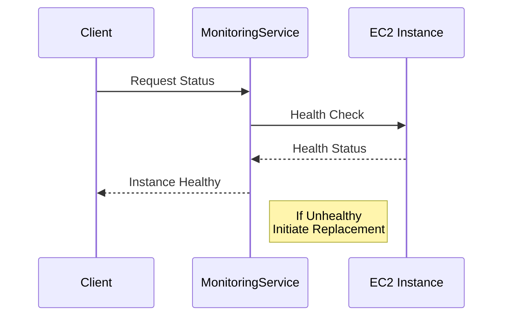

## Introduction

In cloud computing, ensuring the reliability and availability of your applications often hinges on the health of the underlying compute instances. **Compute Health Checks** is a pattern designed to automate the monitoring of compute instances and replace the ones that become unhealthy. This pattern provides organizations with scalability and resilience in their cloud infrastructure.

## Design Pattern Description

Compute Health Checks involve periodically assessing compute instances such as virtual machines or containers for failures or degrading performance. The pattern leverages automation to replace any unhealthy instances with new ones, typically using cloud-native tools and services.

### Key Components

- **Health Monitoring Agent**: A lightweight service running on each compute instance, gathering health metrics and sending them to a monitoring service.

- **Monitoring Service**: A cloud service that receives health data, analyzes it, and determines the health status of each instance.

- **Auto Scaling Group**: A mechanism to automatically launch new instances when the monitoring service detects an unhealthy one.

- **Automation Rules**: Pre-defined policies and procedures that dictate when to mark an instance as unhealthy and initiate replacement actions.

## Architectural Approaches

1. **Agent-Based Monitoring**: Install a monitoring agent on each instance to perform local checks and report back to the central monitoring service.

2. **External Probes**: Use external tools to conduct synthetic transactions or monitor endpoints that represent the health of an application.

3. **Cloud Provider Tools**: Leverage built-in services like AWS CloudWatch, Azure Monitor, and Google Cloud Monitoring for health checks and auto-scaling.

## Best Practices

- **Granular Health Checks**: Implement checks that provide insights not only at the system level (CPU, Memory) but also at the application level (response time, error rates).

- **Dynamic Thresholds**: Use dynamic thresholds for alerting and scaling to avoid false positives due to occasional transient issues.

- **Automated Recovery**: Ensure that your infrastructure can automatically recover from failures with scripts and templates that handle launching, terminating, and configuring instances.

- **Logging and Alerts**: Integrate logging and alerting such that unexpected patterns can trigger notifications and allow for manual intervention if needed.

## Example Code

Here's a basic example of an AWS Auto Scaling group configuration using a health check:

```yaml
Resources:
  AutoScalingGroup:
    Type: 'AWS::AutoScaling::AutoScalingGroup'
    Properties:
      HealthCheckType: 'EC2'
      HealthCheckGracePeriod: 300
      LaunchConfigurationName: !Ref LaunchConfiguration
      MinSize: '1'
      MaxSize: '5'
      DesiredCapacity: '2'
      VPCZoneIdentifier:
        - subnet-abcde123
```

## Diagrams

### UML Sequence Diagram



## Related Patterns

- **Auto Scaling**: Adjust compute resources dynamically to handle demands.
- **Circuit Breaker**: Provide fault tolerance by short-circuiting failing requests.

## Additional Resources

- AWS CloudWatch Documentation
- Azure Monitor Documentation
- Google Cloud Compute Engine Health Checks

## Summary

The **Compute Health Checks** pattern is vital for maintaining the resilience and reliability of cloud-based systems. Through automated monitoring and replacement, organizations can ensure a high uptime and responsive application architecture, leading to improved consumer trust and performance. Embrace this pattern to drive the efficiency and effectiveness of your cloud operations.
