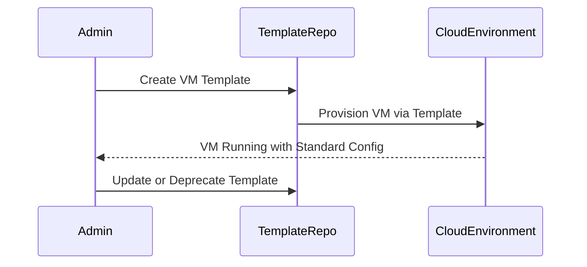

---

linkTitle: "Virtual Machine (VM) Templates"
title: "Virtual Machine (VM) Templates: Creating Standard VM Images for Consistency and Efficiency"
category: "Compute Services and Virtualization"
series: "Cloud Computing: Essential Patterns & Practices"
description: "Explore the Virtual Machine (VM) Templates pattern, a critical design pattern that facilitates the creation of standard virtual machine images to ensure consistency across cloud environments and enable rapid provisioning."
categories:
- Cloud Computing
- Virtualization
- Compute Services
tags:
- Virtual Machines
- Cloud Patterns
- Consistency
- Automation
- Infrastructure as Code
date: 2024-07-07
type: docs

canonical: "https://softwarepatternslexicon.com/18/2/2"
license: "© 2024 Tokenizer Inc. CC BY-NC-SA 4.0"
---

## Introduction

The Virtual Machine (VM) Templates design pattern is pivotal in the realm of cloud computing and virtualization. It involves creating standardized images of virtual machines to accelerate deployment, ensure uniformity across environments, and streamline operational management. By leveraging VM templates, organizations can efficiently manage infrastructure at scale, integrate automation, and enhance the resilience and security posture of their environments.

## Design Pattern Explanation

### Key Concepts

- **Template Creation**: A virtual machine template is a master image of a virtual machine's instance that includes a specific operating system, pre-installed software, configuration settings, and other essential components.

- **Standardization and Consistency**: VM templates are used to standardize configurations across multiple virtual machine instances, ensuring consistency throughout the infrastructure.

- **Rapid Provisioning**: By utilizing VM templates, new virtual machines can be provisioned rapidly with known configurations, reducing setup time and minimizing human errors.

### Architectural Approaches

1. **Template Lifecycle Management**: Establishing processes for creating, updating, and deprecating VM templates ensures that templates remain relevant and secure. This might involve versioning, patch management, and integration with continuous integration/continuous deployment (CI/CD) pipelines.

2. **Centralized Template Repository**: Storing VM templates in a centralized repository (such as AWS AMIs, Azure Managed Images, or Google Cloud VM Images) provides easy access and management. This repository acts as a source of truth for VM configurations.

3. **Customization and Flexibility**: While templates provide a baseline configuration, they should be designed to allow for additional customization post-deployment to meet specific application needs.

### Example Code

Here's an example of using a VM template to automate VM provisioning using Terraform, an Infrastructure as Code tool:

```hcl
provider "aws" {
  region = "us-west-2"
}

resource "aws_instance" "web" {
  ami           = "ami-0c55b159cbfafe1f0"  # AMI ID for your VM Template
  instance_type = "t2.micro"

  tags = {
    Name = "WebServer"
  }
}
```

### Diagrams

Below is UML diagram depicting the lifecycle of a virtual machine template:



## Best Practices

- **Security and Compliance**: Ensure that VM templates are regularly patched and comply with organizational security standards.
  
- **Automation**: Integrate VM template usage within automated deployment pipelines to reduce manual intervention and enhance agility.
  
- **Version Control**: Maintain version control for VM templates to manage updates and rollbacks effectively.

## Related Patterns

- **Immutable Infrastructure**: Combines with VM templates to enhance the reliability and stability of deployments by discarding changes in favor of redeploying from a clean template.
  
- **Configuration Drift Management**: Works alongside VM templates to address configuration drift by ensuring consistent baseline configurations.

## Additional Resources

- [AWS AMI Management](https://docs.aws.amazon.com/AWSEC2/latest/UserGuide/AMIs.html)
- [Azure Image Overview](https://learn.microsoft.com/en-us/azure/virtual-machines/linux/capture-image-template)
- [Google Cloud Custom Images](https://cloud.google.com/compute/docs/images/create-delete-images)

## Conclusion

The Virtual Machine (VM) Templates pattern is integral to modern cloud infrastructure management. By enabling consistency, efficiency, and agility, VM templates empower organizations to harness the benefits of cloud computing fully. This design pattern is essential for enterprises looking to maintain a competitive edge through rapid and reliable infrastructure deployment.


