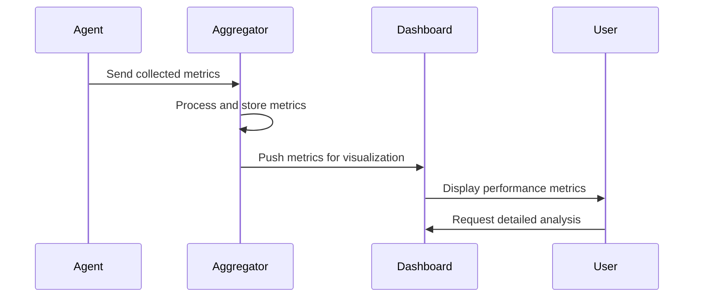

Monitoring compute resources in a cloud environment is crucial for optimizing resource utilization, maintaining elasticity, and improving overall performance. This design pattern focuses on the systematic collection, ingestion, and analysis of performance metrics from various compute services to enable intelligent scaling and cost management.

## Detailed Explanation

Compute resource monitoring and metrics involve capturing data points related to CPU usage, memory utilization, disk I/O, network traffic, and application-level performance metrics. This information helps in understanding system behavior, detecting anomalies, and making informed decisions about scaling and resource allocation.

### Key Components

1. **Metrics Collection Agents**: Install lightweight agents on virtual machines or containers that continuously gather performance data.
2. **Data Aggregation Layer**: Consolidate and process the collected data from multiple sources for a unified view.
3. **Dashboards and Visualization Tools**: Provide graphical representations of the data for easier analysis and decision-making.
4. **Alerting Systems**: Automatically notify administrators of significant changes in performance metrics that might indicate issues.
5. **Automated Scaling Policies**: Use collected metrics to define rules for automatic scaling of compute resources.

## Architectural Approaches

- **Agent-Based Monitoring**: Deploy agents on each compute node that gather and send data periodically to a central server.
- **Agentless Monitoring**: Utilize hypervisor or service APIs to collect metrics without the need for installing software on compute nodes.
- **Serverless Monitoring**: Employ cloud-native services that capture and analyze metrics directly from serverless functions and applications.
  
## Best Practices

- **Granularity**: Define an appropriate level of granularity for metric collection to balance detail with storage and processing costs.
- **Retention Policies**: Establish data retention policies to manage the storage and cost implications of performance data.
- **Data Encryption**: Ensure that all metrics data is encrypted both in transit and at rest to prevent unauthorized access.
- **Anomaly Detection**: Implement machine learning models to automatically detect anomalies and predict potential issues.

## Example Code

The following is an example implementation for setting up a basic monitoring agent using Python.

```python
import psutil
import time
    
def collect_metrics():
    metrics = {
        'cpu': psutil.cpu_percent(interval=1),
        'memory': psutil.virtual_memory().percent,
        'disk': psutil.disk_usage('/').percent
    }
    return metrics

def log_metrics_to_file():
    with open('metrics.log', 'a') as file:
        while True:
            metrics = collect_metrics()
            timestamp = time.strftime('%Y-%m-%d %H:%M:%S')
            file.write(f"{timestamp} {metrics}\n")
            time.sleep(60)

if __name__ == "__main__":
    log_metrics_to_file()
```

## Diagrams

Below is a simplified UML Sequence diagram illustrating the flow of data in a compute resource monitoring system:



## Related Patterns

- **Elastic Resource Allocation**: Utilize the data from monitoring systems to dynamically scale resources up or down.
- **Service Level Agreements (SLA) Monitoring**: Ensure that the system's performance remains within agreed SLAs by continuously checking against performance metrics.

## Additional Resources

- [AWS CloudWatch](https://aws.amazon.com/cloudwatch/)
- [Google Cloud Operations Suite](https://cloud.google.com/products/operations)
- [Azure Monitor](https://azure.microsoft.com/en-us/services/monitor/)
- [Prometheus](https://prometheus.io/)

## Summary

The Compute Resource Monitoring and Metrics pattern is essential for the efficient management of cloud resources. By collecting and analyzing performance data, organizations can optimize resource utilization, enhance system resilience, and make intelligent scaling decisions. Implementing a robust monitoring strategy is crucial for maintaining high availability and performance in distributed cloud environments.
