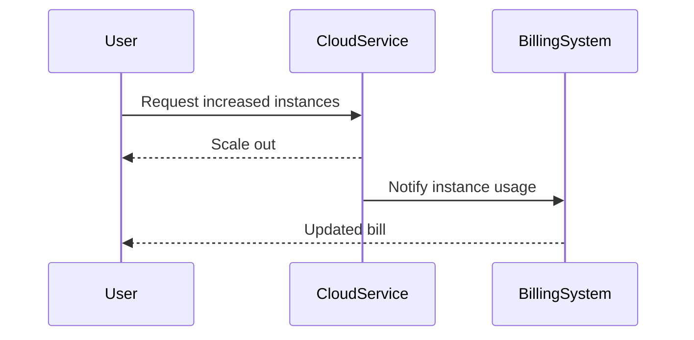

In today's cloud-driven environments, managing costs associated with compute resources is crucial. The Compute Cost Management pattern enables organizations to efficiently analyze and optimize their spending on cloud resources while ensuring optimal performance and scalability. This pattern addresses the pressing need for financial efficiency in cloud infrastructures, which often involve complex and variable cost structures.

## Detailed Explanation

### Design Patterns and Architectural Approaches

Compute Cost Management encompasses several techniques and strategies aimed at understanding, controlling, and reducing costs of cloud resources. Here are some critical components of this pattern:

- **Resource Monitoring and Analysis**: Collecting metrics and logs to gain insights into resource usage and performance. Use of tools like Amazon CloudWatch, Azure Monitor, or Google Cloud Operations Suite to monitor usage patterns and costs.

- **Rightsizing**: Evaluating and adjusting compute resources (CPU, memory, storage) to match actual system requirements, avoiding over-provisioning and underutilization.

- **Spot/Cheap Instances**: Utilizing low-cost cloud instances such as AWS Spot Instances, Azure Spot VMs, or Google Cloud Preemptible VMs to run flexible, fault-tolerant applications.

- **Scaling Mechanisms**: Implementing automated scaling policies to adjust resources in response to workload demands, such as using AWS Auto Scaling or Kubernetes Horizontal Pod Autoscaler.

- **Reservation Models**: Committing to long-term usage with cloud service providers to benefit from discounted rates. Examples include AWS Savings Plans, Azure Reserved VM Instances, and Google Cloud Committed Use Contracts.

- **Tagging and Cost Allocation**: Implementing resource tagging for better cost allocation and understanding of spending in multi-tenant environments or across departments.

### Best Practices

1. **Conduct Regular Audits**: Perform periodic audits of cloud expenses and workloads to identify potential cost savings and inefficiencies.

2. **Use Cost Management Tools**: Leverage the native cost management tools provided by cloud providers, like AWS Cost Explorer, Azure Cost Management, or Google Cloud's Billing Reports, to analyze expenditure and predict future costs.

3. **Optimize Idle Resources**: Identify and shut down idle or unused resources. Tools like Amazon's Instance Scheduler can automate this process.

4. **Leverage Automation**: Use Infrastructure as Code (IaC) and Configuration Management tools like Terraform, Ansible, or AWS CloudFormation to automate the creation and scaling of resources.

### Example Code

Here's a simple example of how AWS Auto Scaling can be configured using Terraform:

```hcl
resource "aws_autoscaling_group" "example" {
  availability_zones = ["us-west-2a", "us-west-2b"]
  desired_capacity   = 2
  max_size           = 5
  min_size           = 1

  launch_configuration = "${aws_launch_configuration.example.id}"

  tag {
    key                 = "Name"
    value               = "example-asg-instance"
    propagate_at_launch = true
  }
}

resource "aws_launch_configuration" "example" {
  name          = "example-lc"
  image_id      = "ami-0abcdef1234567890"
  instance_type = "t2.micro"

  lifecycle {
    create_before_destroy = true
  }
}
```

### Diagrams

A basic sequence of scaling actions might be represented as follows in diagram:



### Related Patterns

- **Auto Scaling**: Automatically scale computing resources based on demand.
- **Resource Tagging**: Applying metadata tags to cloud resources for better management and cost allocation.
- **Serverless Architecture**: Using event-driven services that only consume resources when running.

### Additional Resources

- "AWS Well-Architected Framework: Cost Optimization" - A guide on designing cost-efficient AWS architectures.
- "Google Cloud Cost Management for Enterprises" - Techniques and tools for managing costs in GCP.
- "Azure Cost Management and Billing" - Managing and optimizing costs on Microsoft Azure.

## Summary

Compute Cost Management is an essential pattern for organizations looking to optimize their cloud expenditures without compromising on performance and scalability. By leveraging monitoring tools, rightsizing, spot instances, and reservation models, businesses can achieve significant savings and enhance their cloud strategy effectively. Implementing such a strategy requires continuous monitoring and adjustments to align with changing workloads and economic factors.
