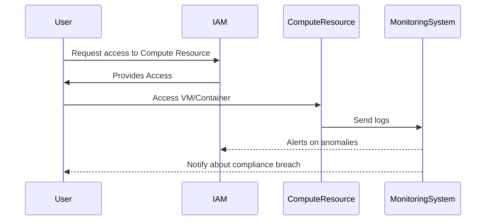

## Introduction

With increasing reliance on cloud services, ensuring compliance and security for compute resources such as virtual machines (VMs) and containers is critical. Organizations must adhere to regulations like GDPR, HIPAA, and other industry standards while guarding against security threats. This pattern provides a comprehensive approach to integrating security and compliance into cloud compute services.

## Detailed Explanation

### Design Patterns and Approaches

- **Identity and Access Management (IAM):** Implement fine-grained access control and identity management to limit access to compute resources. Use roles and permissions to define who can access and manage resources.

- **Network Security:** Use Virtual Private Clouds (VPCs), security groups, and firewall rules to control inbound and outbound traffic. Employ Virtual Network Peering to securely connect different networks.

- **Encryption:** Encrypt data at rest and in transit using strong cryptographic protocols. Implement key management services for handling encryption keys securely.

- **Monitoring and Logging:** Utilize centralized logging and monitoring solutions. Collect logs from compute instances, analyze them for compliance violations, and set up alerts for suspicious activities.

### Best Practices

- **Patch Management:** Automate the process of applying patches to operating systems and applications running on compute resources to mitigate vulnerabilities.

- **Configuration Management:** Use tools like Chef, Puppet, Ansible, or Terraform to enforce compliant configurations across all instances consistently.

- **Incident Response Plan:** Develop and maintain an incident response plan to address security breaches or compliance violations efficiently.

- **Regular Audits and Assessments:** Schedule regular audits to ensure adherence to compliance requirements and assess security postures.

### Example Code

Here is an example of using Terraform to manage security groups in AWS, emphasizing network security compliance:

```hcl
resource "aws_security_group" "web_sg" {
  name        = "web_security_group"
  description = "Security group for web servers"

  ingress {
    from_port   = 80
    to_port     = 80
    protocol    = "tcp"
    cidr_blocks = ["0.0.0.0/0"]
  }

  ingress {
    from_port   = 443
    to_port     = 443
    protocol    = "tcp"
    cidr_blocks = ["0.0.0.0/0"]
  }

  egress {
    from_port   = 0
    to_port     = 0
    protocol    = "-1"
    cidr_blocks = ["0.0.0.0/0"]
  }

  tags = {
    Name = "web_security_group"
  }
}
```

### Diagrams

#### Sequence Diagram



## Related Patterns

- **Zero Trust Architecture:** Builds a security model that assumes no implicit trust; every request to access network resources must be verified.
  
- **Serverless Security Patterns:** Focus on securing serverless functions which are also gaining popularity in handling compute tasks.

- **DevSecOps:** Emphasizes integrating security practices within the DevOps process to deliver secure code faster.

## Additional Resources

- [AWS Well-Architected Framework for Security](https://aws.amazon.com/architecture/well-architected/)
- [Azure Security Documentation](https://docs.microsoft.com/en-us/azure/security/)
- [Google Cloud Security Best Practices](https://cloud.google.com/security/best-practices)

## Summary

Ensuring compliance and security for compute resources in the cloud involves a systematic approach that integrates best practices, automation, and audits into operations. By leveraging IAM, encryption, network security, and automated compliance checks, organizations can safeguard their cloud environments effectively, meeting regulatory requirements and protecting their resources from threats. Keep security configurations updated and regularly test your environment's compliance to maintain robust security postures.
