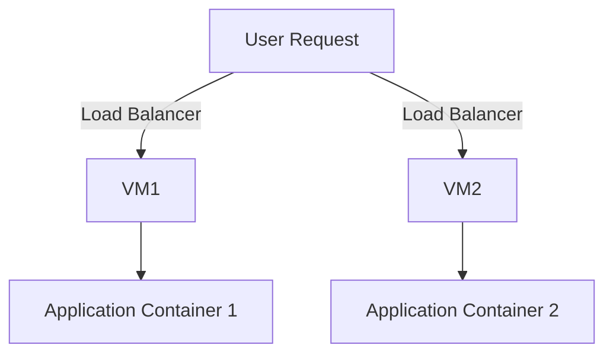

## Introduction

Workload Isolation is a critical design pattern in cloud computing, aimed at separating different workloads to prevent interference, enhance security, and ensure optimal resource utilization. This pattern is particularly important in multi-tenant environments, where multiple customers share the same infrastructure. By isolating workloads, cloud providers can offer improved security, reliability, and performance to their clients.

## Detailed Explanation

### Purpose

The primary goal of the Workload Isolation pattern is to ensure that individual workloads do not adversely affect each other in a shared environment. This isolation helps in maintaining strict boundaries between different applications and data sets, preventing unintended interactions and potential breaches.

### Implementation Approaches

1. **Virtual Machines (VMs):** Traditional method of workload isolation where each workload operates in its dedicated virtual machine. This approach offers robust isolation but may incur overhead due to multiple operating system instances.

2. **Containers:** Lightweight alternatives to VMs that enable running multiple workloads in isolated spaces on a single OS kernel. Containers provide efficiency and fast deployment, although they offer slightly less isolation than VMs.

3. **Serverless Architectures:** Functions run in stateless compute containers and scale automatically. Each function execution is highly isolated, minimizing the risk of interference across tasks.

4. **Kubernetes Namespaces:** In environments using Kubernetes, namespaces can be employed to separate workloads within a cluster, offering logical isolation.

These methods can be further enhanced through proper network segmentation, using Virtual Private Clouds (VPCs), and implementing strict identity and access management (IAM) policies.

## Example Code

Here is an example of using Docker containers to achieve workload isolation:

```shell
docker pull workload1/image:latest
docker pull workload2/image:latest

docker run -d --name workload1_container workload1/image:latest
docker run -d --name workload2_container workload2/image:latest
```

In this example, `workload1` and `workload2` operate in fully isolated Docker containers, preventing any interference.

## Diagrams



The diagram demonstrates workload isolation using two VMs, each hosting a separate application container.

## Related Patterns

- **Multi-Tenancy Pattern:** Allows multiple customers to use shared resources while keeping their data and processes isolated.
  
- **Service Mesh:** Provides secure, managed communication between isolated workloads, ensuring security and observability.

- **Circuit Breaker Pattern:** Prevents failures in one component from affecting others, offering logical isolation.

## Best Practices

- Implement strong identity and access controls to enhance workload isolation.
- Regularly update and patch isolation technologies in use (e.g., VMs, containers).
- Use network policies to segment traffic between isolated workloads.

## Additional Resources

- [The Docker Book: Containerization is the new virtualization](https://www.docker.com/book/)
- [Kubernetes Documentation: Configuring Namespaces](https://kubernetes.io/docs/concepts/overview/working-with-objects/namespaces/)
- [AWS Well-Architected Framework: Security Pillar](https://aws.amazon.com/architecture/well-architected/)

## Summary

Workload Isolation is crucial in modern cloud computing environments to prevent interference, maintain security, and optimize resource use. Whether using VMs, containers, or serverless models, this pattern helps achieve efficient and secure cloud operations. By implementing Workload Isolation, organizations can enhance operational efficiency and protect sensitive data while maintaining high availability and performance.
