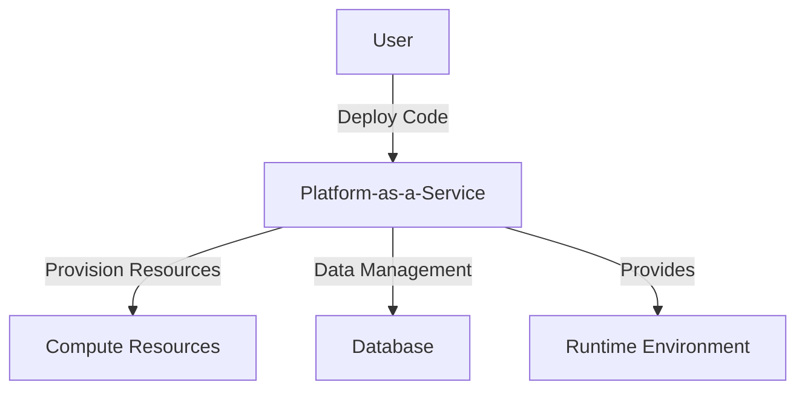

## Introduction

Platform-as-a-Service (PaaS) offers a platform allowing customers to develop, run, and manage applications without the complexity of maintaining underlying hardware and software layers. This pattern focuses on abstracting compute details, so developers can concentrate on building and deploying applications.

## Detailed Explanations

### Architectural Approach

PaaS provides an environment where development, testing, and deployment can be seamlessly executed without managing the underlying infrastructure. By offering pre-configured runtime environments, database platforms, and application services, PaaS solutions abstract a significant portion of IT complexity.

**Components of PaaS:**
- **Development Tools:** Integrated development environments (IDEs), version control systems, and build automation tools.
- **Middleware:** Services for messaging, authentication, and integration with other platforms.
- **Database Management:** Scalable database solutions managed by the provider.
- **Business Analytics:** Tools for data visualization and analysis.

### Paradigms and Best Practices

1. **Scalability**: Leverage automatic scaling features to accommodate varying workloads.
2. **Continuous Integration/Continuous Deployment (CI/CD)**: Utilize built-in CI/CD pipelines to accelerate development and deployment cycles.
3. **Multi-tenant Architecture**: Opt for a multi-tenant setup to efficiently utilize resources and reduce costs.
4. **Security**: Implement robust identity and access management, monitoring, and compliance checks as provided by the PaaS platform.
5. **Cost Efficiency**: Monitor usage and optimize resource allocation to ensure cost-effectiveness.

### Example Code

Here's a basic example using Google App Engine, a popular PaaS service, to deploy a Node.js application:

```javascript
// server.js
const express = require('express');
const app = express();

app.get('/', (req, res) => {
    res.send('Hello, World!');
});

const port = process.env.PORT || 8080;
app.listen(port, () => {
    console.log(`App listening on port ${port}`);
});

// app.yaml
runtime: nodejs16
```

Deploy this application using the gcloud command line:

```bash
gcloud app deploy
```

### Diagrams

#### PaaS Architecture Overview



## Related Patterns

- **Infrastructure-as-a-Service (IaaS):** Offers virtualized computing resources over the internet, requiring more management.
- **Software-as-a-Service (SaaS):** Delivers applications over the internet, managed by the provider.
- **Serverless Architecture:** Focuses on event-driven compute resources without managing servers.

## Additional Resources

- [Understanding PaaS - IBM Cloud](https://www.ibm.com/cloud/learn/paas)
- [Google Cloud PaaS Documentation](https://cloud.google.com/appengine)
- [Microsoft Azure App Service](https://azure.microsoft.com/en-us/services/app-service/)

## Summary

Platform-as-a-Service (PaaS) streamlines application development and deployment by abstracting away underlying hardware and software complexities. By using PaaS, organizations can accelerate development cycles, reduce costs, and improve the scalability and reliability of their applications. With built-in tools for integration, security, and analytics, PaaS becomes an essential component of modern cloud strategies.
