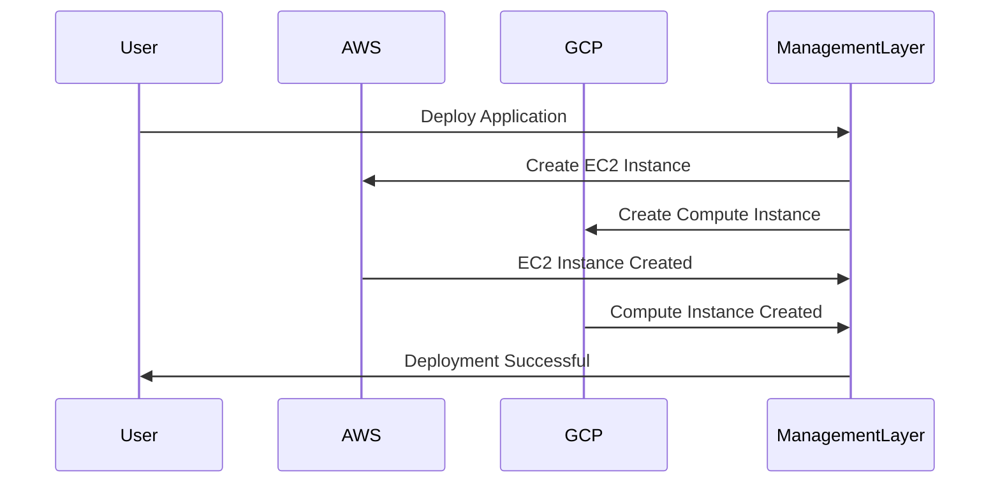

## Introduction

In today's cloud-centric world, businesses are harnessing the power of multiple cloud providers to ensure reliability, flexibility, and cost efficiency. However, managing compute resources across different cloud environments can pose significant challenges. Multi-Cloud Compute Management is a design pattern that addresses these challenges by enabling unified management of compute resources across multiple cloud platforms.

## Design Pattern Explanation

### Key Characteristics
- **Cross-Provider Coordination**: Ensure consistent compute resource deployment, scaling, monitoring, and management across various cloud environments like AWS, Azure, GCP, and others.
- **Resilience and Redundancy**: Enable failover strategies that leverage multiple clouds to ensure high availability and disaster recovery.
- **Cost Efficiency**: Optimize compute resource use by selecting the most cost-effective cloud provider for specific workloads.
- **Vendor Independence**: Minimize reliance on a single cloud provider, reducing risk and increasing bargaining power.

### Architectural Approaches

#### Unified Management Layer
Implement a centralized management layer that can interact with APIs of different cloud providers. This layer abstracts cloud-specific details and provides a unified interface for operations teams to manage compute resources efficiently.

#### Portable Workloads
Design applications as portable workloads using containerization and orchestration tools like Kubernetes, which facilitate deployment and management across various cloud platforms without extensive reconfiguration.

#### Cloud-Agnostic Monitoring
Use monitoring and alerting tools that are compatible with multiple cloud providers to gain a comprehensive view of system performance and security across clouds.

## Example Code

```javascript
// Example: Node.js script to deploy instances across AWS and GCP
const aws = require('aws-sdk');
const { Compute } = require('@google-cloud/compute');

// AWS configuration
const awsEC2 = new aws.EC2({region: 'us-west-1'});

// GCP configuration
const gcpCompute = new Compute();

async function launchInstances() {
  // Launch AWS instance
  const awsParams = {
    ImageId: 'ami-abc12345',
    InstanceType: 't2.micro',
    MinCount: 1,
    MaxCount: 1,
  };
  const awsInstance = await awsEC2.runInstances(awsParams).promise();

  // Launch GCP instance
  const zone = gcpCompute.zone('us-west1-a');
  const config = {
    os: 'ubuntu',
    http: true,
  };
  const gcpVM = await zone.createVM('my-vm-name', config);
  
  console.log('AWS Instance:', awsInstance);
  console.log('GCP VM:', gcpVM);
}

launchInstances().catch(console.error);
```

## Diagram



## Related Patterns

- **Cloud Bursting**: Dynamically scale compute resources out to a public cloud.
- **Hybrid Cloud Management**: Manage resources in both private and public clouds.
- **Service-Oriented Architecture (SOA)**: Apply integration patterns to microservices across multiple clouds.

## Additional Resources

- [Managing Multi-Cloud Environments](https://azure.microsoft.com/en-us/solutions/multi-cloud/)
- [Kubernetes - Multi-Cloud Deployments](https://kubernetes.io/docs/concepts/cluster-administration/federation/)

## Summary

Multi-Cloud Compute Management provides a structured approach to handle compute resources across various cloud environments efficiently. It promotes flexibility, resilience, and cost optimization by leveraging the strengths of multiple cloud platforms while minimizing dependencies on individual providers. Adopting this pattern enables organizations to create robust, cloud-agnostic applications capable of sustaining modern business demands.
