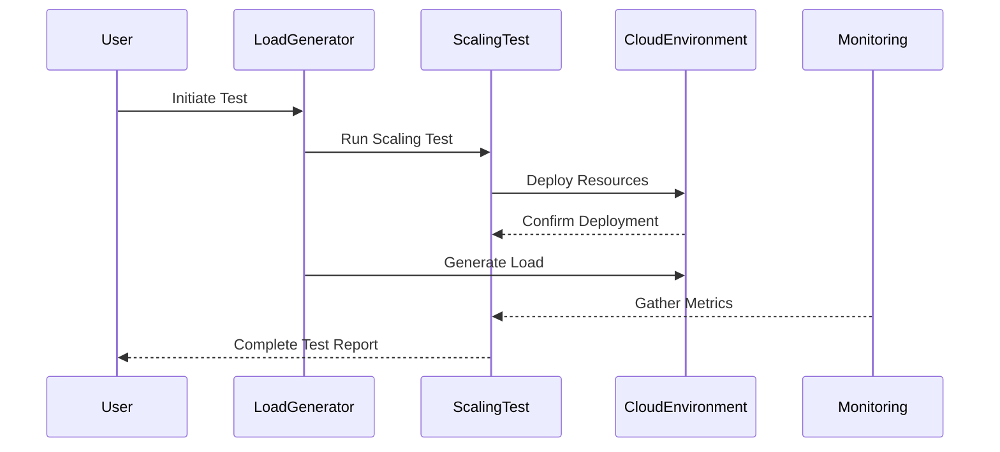

## Introduction

Automated Scaling Testing is a cloud computing design pattern that emphasizes the importance of validating scaling policies for cloud applications. By simulating varying workloads and observing application behavior, organizations can ensure their applications scale appropriately, maintain performance, and provide reliable services to users. This pattern leverages both manual and automated testing methodologies and applies them within cloud environments to validate the elasticity of resources.

## Detailed Explanation

### What is Automated Scaling Testing?

Automated Scaling Testing involves setting up tests that simulate real-world workload scenarios to validate scaling policies and configurations of cloud applications. It addresses the need to ensure that as demand increases or decreases, the system can automatically adjust resources to maintain performance without manual intervention.

### Key Components

1. **Workload Simulation**: Generating synthetic transactions and requests to mimic real user activity.
2. **Monitoring and Metrics Collection**: Using tools to gather data on application performance under different load conditions.
3. **Automation Frameworks**: Leveraging automation tools and scripts to execute scaling tests efficiently.
4. **Scaling Policies**: Rules and configurations that determine when and how resources are added or removed.
5. **Analysis and Reporting**: Identifying bottlenecks and inefficiencies through detailed reports and metrics.

## Architectural Approaches

- **Load Generation Tools**: Utilize cloud-based or on-premise tools such as Apache JMeter, Gatling, or k6 to simulate user load.
- **Infrastructure as Code (IaC)**: Implement using tools like Terraform or AWS CloudFormation to manage and provision testing environments consistently.
- **Cloud Monitoring Services**: Employ services such as AWS CloudWatch, Azure Monitor, or Google Cloud Operations Suite for real-time tracking and logging.

## Best Practices

- **Baseline Performance Metrics**: Establish baseline metrics for performance before testing.
- **Incremental Load Increases**: Gradually increase load to identify specific thresholds for scaling triggers.
- **Scenario Variety**: Test various scenarios including peak loads, sustained loads, and recovery situations.
- **Automation Integration**: Integrate scaling tests into CI/CD pipelines to ensure continuous validation of scaling policies.

## Example Code

Here is an example of using Terraform to set up a scaling group with automated tests on AWS:

```hcl
resource "aws_autoscaling_group" "example" {
  availability_zones = ["us-west-2a", "us-west-2b"]
  max_size           = 5
  min_size           = 1
  desired_capacity   = 1

  launch_configuration = aws_launch_configuration.example.id

  # Policies
  scaling_policies {
    policy_name          = "scale-out"
    adjustment_type      = "ChangeInCapacity"
    scaling_adjustment   = 1
    cooldown             = 300
  }

  scaling_policies {
    policy_name          = "scale-in"
    adjustment_type      = "ChangeInCapacity"
    scaling_adjustment   = -1
    cooldown             = 300
  }
}
```

## Diagrams

Here's a basic sequence diagram showcasing an automated scaling test:



## Related Patterns

- **Elasticity**: The broader concept of scaling resources up and down as needed.
- **Load Balancing**: Distributing network or application traffic across multiple servers.
- **Auto-Scaling**: Automatically adjusting the number of resources based on demand.

## Additional Resources

- ["Designing for Scale" on AWS Training](https://aws.amazon.com/training/)
- [Microsoft Azure Scaling Guidance](https://learn.microsoft.com/en-us/azure/architecture/best-practices/auto-scaling)
- [Google Cloud's Guide to Resilient Architectures](https://cloud.google.com/architecture)

## Summary

Automated Scaling Testing is essential for validating the scalability and elasticity of cloud-based applications. By simulating various workloads, deploying robust monitoring solutions, and automating tests, organizations ensure their applications remain efficient and performant under dynamic conditions. Adopting this pattern leads to improved reliability and user satisfaction, making it a cornerstone of modern cloud computing practices.
