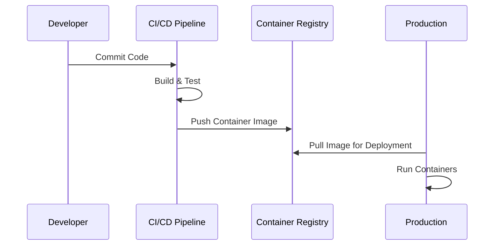

## Introduction

The **Containerization of Applications** pattern involves encapsulating an application and its dependencies into a container, which can be run consistently across various computing environments. This practice enhances application portability and resource efficiency, making it an essential pattern in cloud computing and modern software deployment strategies.

## Detailed Explanation

### Principles of Containerization

Containerization is grounded in the isolation and encapsulation of application components along with their respective dependencies. Unlike traditional virtualization, which involves running full-fledged operating systems per instance, containerization shares the host system's kernel but keeps the application layer isolated. This leads to more efficient resource usage and faster startup times.

### Containers vs Virtual Machines

- **Containers**: Share the host OS kernel, minimal overhead, fast startup.
- **Virtual Machines**: Include guest OS, higher resource requirement, slower initialization.

### Key Technologies

- **Docker**: A popular platform for container development and deployment.
- **Kubernetes**: An orchestration tool for managing containerized applications at scale across clustered environments.

### Benefits

- **Portability**: Containers can run on any system that supports container runtimes.
- **Scalability**: Easily scale applications by adding or removing container instances.
- **Resource Efficiency**: Less overhead compared to VMs, leading to better utilization.

## Architectural Approaches

### Microservices Architecture

Containers are ideal for deploying microservices, as they encapsulate individual services, facilitating independent deployment and scaling. This approach promotes separation of concerns and allows different teams to work on distinct services without conflicts.

### DevOps and Continuous Deployment

By integrating containers into CI/CD pipelines, teams can achieve faster and more reliable releases. The consistent environment provided by containers reduces "works on my machine" issues.

### Example Code: Dockerfile for a Simple Application

Below is an example of a `Dockerfile` used to containerize a simple Node.js application:

```dockerfile
FROM node:14

WORKDIR /usr/src/app

COPY package*.json ./
RUN npm install

COPY . .

EXPOSE 8080

CMD ["node", "app.js"]
```

## Diagrams

### UML Sequence Diagram



## Related Patterns

- **Microservices Architecture**: Decomposing applications into smaller, decentralized services that can be independently deployed.
- **Service Mesh**: Managing microservices with added networking features like service discovery and load balancing.
- **Immutable Infrastructure**: Deploying unchangeable containers to ensure consistency and reliability.

## Additional Resources

- [Docker Documentation](https://docs.docker.com/)
- [Kubernetes Documentation](https://kubernetes.io/docs/home/)
- [The Twelve-Factor App](https://12factor.net/)

## Summary

Containerization transforms application deployment by providing a lightweight and portable solution that addresses resource inefficiencies found in traditional virtualization. With increasing adoption of microservices, the cloud, and DevOps methodologies, the Containerization of Applications pattern stands out as a critical method in modern computing strategy.
