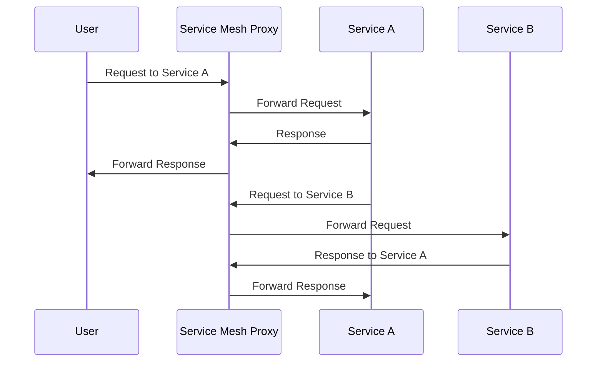

## Introduction

In modern cloud architectures, managing the communication between compute services becomes increasingly complex due to the diversity and scalability requirements of applications. A service mesh provides a dedicated infrastructure layer to manage service-to-service communication within your cloud-native applications, enhancing reliability and security.

## Design Pattern Overview

The **Compute Orchestration with Service Mesh** pattern involves integrating a service mesh to manage and observe interactions between compute services effectively. This pattern is essential in microservices architecture, where numerous services need seamless communication with minimal latency and high reliability. By abstracting communication logic into a mesh, developers can focus more on business logic rather than network complexities.

## Architectural Components

- **Service Mesh Control Plane:** Manages and configures proxies to route traffic, enforce policies, and gather telemetry.
- **Service Mesh Data Plane:** Consists of lightweight proxies deployed alongside each compute service to handle traffic flow, security, and observability.
- **Orchestrator (e.g., Kubernetes):** Handles service deployments, scaling, and provides service discovery. The orchestrator integrates with the service mesh for enhanced communication management.
- **Service Registry and Discovery:** Ensures services can be easily found within the mesh for reliable communication.
- **Policy Management:** Applies security, rate limiting, and access control policies across the service mesh.

## Best Practices

- **Security First:** Use mTLS (mutual Transport Layer Security) for encrypting service-to-service communications to secure data in transit within the mesh.
- **Enable Observability:** Leverage the service mesh’s telemetry data to monitor metrics, traces, and logs for insights into service health and performance.
- **Gradual Rollouts:** Utilize canary deployments and blue-green deployments to introduce changes safely with the ability to roll back if issues occur.
- **Optimize Traffic Management:** Use policies to manage network traffic efficiently, including load balancing, failover, and fault injection for testing service resilience.
- **Decouple Deployment and Operations:** Allow independent deployment of services by decoupling microservice operations from their communication policy management through the mesh.

## Example Code

Here is a basic example of how to define a service in a service mesh using YAML configuration in a Kubernetes environment with Istio:

```yaml
apiVersion: v1
kind: Service
metadata:
  name: my-service
  labels:
    app: my-app
spec:
  ports:
  - port: 80
    name: http
  selector:
    app: my-app
---
apiVersion: apps/v1
kind: Deployment
metadata:
  name: my-app-deployment
  labels:
    app: my-app
spec:
  replicas: 3
  selector:
    matchLabels:
      app: my-app
  template:
    metadata:
      labels:
        app: my-app
    spec:
      containers:
      - name: my-app-container
        image: my-app-image:latest
        ports:
        - containerPort: 80
```

## Diagrams

Here’s a basic sequence diagram illustrating service interactions through a service mesh:



## Related Patterns

- **Microservices Architecture:** This pattern is tightly coupled with microservices architecture, effectively managing inter-service communication.
- **API Gateway:** Often used in conjunction with service meshes to manage external access to services.
- **Sidecar Proxy Pattern:** Utilizes sidecars for seamless proxy capability within the service mesh.

## Additional Resources

- [Istio: An open platform to connect, secure, and observe services](https://istio.io/)
- [Linkerd: Service mesh for Kubernetes](https://linkerd.io/)
- [Consul by HashiCorp: Secure Service Networking](https://www.consul.io/)
- [CNCF Service Mesh Landscape](https://landscape.cncf.io/)

## Summary

The Compute Orchestration with Service Mesh pattern enhances communication management in cloud-native applications by providing crucial features such as traffic control, security, and observability. By leveraging service meshes, cloud architectures can achieve more reliable, secure, and observable service-to-service interactions, which are vital for maintaining scalability and performance in modern compute services.
