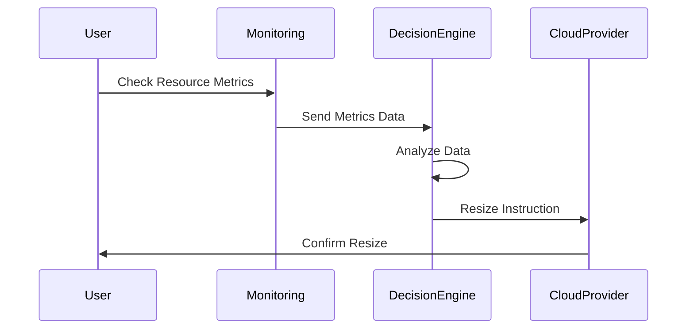

## Introduction

In cloud computing ecosystems, managing resources effectively is essential to ensure optimal performance and cost-efficiency. **Compute Resource Rightsizing** is a design pattern that focuses on aligning cloud resources—such as virtual machine (VM) instances—with actual workload needs. This pattern addresses the challenges of overprovisioning and underutilization that can lead to unnecessary expenses and inefficient resource allocation.

## Detailed Explanation

### Problem

In the dynamic environment of cloud computing, choosing the right instance type and size for a workload poses challenges. Overprovisioning results in excess costs as resources remain underutilized, whereas underprovisioning can degrade performance, affecting user experience and operational capabilities.

### Solution

Compute Resource Rightsizing involves continuously analyzing and adjusting cloud instances to meet the workload requirements accurately. This involves:

- **Monitoring and Analysis**: Deploy tools to monitor resource usage metrics such as CPU, memory, and network bandwidth. Analyze these metrics over time to identify usage patterns.

- **Adjustment and Scaling**: Based on analytics, adjust the compute instances accordingly. This may involve resizing current instances to smaller types or switching to larger ones if demand increases.

- **Automation**: Incorporate automated scripts or use cloud provider solutions to dynamically resize resources, ensuring that application performance remains consistent while optimizing costs.

### Architectural Approach

1. **Assessment and Benchmarking**: Establish baselines for performance by running benchmarks on different instance types and sizes.

2. **Monitoring Infrastructure**: Set up a robust monitoring system using tools such as AWS CloudWatch, Azure Monitor, or Google Cloud Operations Suite to track usage metrics.

3. **Decision-Making Algorithms**: Implement rule-based or machine learning algorithms that can make automatic scaling and resizing decisions based on usage data.

4. **Feedback Loop**: Create a continuous feedback loop for monitoring, analysis, adjustment, and validation to ensure resources remain optimized.

### Paradigms and Technologies

- **Auto-scaling**: Utilizing auto-scaling groups to dynamically manage resources based on real-time demand.
- **Machine Learning for Predictive Analysis**: Leverage ML models to forecast workload needs more accurately and determine optimal resource configurations.
- **Containerization**: Using containers to provide a more granular level of resource allocation and management.

## Example Code

Below is a pseudocode example representing a simplified rightsizing script:

```javascript
function analyzeMetrics(metrics) {
  // Analyze resource usage metrics
  if (metrics.cpuUsage > 80) {
    return "scaleUp"
  } else if (metrics.cpuUsage < 30) {
    return "scaleDown"
  }
  return "maintain"
}

function resizeInstance(instanceId, action) {
  switch (action) {
    case "scaleUp":
      // Command to resize to a larger instance
      resize(instanceId, "increase");
      break;
    case "scaleDown":
      // Command to resize to a smaller instance
      resize(instanceId, "decrease");
      break;
    default:
      // Maintain current size
      break;
  }
}

// Sample execution
let metrics = getMetrics(instanceId);
let action = analyzeMetrics(metrics);
resizeInstance(instanceId, action);
```

## Diagrams

### UML Sequence Diagram



## Related Patterns

- **Auto-scaling**: Automates the provisioning and de-provisioning of resources as demand rises and falls.
- **Dynamic Workload Distribution**: Balances workloads across resources to optimize usage.

## Additional Resources

- AWS Compute Optimizer: [AWS Compute Optimizer](https://aws.amazon.com/compute-optimizer/)
- Google Cloud Recommender: [Google Cloud Recommender](https://cloud.google.com/recommender)
- Azure Advisor: [Azure Advisor](https://azure.microsoft.com/en-us/services/advisor/)

## Summary

Compute Resource Rightsizing enables organizations to achieve a balance between cost and performance by ensuring that their cloud deployments are optimally configured for workload demands. By employing monitoring, analytics, and automation strategies, businesses can dynamically adjust their compute resources to maximize efficiency. This not only reduces unnecessary costs but also enhances application performance, leading to improved user satisfaction. Implementing this design pattern requires constant attention to data analysis and a commitment to leveraging cloud-native tools and technologies.
